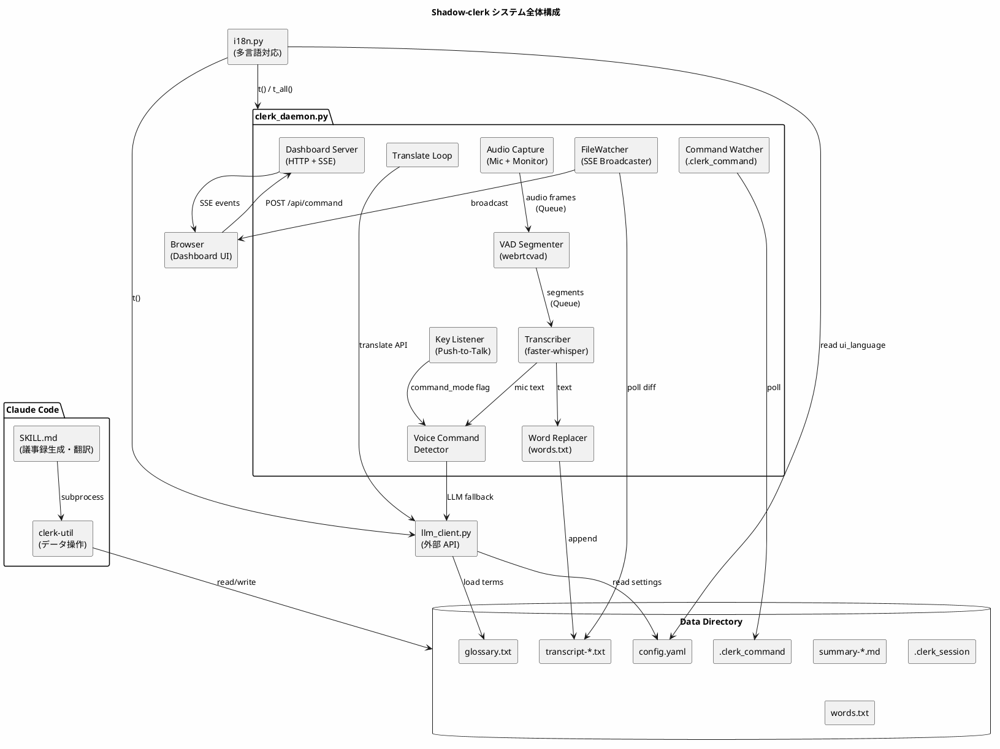
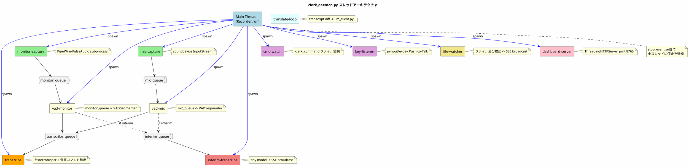
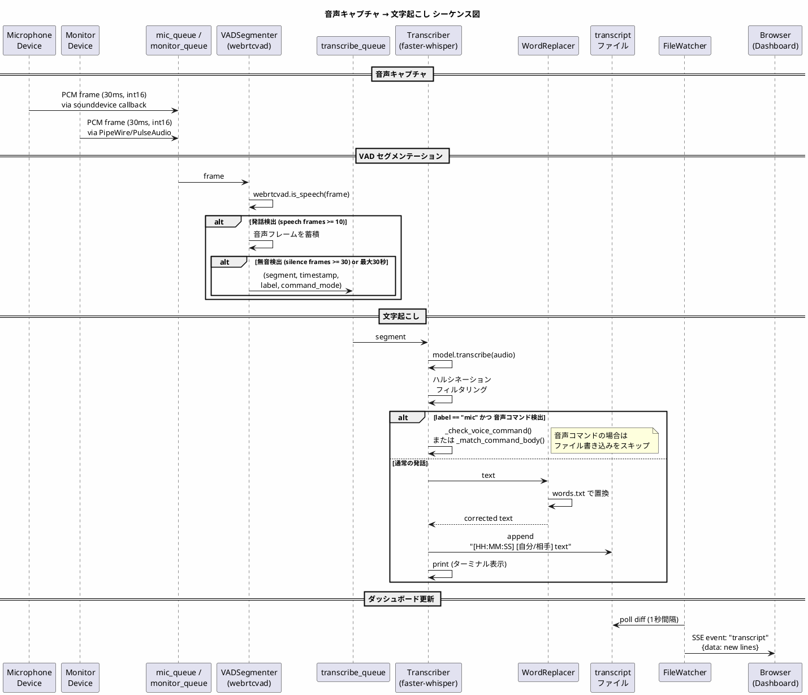
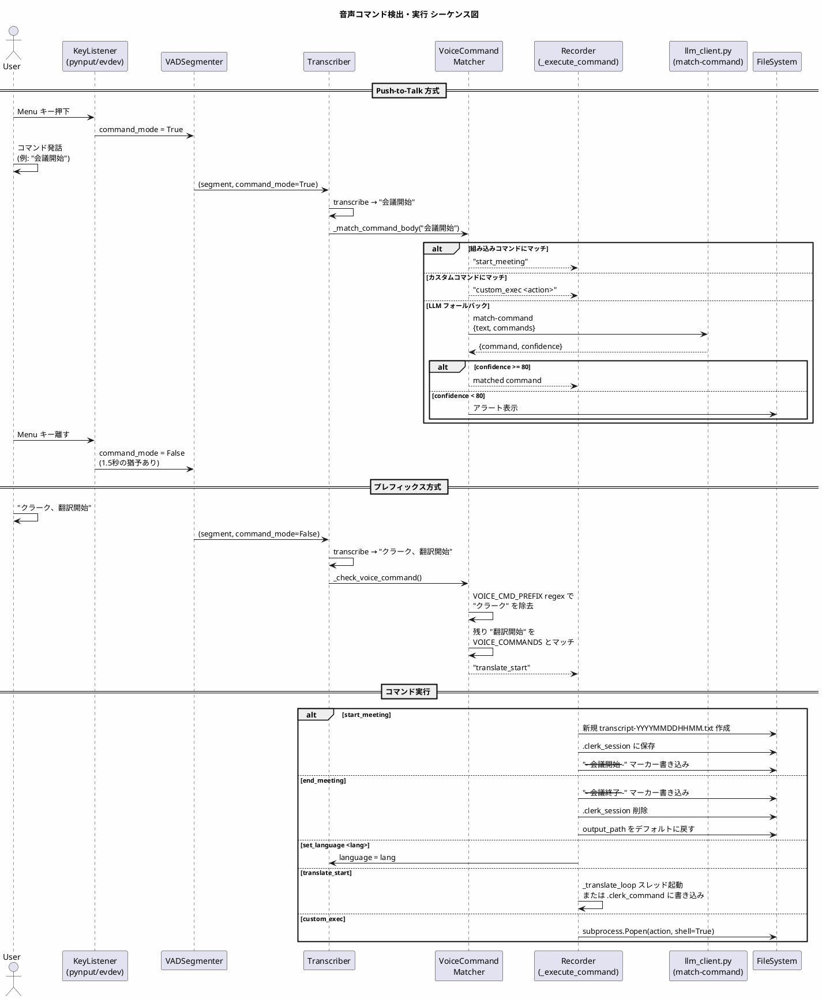
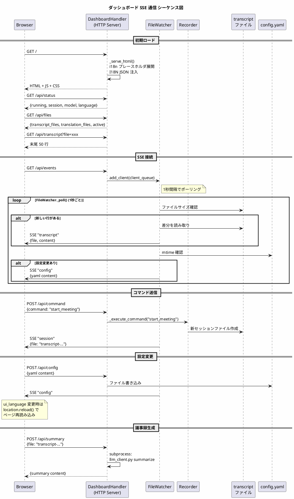
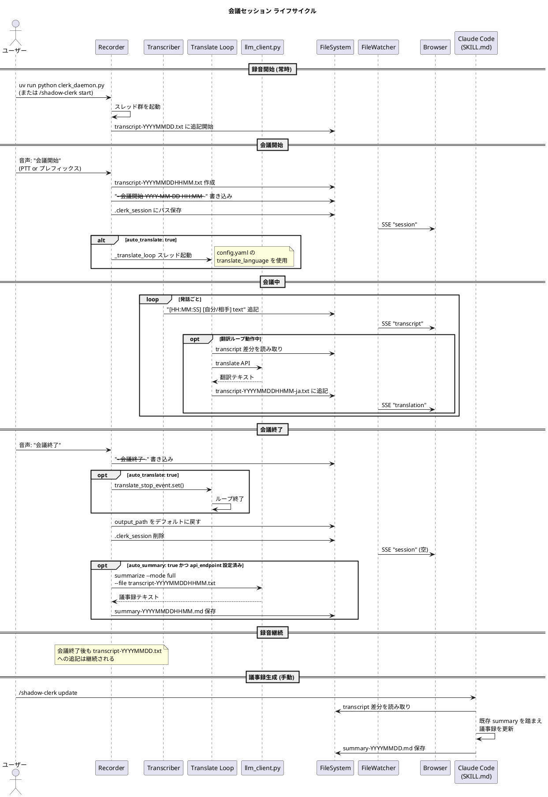
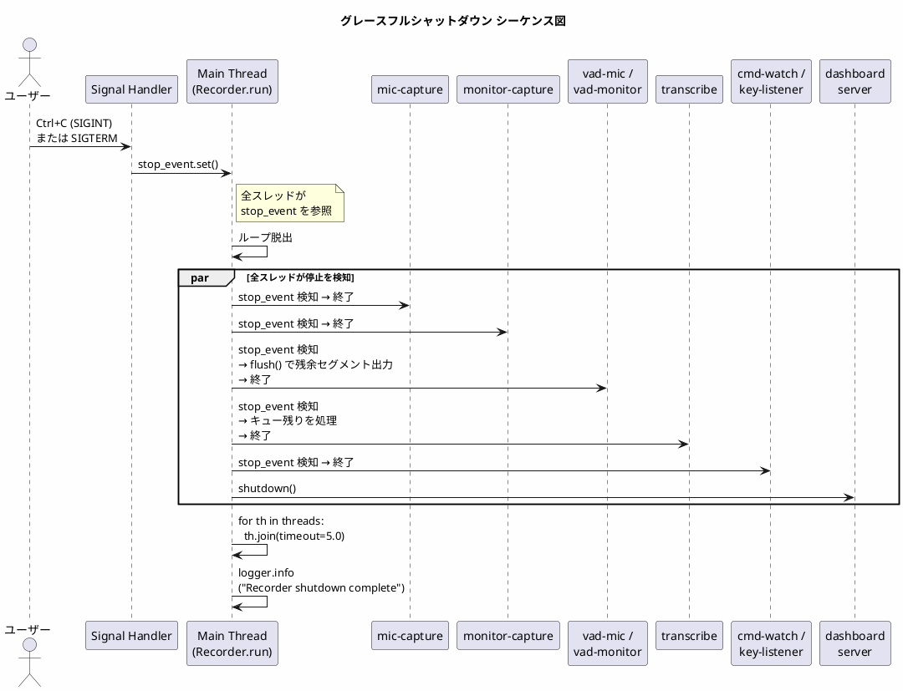

# Shadow-clerk 設計仕様

## 概要

Ubuntu 環境で Web会議の音声をリアルタイムで録音・文字起こしし、Claude Code の Skill で議事録生成・翻訳を行うシステム。

## アーキテクチャ

### モジュール A: clerk_daemon.py（録音・文字起こし）

Python スクリプト。常駐してリアルタイムに文字起こしを行う。

- **音声キャプチャ**: マイク（自分）とシステム音声モニター（相手）を同時キャプチャ
- **バックエンド**: PipeWire → PulseAudio → sounddevice の順で自動検出
- **VAD**: webrtcvad によるセグメンテーション（発話区間の検出・分割）
- **文字起こし**: faster-whisper（CPU, int8）。モデルサイズは tiny/base/small/medium/large-v3 から選択
- **出力**: タイムスタンプ・スピーカーラベル付きで transcript ファイルに追記
  - デフォルト: `transcript-YYYYMMDD.txt`（日付が変わったら自動で新ファイルに切り替え）
  - 会議セッション中: `transcript-YYYYMMDDHHMM.txt`
  - 形式: `[YYYY-MM-DD HH:MM:SS] [自分/相手] テキスト`
- **words.txt**: TSV 形式の単語置換リスト。音声認識のよくある誤認識を自動修正。ファイル変更時は自動再読み込み
- **コマンドインターフェース**: `.clerk_command` ファイル経由で以下を受付
  - `set_language <lang>` / `unset_language` — 言語切り替え
  - `set_model <size>` — Whisper モデル切り替え（ランタイム再ロード）
  - `start_meeting` / `end_meeting` — 会議セッション管理
  - `translate_start` / `translate_stop` — 翻訳ループ開始・停止（`llm_provider: api` 時は clerk_daemon.py が直接処理、`claude` 時は SKILL.md 向けにファイルを残す）
- **音声コマンド**: マイク入力から音声コマンドを検出・実行。2つの方式がある:
  - **Push-to-Talk（推奨）**: `voice_command_key`（デフォルト: Menu キー）を押しながら発話すると、プレフィックスなしでコマンドとして認識される。Whisper の「クラーク」誤認識問題を回避できる
  - **プレフィックス方式（フォールバック）**: 「clerk」または「クラーク」に続けてコマンドを発話する
  - 「クラーク、会議開始」/ "clerk, start meeting" — 会議セッション開始
  - 「クラーク、会議終了」/ "clerk, end meeting" — 会議セッション終了
  - 「クラーク、言語 日本語」/ "clerk, language ja" — 言語を日本語に切り替え
  - 「クラーク、言語 英語」/ "clerk, language en" — 言語を英語に切り替え
  - 「クラーク、言語設定なし」/ "clerk, unset language" — 言語を自動検出に戻す
  - 「クラーク、翻訳開始」/ "clerk, start translation" — 翻訳ループを開始
  - 「クラーク、翻訳停止」/ "clerk, stop translation" — 翻訳ループを停止
- **カスタム音声コマンド**: config.yaml の `custom_commands` リストで独自コマンドを登録できる
  - `pattern`: 正規表現（IGNORECASE で適用）
  - `action`: シェルコマンド文字列（`subprocess.Popen(shell=True)` で実行）
  - 組み込みコマンドより低い優先度で評価される
  - 例: `{pattern: "youtube|ユーチューブ", action: "xdg-open https://www.youtube.com"}`
- **LLM フォールバック**: 組み込みコマンドにもカスタムコマンドにもマッチしない音声コマンドは、`api_endpoint` が設定されている場合に LLM にクエリとして送信される
  - `llm_client.py query` サブコマンドをバックグラウンドで実行
  - 結果は stdout に表示し、`.clerk_response` ファイルに保存

### モジュール B: SKILL.md（Claude Code Skill）

Claude Code の Skill として動作。transcript を読み議事録生成・翻訳を行う。

サブコマンド:
- `update` / 引数なし — 差分テキストから議事録(summary.md)を更新
- `full` — 全文から議事録を再生成
- `set language <lang>` — 文字起こし言語を切り替え
- `set model <size>` — Whisper モデルを切り替え
- `config show` — 設定を表示
- `config set <key> <value>` — 設定を変更
- `config init` — デフォルト設定ファイルを生成
- `start meeting` / `end meeting` — 会議セッション管理（auto_translate / auto_summary 連動）
- `start [opts]` — clerk_daemon.py をバックグラウンドで起動
- `stop` — clerk_daemon.py を停止
- `status` — 録音・文字起こしの状態表示
- `translate <lang>` — リアルタイム翻訳モード（ループで新行検出→翻訳→ファイル保存）
- `translate stop` — 翻訳モード停止
- `setup` — 必要な Bash permission を自動設定
- `help` — サブコマンド一覧表示

### モジュール C: llm_client.py（外部 API 翻訳・Summary 生成）

`llm_provider: api` の場合に使用する Python スクリプト。OpenAI Compatible API で翻訳と議事録生成を行う。

サブコマンド:
- `translate <lang>` — stdin から transcript 行を受け取り翻訳して stdout に出力
  - タイムスタンプ・スピーカーラベル保持、マーカー行はそのまま
  - 音声認識の誤認識を文脈から補正してから翻訳
- `query <prompt>` — LLM に自由形式のクエリを投げて回答を stdout に出力
  - 音声コマンドの LLM フォールバックから呼び出される
- `summarize --mode full --file <transcript>` — transcript 全文から議事録生成
- `summarize --mode update --file <transcript> --existing <summary>` — 既存 summary を踏まえた差分更新

設定:
- 起動時にデータディレクトリの `.env` ファイルを読み込み、環境変数にセットする（既存の環境変数は上書きしない）
- API キーは `os.environ[config["api_key_env"]]` から取得（config にキー自体は保存しない）
- ローカル API（Ollama 等）で認証不要の場合は `api_key_env: null` でダミーキーを使用

### clerk-util（データディレクトリ操作ラッパー）

データディレクトリ (`~/.claude/skills/shadow-clerk/data`) への操作を1つのシェルスクリプトに集約。
Claude Code の permission パターンを `Bash(<clerk-util のフルパス> *)` の1行で済ませる。
`config.yaml` の `output_directory` を自動参照し、`transcript-*`/`summary-*` ファイルは指定ディレクトリから解決する。

サブコマンド: `read`, `read-from`, `write`, `append`, `lines`, `size`, `mtime`, `exists`, `ls`, `command`, `recorder-status`, `read-config`, `write-config`, `path`

### モジュール D: Web ダッシュボード（clerk_daemon.py 内蔵）

clerk_daemon.py に統合された Web ダッシュボード。ブラウザから transcript・翻訳・ログのリアルタイム監視とコマンド送信が可能。

- **サーバー**: Python 標準ライブラリの `ThreadingHTTPServer` + SSE（Server-Sent Events）
- **ポート**: 8765（`--dashboard-port` で変更可能）
- **有効化**: デフォルトで有効（`--no-dashboard` で無効化）
- **エンドポイント**:
  - `GET /` — ダッシュボード HTML
  - `GET /api/events` — SSE イベントストリーム（transcript/translation/log/recorder_status/session/command/response/config）
  - `GET /api/status` — recorder 状態 JSON
  - `GET /api/files` — transcript ファイル一覧 + アクティブファイル
  - `GET /api/transcript?file=xxx` — transcript の末尾 50 行
  - `GET /api/translation?file=xxx` — 翻訳ファイルの末尾 50 行
  - `GET /api/logs` — ログ末尾 100 行
  - `POST /api/command` — コマンド送信（`.clerk_command` に書き込み）
- **UI**: ダークテーマ、transcript/翻訳パネル（speaker 色分け）、ログパネル、コマンドボタン

## アーキテクチャ図 (PlantUML)

### システム全体構成



### スレッドアーキテクチャ



### 音声キャプチャ → 文字起こしフロー



### 音声コマンド検出・実行フロー



### ダッシュボード通信フロー



### 会議セッションライフサイクル



### グレースフルシャットダウン



## データディレクトリ

`~/.claude/skills/shadow-clerk/data/` にランタイムデータを保存する（`output_directory` 設定時、transcript/summary は指定ディレクトリに保存）:

| ファイル | 説明 |
|---|---|
| `transcript-YYYYMMDD.txt` | デフォルトの文字起こしファイル（日付ベース） |
| `transcript-YYYYMMDDHHMM.txt` | 会議セッション用 transcript |
| `transcript-YYYYMMDD-<lang>.txt` | 翻訳結果ファイル |
| `summary-YYYYMMDD.md` | 議事録（transcript に対応） |
| `summary-YYYYMMDDHHMM.md` | 会議セッション用議事録 |
| `words.txt` | 単語置換リスト (TSV) |
| `.clerk_session` | アクティブな会議セッションのファイルパス |
| `.clerk_command` | clerk_daemon.py へのコマンド（一時ファイル） |
| `.transcript_offset` | 議事録生成用のバイトオフセット |
| `.translate_offset` | 翻訳用のバイトオフセット |
| `config.yaml` | 設定ファイル |
| `.clerk_response` | LLM フォールバックの回答（最新の1件） |
| `.env` | API キー等の環境変数（llm_client.py が読み込む） |

## 設定ファイル (config.yaml)

`~/.claude/skills/shadow-clerk/data/config.yaml` にユーザー設定を保存する。

```yaml
# shadow-clerk 設定
translate_language: ja        # 翻訳先言語 (ja/en/etc)
auto_translate: false         # start meeting 時に自動翻訳を開始
auto_summary: false           # end meeting 時に自動 summary 生成
default_language: null        # clerk_daemon.py のデフォルト言語 (null=自動検出)
default_model: small          # clerk_daemon.py のデフォルト Whisper モデル
output_directory: null        # transcript 出力先ディレクトリ (null=データディレクトリ)
llm_provider: claude          # 翻訳・Summary の LLM ("claude"=インライン / "api"=外部 API)
api_endpoint: null            # OpenAI Compatible API の base URL
api_model: null               # API モデル名 (gpt-4o, etc.)
api_key_env: SHADOW_CLERK_API_KEY  # API キーを格納する環境変数名
custom_commands: []               # カスタム音声コマンド (pattern + action のリスト)
initial_prompt: null              # Whisper の initial_prompt (音声認識のヒント語彙)
voice_command_key: menu        # Push-to-Talk キー (null=無効, ctrl_r/ctrl_l/alt_r/alt_l/shift_r/shift_l)
whisper_beam_size: 5           # Whisper beam size (1=高速, 5=高精度)
whisper_compute_type: int8     # 計算精度 (int8/float16/float32)
whisper_device: cpu            # デバイス (cpu/cuda)
ui_language: ja                # UI言語 (ja/en) — ダッシュボード・ターミナル出力・LLMプロンプトの言語
```

- clerk_daemon.py 起動時に config.yaml を読み込み、CLI 引数が未指定の場合のみ `default_model`、`default_language`、`output_directory` を適用する
- `start meeting` 実行時に `auto_translate: true` なら翻訳を自動開始する
- `end meeting` 実行時に `auto_translate` の翻訳を停止し、`auto_summary: true` なら議事録を自動生成する

## 依存関係

- Python 3.12+
- faster-whisper, sounddevice, webrtcvad, numpy, pyyaml, openai, pynput
- システム: libportaudio2, PipeWire or PulseAudio
- pynput が未インストールの場合、Push-to-Talk は無効（警告ログを出力し、従来のプレフィックス方式のみで動作）
