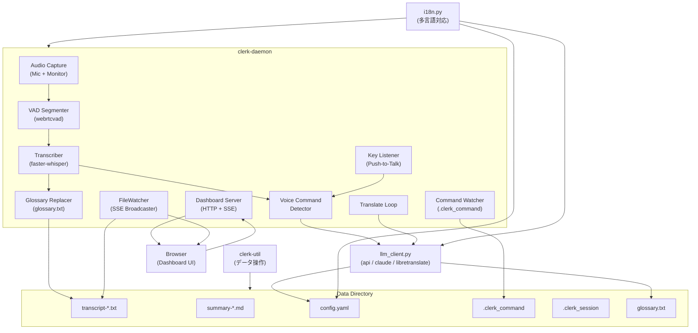
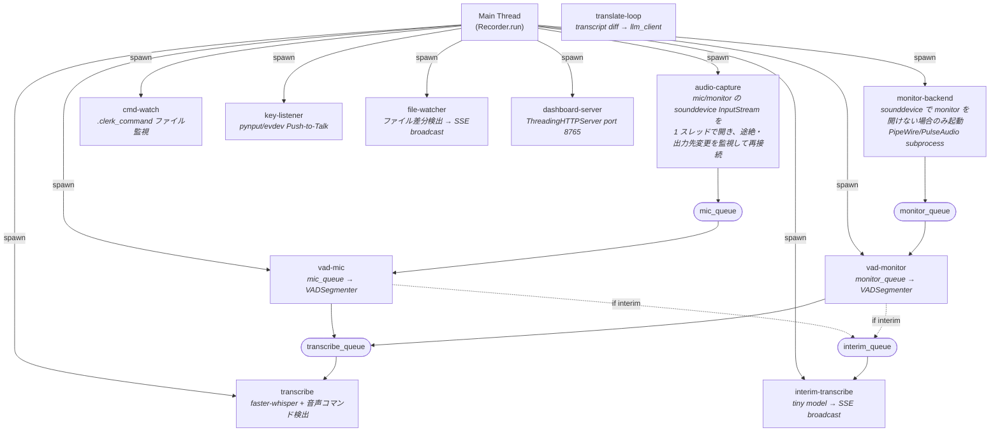
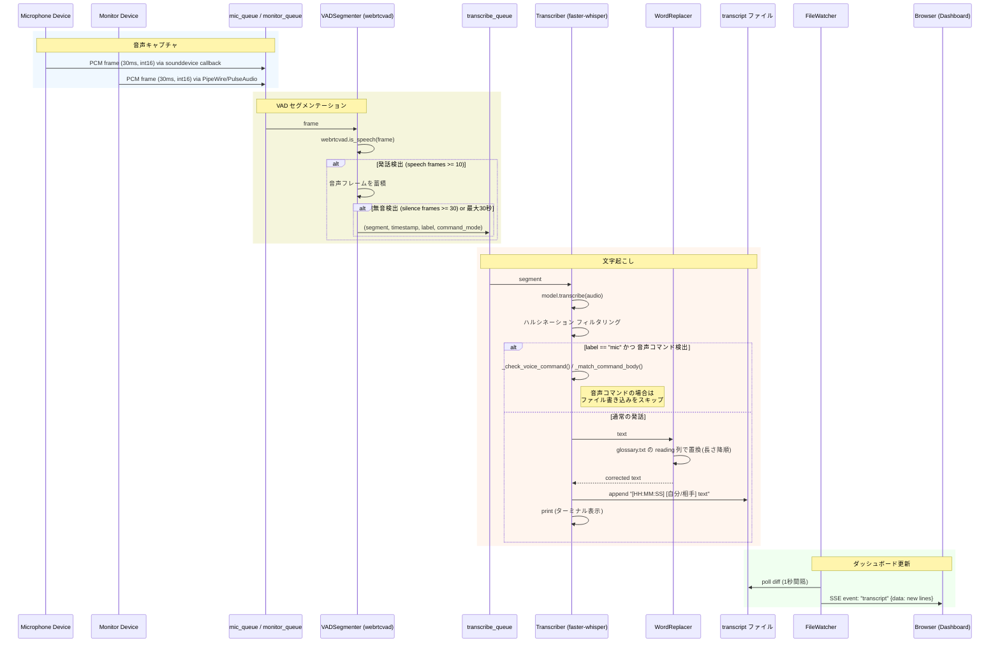
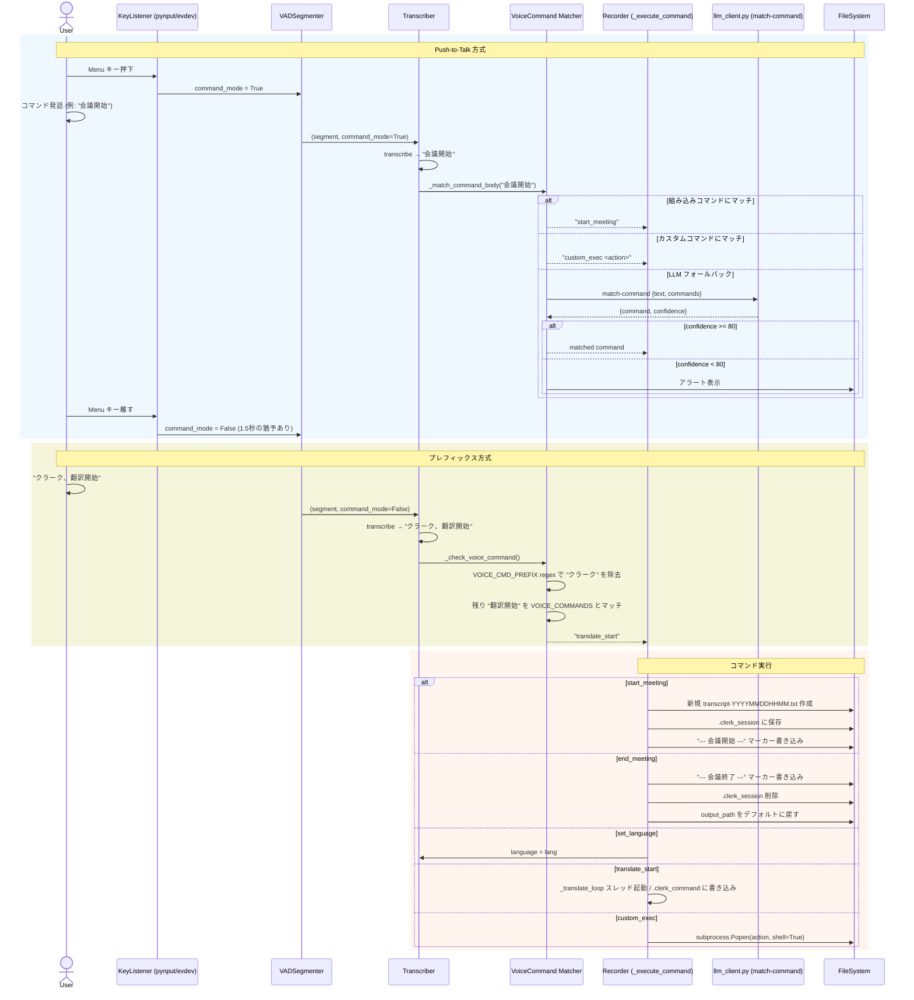
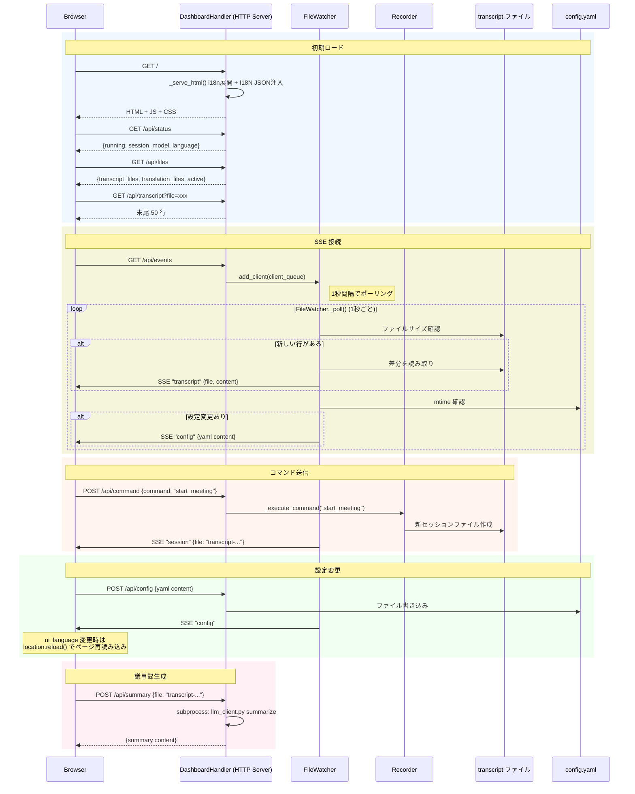
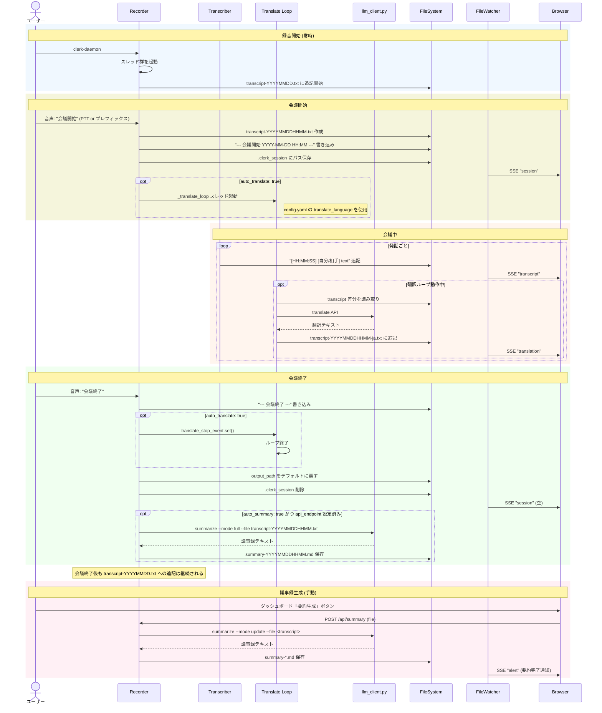
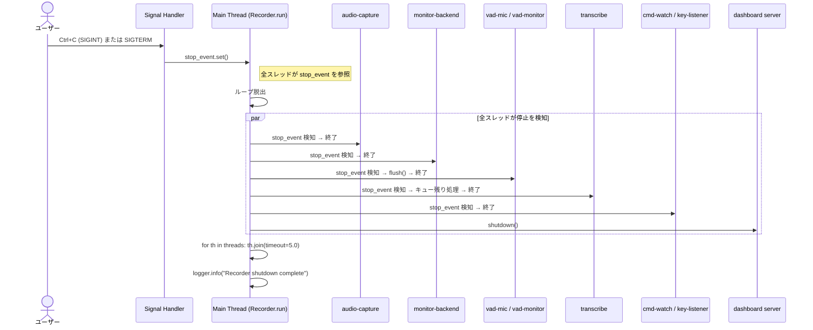

# Shadow-clerk 設計仕様

## 概要

Ubuntu 環境で Web会議の音声をリアルタイムで録音・文字起こしし、外部 LLM(OpenAI互換API / `claude -p` / LibreTranslate)で議事録生成・翻訳を行うシステム。

## アーキテクチャ

### モジュール A: clerk-daemon（録音・文字起こし）

Python スクリプト。常駐してリアルタイムに文字起こしを行う。

- **音声キャプチャ**: マイク（自分）とシステム音声モニター（相手）を同時キャプチャ
- **バックエンド**: PipeWire → PulseAudio → sounddevice の順で自動検出
- **VAD**: webrtcvad によるセグメンテーション（発話区間の検出・分割）
- **文字起こし**: faster-whisper（CPU, int8）。モデルサイズは tiny/base/small/medium/large-v3 から選択
- **出力**: タイムスタンプ・スピーカーラベル付きで transcript ファイルに追記
  - デフォルト: `transcript-YYYYMMDD.txt`（日付が変わったら自動で新ファイルに切り替え）
  - 会議セッション中: `transcript-YYYYMMDDHHMM.txt` または `transcript-YYYYMMDDHHMM@<会議名>.txt`（会議名付き、Google Calendar 連携時や rename 時）
  - 翻訳ファイル: `transcript-YYYYMMDD[HHMM][@name]-<lang>.txt`
  - 形式: `[YYYY-MM-DD HH:MM:SS] [自分/相手] テキスト`
- **glossary.txt**: TSV 形式の用語集。`reading` 列を使って音声認識の誤認識を機械置換（長さ降順で適用）、LLM 翻訳・要約のヒントとしても使用。ファイル変更時は自動再読み込み
- **音声認識モデル**: 日本語時は `japanese_asr_model` で `default` / `kotoba-whisper` / `reazonspeech-k2` から切替可能。中間認識（`interim_transcription: true` 時）用にも別系統（`interim_model`, `interim_japanese_asr_model`）
- **コマンドインターフェース**: `.clerk_command` ファイル経由で以下を受付
  - `set_language <lang>` / `unset_language` — 言語切り替え
  - `set_model <size>` — Whisper モデル切り替え（ランタイム再ロード）
  - `start_meeting` / `end_meeting` — 会議セッション管理
  - `translate_start` / `translate_stop` — 翻訳ループ開始・停止（clerk-daemon が `_launch_translate_thread` で内部処理、provider に応じて llm_client に委譲）
- **音声コマンド**: マイク入力から音声コマンドを検出・実行。2つの方式がある:
  - **Push-to-Talk（推奨）**: `voice_command_key`（デフォルト: `f23` — xremap 等で物理キーに割り当て前提）を押しながら発話すると、ウェイクワードなしでコマンドとして認識される。離した後も 1.5 秒の猶予タイマーあり
  - **ウェイクワード方式（フォールバック）**: `wake_word`（デフォルト: 「シェルク」）に続けてコマンドを発話する。設定値から濁点・半濁点・小書き・ひらがなのバリアントを自動生成する fuzzy マッチが効く
  - 「シェルク、会議開始」/ "clerk, start meeting" — 会議セッション開始
  - 「シェルク、会議終了」/ "clerk, end meeting" — 会議セッション終了
  - 「シェルク、言語 日本語」/ "clerk, language ja" — 言語を日本語に切り替え
  - 「シェルク、言語 英語」/ "clerk, language en" — 言語を英語に切り替え
  - 「シェルク、言語設定なし」/ "clerk, unset language" — 言語を自動検出に戻す
  - 「シェルク、翻訳開始」/ "clerk, start translation" — 翻訳ループを開始
  - 「シェルク、翻訳停止」/ "clerk, stop translation" — 翻訳ループを停止
- **カスタム音声コマンド**: config.yaml の `custom_commands` リストで独自コマンドを登録できる
  - `pattern`: 正規表現（IGNORECASE で適用）
  - `action`: シェルコマンド文字列（`subprocess.Popen(shell=True)` で実行）
  - 組み込みコマンドより低い優先度で評価される
  - 例: `{pattern: "youtube|ユーチューブ", action: "xdg-open https://www.youtube.com"}`
- **LLM フォールバック**: 組み込みコマンドにもカスタムコマンドにもマッチしない音声コマンドは、`api_endpoint` が設定されている場合に LLM にクエリとして送信される
  - `llm_client.py query` サブコマンドをバックグラウンドで実行
  - 結果は stdout に表示し、`.clerk_response` ファイルに保存

### モジュール B: llm_client.py（翻訳・議事録生成）

clerk-daemon の翻訳ループおよび議事録生成スレッドから `python -m shadow_clerk.llm_client ...` として起動される Python スクリプト。`config.yaml:llm_provider` / `translation_provider` に応じて以下の3つのバックエンドを切り替える:

- **api**: OpenAI Compatible API(Ollama / vLLM / 商用 API 等)
- **claude**: `claude -p` を subprocess 起動(既存の Claude Code OAuth ログインを利用)
  - `claude_cli_path`(default `"claude"`)、`claude_cli_model`(default `"haiku"`)で制御
  - `--output-format json` でレスポンス取得、`is_error` チェック・コスト記録あり
- **libretranslate**: LibreTranslate ローカル API(翻訳のみ)

サブコマンド:
- `translate <lang>` — stdin から transcript 行を受け取り翻訳して stdout に出力
  - タイムスタンプ・スピーカーラベル保持、マーカー行はそのまま
  - 音声認識の誤認識を文脈から補正してから翻訳
  - `--file <path> --offset <bytes>` で差分読み込み対応
  - プロバイダは `translation_provider` 設定で `libretranslate` / `api` / `claude` を切替可能(未設定時は `llm_provider` にフォールバック)
- `query <prompt>` — LLM に自由形式のクエリを投げて回答を stdout に出力
  - 音声コマンドの LLM フォールバックから呼び出される
- `summarize --mode full --file <transcript>` — transcript 全文から議事録生成
- `summarize --mode update --file <transcript> --existing <summary>` — 既存 summary を踏まえた差分更新
- `match-command` — stdin から `{text, commands}` JSON を受け取り、音声テキストに最も近いコマンドを推測。`{command, confidence}` を出力
- `spell-check` — stdin のテキストを誤字訂正して stdout に出力（`spell_check_model` 設定の transformers モデルを使用、主に LibreTranslate の前段処理向け）

設定:
- 起動時にデータディレクトリの `.env` ファイルを読み込み、環境変数にセットする（既存の環境変数は上書きしない）
- API キーは `os.environ[config["api_key_env"]]` から取得（config にキー自体は保存しない）
- ローカル API（Ollama 等）で認証不要の場合は `api_key_env: null` でダミーキーを使用

### clerk-util（データディレクトリ操作ラッパー）

データディレクトリ (`~/.local/share/shadow-clerk`) への操作を1つのコマンドに集約。
Claude Code の permission パターンを `Bash(<clerk-util のフルパス> *)` の1行で済ませる。
`config.yaml` の `output_directory` を自動参照し、`transcript-*`/`summary-*` ファイルは指定ディレクトリから解決する。

サブコマンド:
- ファイル操作: `read`, `read-from`, `write`, `append`, `lines`, `size`, `mtime`, `exists`, `ls`, `path`
- コマンド連携: `command`, `poll-command`, `recorder-status`
- 設定: `read-config`, `write-config`, `write-config-value`
- プロセス管理: `start`, `stop`, `restart`
- LLM ラッパー: `run-llm`, `summarize`
- セットアップ: `gcal-auth`（Google Calendar OAuth 認証）, `claude-setup`（Claude Code permission 設定）
- その他: `help`

### モジュール D: Web ダッシュボード（clerk-daemon 内蔵）

clerk-daemon に統合された Web ダッシュボード。ブラウザから transcript・翻訳・ログのリアルタイム監視とコマンド送信が可能。

- **サーバー**: Python 標準ライブラリの `ThreadingHTTPServer` + SSE（Server-Sent Events）
- **ポート**: 8765（`--dashboard-port` で変更可能）
- **有効化**: デフォルトで有効（`--no-dashboard` で無効化）
- **エンドポイント (GET)**:
  - `/` — ダッシュボード HTML
  - `/api/events` — SSE イベントストリーム（transcript/translation/log/recorder_status/session/command/response/config/interim/summary/gcal）
  - `/api/status` — recorder 状態 JSON
  - `/api/files` — transcript ファイル一覧 + アクティブファイル
  - `/api/transcript?file=xxx` — transcript の末尾 N 行
  - `/api/translation?file=xxx` — 翻訳ファイルの末尾 N 行
  - `/api/summary?file=xxx` — 議事録ファイル内容
  - `/api/logs` — ログ末尾 N 行
  - `/api/config` — `config.yaml` を JSON で返却
  - `/api/glossary` — 用語集（glossary.txt）を返却
  - `/api/models` — 利用可能な ASR モデル一覧
  - `/api/gcal-events` — Google Calendar イベント一覧（gcal_integration 有効時）
  - `/api/search?q=...` — transcript の全文検索
- **エンドポイント (POST)**:
  - `/api/command` — コマンド送信（`.clerk_command` に書き込み）
  - `/api/config` — 設定を更新（config.yaml に書き込み）
  - `/api/glossary` — 用語集を更新
  - `/api/summary` — 議事録を生成・更新
  - `/api/summary/notify` — 議事録生成完了通知を SSE で配信
  - `/api/transcript/delete` — 行削除
  - `/api/transcript/delete-file` — ファイル削除
  - `/api/transcript/extract-meeting` — 会議セッション部分を抽出して `@meeting-name` ファイルに切り出し
  - `/api/transcript/split-by-silence` — 無音検出で分割
  - `/api/transcript/rename-meeting` — 会議名変更（対応する translation/summary も追従）
  - `/api/transcript/merge-to-daily` — 会議ファイルを日次ファイルにマージ
- **UI**: ダークテーマ、transcript/翻訳/要約の3ペイン（speaker 色分け）、ログパネル、コマンドボタン、会議一覧・検索タブ

### モジュール E: Google Calendar 連携（オプション、`gcal_monitor.py`）

`gcal_integration: true` の場合、Google Calendar を監視してイベント開始/終了時刻に `start_meeting` / `end_meeting` を自動発火する。

- 認証: OAuth 2.0（`clerk-util gcal-auth <credentials.json>` で初回認証、以降はトークンを `gcal_token.json` に保存して再利用）
- スコープ: `https://www.googleapis.com/auth/calendar.readonly`（読み取り専用）
- 監視対象: `gcal_calendar_id`（デフォルト `primary`）
- 前後バッファ: `gcal_buffer_minutes`（開始 N 分前）/ `gcal_end_buffer_minutes`（終了 N 分後）
- Transcript ファイル名に予定タイトルが `@meeting-name` として付与される
- スレッドは `gcal-monitor`（daemon スレッド）

依存: `google-auth-oauthlib`, `google-api-python-client`（`uv sync --extra gcal` で追加）

## アーキテクチャ図

### システム全体構成


```mermaid
graph TB
    subgraph recorder["clerk-daemon"]
        capture["Audio Capture<br/>(Mic + Monitor)"]
        vad["VAD Segmenter<br/>(webrtcvad)"]
        transcriber["Transcriber<br/>(faster-whisper)"]
        vcmd["Voice Command<br/>Detector"]
        replacer["Glossary Replacer<br/>(glossary.txt)"]
        cmdwatch["Command Watcher<br/>(.clerk_command)"]
        ptt["Key Listener<br/>(Push-to-Talk)"]
        translateloop["Translate Loop"]
        dashboard["Dashboard Server<br/>(HTTP + SSE)"]
        filewatcher["FileWatcher<br/>(SSE Broadcaster)"]
    end

    util["clerk-util<br/>(データ操作)"]

    llm["llm_client.py<br/>(api / claude / libretranslate)"]
    i18n["i18n.py<br/>(多言語対応)"]
    browser["Browser<br/>(Dashboard UI)"]

    subgraph data["Data Directory"]
        transcript["transcript-*.txt"]
        summary["summary-*.md"]
        config["config.yaml"]
        clkcmd[".clerk_command"]
        session[".clerk_session"]
        glossary["glossary.txt"]
    end

    capture --> vad
    vad --> transcriber
    transcriber --> vcmd
    transcriber --> replacer
    replacer --> transcript
    vcmd --> llm
    cmdwatch --> clkcmd
    ptt --> vcmd
    translateloop --> llm
    dashboard --> browser
    browser --> dashboard
    filewatcher --> transcript
    filewatcher --> browser
    util --> data
    llm --> config
    llm --> glossary
    i18n --> config
    i18n --> recorder
    i18n --> llm
```

### スレッドアーキテクチャ


```mermaid
graph TB
    main["Main Thread<br/>(Recorder.run)"]

    mic["audio-capture<br/><i>mic/monitor の sounddevice InputStream を<br/>1 スレッドで開き、途絶・出力先変更を監視して再接続</i>"]
    mon["monitor-backend<br/><i>sounddevice で monitor を開けない場合のみ起動<br/>PipeWire/PulseAudio subprocess</i>"]
    vadm["vad-mic<br/><i>mic_queue → VADSegmenter</i>"]
    vadmon["vad-monitor<br/><i>monitor_queue → VADSegmenter</i>"]
    trans["transcribe<br/><i>faster-whisper + 音声コマンド検出</i>"]
    interim["interim-transcribe<br/><i>tiny model → SSE broadcast</i>"]
    cmd["cmd-watch<br/><i>.clerk_command ファイル監視</i>"]
    key["key-listener<br/><i>pynput/evdev Push-to-Talk</i>"]
    tl["translate-loop<br/><i>transcript diff → llm_client</i>"]
    fw["file-watcher<br/><i>ファイル差分検出 → SSE broadcast</i>"]
    dash["dashboard-server<br/><i>ThreadingHTTPServer port 8765</i>"]

    mq([mic_queue])
    moq([monitor_queue])
    tq([transcribe_queue])
    iq([interim_queue])

    main -->|spawn| mic
    main -->|spawn| mon
    main -->|spawn| vadm
    main -->|spawn| vadmon
    main -->|spawn| trans
    main -->|spawn| interim
    main -->|spawn| cmd
    main -->|spawn| key
    main -->|spawn| fw
    main -->|spawn| dash

    mic --> mq
    mon --> moq
    mq --> vadm
    moq --> vadmon
    vadm --> tq
    vadmon --> tq
    vadm -.->|if interim| iq
    vadmon -.->|if interim| iq
    tq --> trans
    iq --> interim
```

> `stop_event.set()` で全スレッドに停止を通知

### 音声キャプチャ → 文字起こしフロー


```mermaid
sequenceDiagram
    participant Mic as Microphone Device
    participant Mon as Monitor Device
    participant Q as mic_queue / monitor_queue
    participant VAD as VADSegmenter (webrtcvad)
    participant TQ as transcribe_queue
    participant Whisper as Transcriber (faster-whisper)
    participant WR as WordReplacer
    participant File as transcript ファイル
    participant FW as FileWatcher
    participant Browser as Browser (Dashboard)

    rect rgb(240, 248, 255)
        Note over Mic, Q: 音声キャプチャ
        Mic->>Q: PCM frame (30ms, int16) via sounddevice callback
        Mon->>Q: PCM frame (30ms, int16) via PipeWire/PulseAudio
    end

    rect rgb(245, 245, 220)
        Note over Q, VAD: VAD セグメンテーション
        Q->>VAD: frame
        VAD->>VAD: webrtcvad.is_speech(frame)
        alt 発話検出 (speech frames >= 10)
            VAD->>VAD: 音声フレームを蓄積
            alt 無音検出 (silence frames >= 30) or 最大30秒
                VAD->>TQ: (segment, timestamp, label, command_mode)
            end
        end
    end

    rect rgb(255, 245, 238)
        Note over TQ, File: 文字起こし
        TQ->>Whisper: segment
        Whisper->>Whisper: model.transcribe(audio)
        Whisper->>Whisper: ハルシネーション フィルタリング
        alt label == "mic" かつ 音声コマンド検出
            Whisper->>Whisper: _check_voice_command() / _match_command_body()
            Note right of Whisper: 音声コマンドの場合は<br/>ファイル書き込みをスキップ
        else 通常の発話
            Whisper->>WR: text
            WR->>WR: glossary.txt の reading 列で置換(長さ降順)
            WR-->>Whisper: corrected text
            Whisper->>File: append "[HH:MM:SS] [自分/相手] text"
            Whisper->>Whisper: print (ターミナル表示)
        end
    end

    rect rgb(240, 255, 240)
        Note over FW, Browser: ダッシュボード更新
        FW->>File: poll diff (1秒間隔)
        FW->>Browser: SSE event: "transcript" {data: new lines}
    end
```

### 音声コマンド検出・実行フロー


```mermaid
sequenceDiagram
    actor User
    participant Key as KeyListener (pynput/evdev)
    participant VAD as VADSegmenter
    participant Trans as Transcriber
    participant Match as VoiceCommand Matcher
    participant Exec as Recorder (_execute_command)
    participant LLM as llm_client.py (match-command)
    participant FS as FileSystem

    rect rgb(240, 248, 255)
        Note over User, FS: Push-to-Talk 方式
        User->>Key: Menu キー押下
        Key->>VAD: command_mode = True
        User->>User: コマンド発話 (例: "会議開始")
        VAD->>Trans: (segment, command_mode=True)
        Trans->>Trans: transcribe → "会議開始"
        Trans->>Match: _match_command_body("会議開始")
        alt 組み込みコマンドにマッチ
            Match-->>Exec: "start_meeting"
        else カスタムコマンドにマッチ
            Match-->>Exec: "custom_exec <action>"
        else LLM フォールバック
            Match->>LLM: match-command {text, commands}
            LLM-->>Match: {command, confidence}
            alt confidence >= 80
                Match-->>Exec: matched command
            else confidence < 80
                Match->>FS: アラート表示
            end
        end
        User->>Key: Menu キー離す
        Key->>VAD: command_mode = False (1.5秒の猶予あり)
    end

    rect rgb(245, 245, 220)
        Note over User, FS: プレフィックス方式
        User->>User: "クラーク、翻訳開始"
        VAD->>Trans: (segment, command_mode=False)
        Trans->>Trans: transcribe → "クラーク、翻訳開始"
        Trans->>Match: _check_voice_command()
        Match->>Match: VOICE_CMD_PREFIX regex で "クラーク" を除去
        Match->>Match: 残り "翻訳開始" を VOICE_COMMANDS とマッチ
        Match-->>Exec: "translate_start"
    end

    rect rgb(255, 245, 238)
        Note over Exec, FS: コマンド実行
        alt start_meeting
            Exec->>FS: 新規 transcript-YYYYMMDDHHMM.txt 作成
            Exec->>FS: .clerk_session に保存
            Exec->>FS: "--- 会議開始 ---" マーカー書き込み
        else end_meeting
            Exec->>FS: "--- 会議終了 ---" マーカー書き込み
            Exec->>FS: .clerk_session 削除
            Exec->>FS: output_path をデフォルトに戻す
        else set_language
            Exec->>Trans: language = lang
        else translate_start
            Exec->>Exec: _translate_loop スレッド起動 / .clerk_command に書き込み
        else custom_exec
            Exec->>FS: subprocess.Popen(action, shell=True)
        end
    end
```

### ダッシュボード通信フロー


```mermaid
sequenceDiagram
    participant B as Browser
    participant DH as DashboardHandler (HTTP Server)
    participant FW as FileWatcher
    participant Rec as Recorder
    participant TF as transcript ファイル
    participant Cfg as config.yaml

    rect rgb(240, 248, 255)
        Note over B, Cfg: 初期ロード
        B->>DH: GET /
        DH->>DH: _serve_html() i18n展開 + I18N JSON注入
        DH-->>B: HTML + JS + CSS
        B->>DH: GET /api/status
        DH-->>B: {running, session, model, language}
        B->>DH: GET /api/files
        DH-->>B: {transcript_files, translation_files, active}
        B->>DH: GET /api/transcript?file=xxx
        DH-->>B: 末尾 50 行
    end

    rect rgb(245, 245, 220)
        Note over B, Cfg: SSE 接続
        B->>DH: GET /api/events
        DH->>FW: add_client(client_queue)
        Note right of FW: 1秒間隔でポーリング
        loop FileWatcher._poll() (1秒ごと)
            FW->>TF: ファイルサイズ確認
            alt 新しい行がある
                FW->>TF: 差分を読み取り
                FW->>B: SSE "transcript" {file, content}
            end
            FW->>Cfg: mtime 確認
            alt 設定変更あり
                FW->>B: SSE "config" {yaml content}
            end
        end
    end

    rect rgb(255, 245, 238)
        Note over B, TF: コマンド送信
        B->>DH: POST /api/command {command: "start_meeting"}
        DH->>Rec: _execute_command("start_meeting")
        Rec->>TF: 新セッションファイル作成
        FW->>B: SSE "session" {file: "transcript-..."}
    end

    rect rgb(240, 255, 240)
        Note over B, Cfg: 設定変更
        B->>DH: POST /api/config {yaml content}
        DH->>Cfg: ファイル書き込み
        FW->>B: SSE "config"
        Note over B: ui_language 変更時は<br/>location.reload() でページ再読み込み
    end

    rect rgb(255, 240, 245)
        Note over B, DH: 議事録生成
        B->>DH: POST /api/summary {file: "transcript-..."}
        DH->>DH: subprocess: llm_client.py summarize
        DH-->>B: {summary content}
    end
```

### 会議セッションライフサイクル


```mermaid
sequenceDiagram
    actor User as ユーザー
    participant Rec as Recorder
    participant Trans as Transcriber
    participant TL as Translate Loop
    participant LLM as llm_client.py
    participant FS as FileSystem
    participant FW as FileWatcher
    participant B as Browser

    rect rgb(240, 248, 255)
        Note over User, B: 録音開始 (常時)
        User->>Rec: clerk-daemon
        Rec->>Rec: スレッド群を起動
        Rec->>FS: transcript-YYYYMMDD.txt に追記開始
    end

    rect rgb(245, 245, 220)
        Note over User, B: 会議開始
        User->>Rec: 音声: "会議開始" (PTT or プレフィックス)
        Rec->>FS: transcript-YYYYMMDDHHMM.txt 作成
        Rec->>FS: "--- 会議開始 YYYY-MM-DD HH:MM ---" 書き込み
        Rec->>FS: .clerk_session にパス保存
        FW->>B: SSE "session"
        opt auto_translate: true
            Rec->>TL: _translate_loop スレッド起動
            Note right of TL: config.yaml の translate_language を使用
        end
    end

    rect rgb(255, 245, 238)
        Note over Trans, B: 会議中
        loop 発話ごと
            Trans->>FS: "[HH:MM:SS] [自分/相手] text" 追記
            FW->>B: SSE "transcript"
            opt 翻訳ループ動作中
                TL->>FS: transcript 差分を読み取り
                TL->>LLM: translate API
                LLM-->>TL: 翻訳テキスト
                TL->>FS: transcript-YYYYMMDDHHMM-ja.txt に追記
                FW->>B: SSE "translation"
            end
        end
    end

    rect rgb(240, 255, 240)
        Note over User, B: 会議終了
        User->>Rec: 音声: "会議終了"
        Rec->>FS: "--- 会議終了 ---" 書き込み
        opt auto_translate: true
            Rec->>TL: translate_stop_event.set()
            TL->>TL: ループ終了
        end
        Rec->>FS: output_path をデフォルトに戻す
        Rec->>FS: .clerk_session 削除
        FW->>B: SSE "session" (空)
        opt auto_summary: true かつ api_endpoint 設定済み
            Rec->>LLM: summarize --mode full --file transcript-YYYYMMDDHHMM.txt
            LLM-->>Rec: 議事録テキスト
            Rec->>FS: summary-YYYYMMDDHHMM.md 保存
        end
    end

    Note over Rec: 会議終了後も transcript-YYYYMMDD.txt への追記は継続される

    rect rgb(255, 240, 245)
        Note over User, B: 議事録生成 (手動)
        User->>B: ダッシュボード「要約生成」ボタン
        B->>Rec: POST /api/summary (file)
        Rec->>LLM: summarize --mode update --file <transcript>
        LLM-->>Rec: 議事録テキスト
        Rec->>FS: summary-*.md 保存
        FW->>B: SSE "alert" (要約完了通知)
    end
```

### グレースフルシャットダウン


```mermaid
sequenceDiagram
    actor User as ユーザー
    participant Sig as Signal Handler
    participant Main as Main Thread (Recorder.run)
    participant Mic as audio-capture
    participant Mon as monitor-backend
    participant VAD as vad-mic / vad-monitor
    participant Trans as transcribe
    participant Aux as cmd-watch / key-listener
    participant Dash as dashboard server

    User->>Sig: Ctrl+C (SIGINT) または SIGTERM
    Sig->>Main: stop_event.set()
    Note right of Main: 全スレッドが stop_event を参照
    Main->>Main: ループ脱出

    par 全スレッドが停止を検知
        Main->>Mic: stop_event 検知 → 終了
        Main->>Mon: stop_event 検知 → 終了
        Main->>VAD: stop_event 検知 → flush() → 終了
        Main->>Trans: stop_event 検知 → キュー残り処理 → 終了
        Main->>Aux: stop_event 検知 → 終了
        Main->>Dash: shutdown()
    end

    Main->>Main: for th in threads: th.join(timeout=5.0)
    Main->>Main: logger.info("Recorder shutdown complete")
```

## データディレクトリ

`~/.local/share/shadow-clerk/` にランタイムデータを保存する（`output_directory` 設定時、transcript/summary は指定ディレクトリに保存）:

| ファイル | 説明 |
|---|---|
| `transcript-YYYYMMDD.txt` | デフォルトの文字起こしファイル（日付ベース） |
| `transcript-YYYYMMDDHHMM.txt` | 会議セッション用 transcript |
| `transcript-YYYYMMDDHHMM@<会議名>.txt` | 会議名付き transcript（Google Calendar 連携、rename 時） |
| `transcript-*-<lang>.txt` | 翻訳結果ファイル（会議名含む対応: `transcript-YYYYMMDDHHMM@<会議名>-<lang>.txt`） |
| `summary-YYYYMMDD.md` | 議事録（日次 transcript に対応） |
| `summary-YYYYMMDDHHMM[@<会議名>].md` | 会議セッション用議事録 |
| `glossary.txt` | 用語集 (TSV: reading/note/各言語列) — 用語置換 + LLM ヒントの両用 |
| `.clerk_session` | アクティブな会議セッションのファイルパス |
| `.clerk_command` | clerk-daemon へのコマンド（一時ファイル） |
| `.transcript_offset` | 議事録生成用のバイトオフセット（グローバル） |
| `<transcript>.translate_offset` | 翻訳用のバイトオフセット（ファイルごと） |
| `config.yaml` | 設定ファイル |
| `.clerk_response` | LLM フォールバックの回答（最新の1件） |
| `gcal_token.json` | Google Calendar OAuth 認証トークン（`gcal_token_file` で変更可） |
| `.env` | API キー等の環境変数（llm_client.py が読み込む） |

## 設定ファイル (config.yaml)

`~/.local/share/shadow-clerk/config.yaml` にユーザー設定を保存する。

```yaml
# shadow-clerk 設定 (実装の DEFAULT_CONFIG は _daemon_constants.py を参照)

# --- 基本 ---
translate_language: ja            # 翻訳先言語 (ja/en/etc)
auto_translate: false             # start meeting 時に自動翻訳を開始
auto_summary: false               # end meeting 時に自動 summary 生成
default_language: null            # clerk-daemon のデフォルト言語 (null=自動検出)
default_model: small              # デフォルト Whisper モデル (tiny/base/small/medium/large-v3)
output_directory: null            # transcript 出力先ディレクトリ (null=データディレクトリ)
ui_language: ja                   # UI言語 (ja/en) — ダッシュボード・ターミナル出力・LLMプロンプト

# --- LLM / 翻訳プロバイダ ---
llm_provider: claude              # 翻訳・Summary の LLM ("claude" / "api")
translation_provider: null        # 翻訳の個別プロバイダ上書き (null / "libretranslate" / "api")
api_endpoint: null                # OpenAI Compatible API の base URL
api_model: null                   # API モデル名 (gpt-4o, etc.)
api_key_env: SHADOW_CLERK_API_KEY # API キーを格納する環境変数名

# --- LibreTranslate ---
libretranslate_endpoint: null     # LibreTranslate のエンドポイント
libretranslate_api_key: null      # (省略可)
libretranslate_spell_check: false # 翻訳前に transformers でスペル訂正
spell_check_model: <HF model>     # スペル訂正モデル (transformers)

# --- 音声認識 (ASR) ---
whisper_beam_size: 5              # Whisper beam size (1=高速, 5=高精度)
whisper_compute_type: int8        # 計算精度 (int8/float16/float32)
whisper_device: cpu               # デバイス (cpu/cuda)
japanese_asr_model: default       # ja 時の ASR (default/kotoba-whisper/reazonspeech-k2)
kotoba_whisper_model: <HF model>  # kotoba-whisper 時に使うモデル
initial_prompt: null              # Whisper の initial_prompt

# --- 中間文字起こし (確定前プレビュー) ---
interim_transcription: false      # 有効/無効
interim_model: base               # 中間認識用 Whisper モデル
interim_japanese_asr_model: default  # 中間認識の ja 別モデル

# --- 議事録 (summary) ---
summary_source: null              # null=auto (translation があれば優先) / transcript / translate
summary_language: null            # null=ui_language にフォールバック / ja / en / zh / ko / ...
summary_length: half              # full / half / quarter (要約分量)
summary_hiragana_step: true       # 要約前に漢字→ひらがな変換を挟む
translation_hiragana_step: true   # 翻訳前に漢字→ひらがな変換を挟む

# --- 音声コマンド / PTT / ウェイクワード ---
voice_command_key: f23            # Push-to-Talk キー (null=無効, f23/menu/ctrl_r/alt_r/shift_r など)
wake_word: シェルク                 # ウェイクワード (カタカナ、fuzzy パターン自動生成)
custom_commands: []               # カスタム音声コマンド (pattern + action のリスト)

# --- Google Calendar 連携 ---
gcal_integration: false           # 有効/無効
gcal_credentials_file: null       # OAuth credentials.json のパス
gcal_token_file: null             # 認証済みトークン保存先 (デフォルト: DATA_DIR/gcal_token.json)
gcal_calendar_id: primary         # 監視対象カレンダー ID
gcal_buffer_minutes: 2            # 開始 N 分前に start_meeting を送信
gcal_end_buffer_minutes: 1        # 終了 N 分後に end_meeting を送信
```

- clerk-daemon 起動時に config.yaml を読み込み、CLI 引数が未指定の場合のみ `default_model`、`default_language`、`output_directory` を適用する
- `start meeting` 実行時に `auto_translate: true` なら翻訳を自動開始する
- `end meeting` 実行時に `auto_translate` の翻訳を停止し、`auto_summary: true` なら議事録を自動生成する

## 依存関係

### 必須
- Python 3.11+
- `faster-whisper`, `sounddevice`, `webrtcvad`, `numpy`, `pyyaml`, `openai`, `pynput`
- システム: `libportaudio2`, PipeWire or PulseAudio

### オプション (`uv sync --extra <name>`)
- `spell-check`: `transformers`, `torch`, `sentencepiece` — LibreTranslate 前段のスペル訂正用
- `reazonspeech`: `sherpa-onnx`, `reazonspeech-k2-asr` — 日本語 ASR 代替モデル
- `gcal`: `google-auth-oauthlib`, `google-api-python-client` — Google Calendar 連携
- `speaker-diarization`(未完): `speechbrain`, `torchaudio` — 話者分離(実験的、動作しない場合あり)

### Wayland 環境
- `evdev` が必要(X11 では `pynput` でPTTキーを捕まえられるが Wayland では動かないため、`evdev` による代替実装を追加)
- `/dev/input/*` の読み取り権限: `sudo usermod -aG input $USER` が必要

### フォールバック挙動
- `pynput` / `evdev` のどちらも利用不可の場合、Push-to-Talk は無効になりウェイクワード方式のみで動作
