# Shadow-Clerk Feature Tour

Shadow-Clerk は会議やデスクトップ音声をリアルタイムに文字起こし・翻訳する常駐デーモンです。ブラウザベースのダッシュボードから全機能を操作できます。Ubuntu + PipeWire / PulseAudio 環境で動作します。

**LLM なしで使える最小構成:** 文字起こし + LibreTranslate 翻訳であれば、外部 API や Claude Code は不要。すべてローカルで完結できます。

## 起動方法

`clerk-util start` コマンドでデーモンをフォアグラウンド起動します。`-d` オプションを付けるとバックグラウンド（デーモン）として起動します。

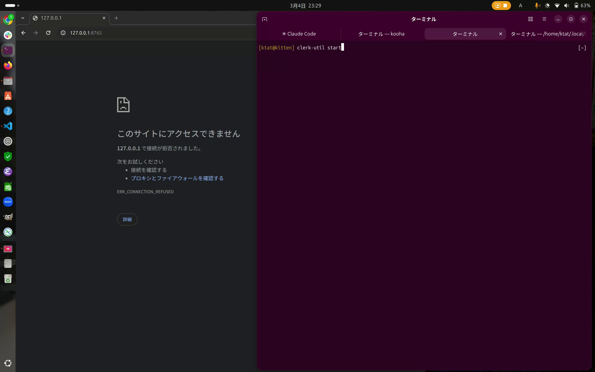

起動すると `http://127.0.0.1:8765` でダッシュボードにアクセスできます。

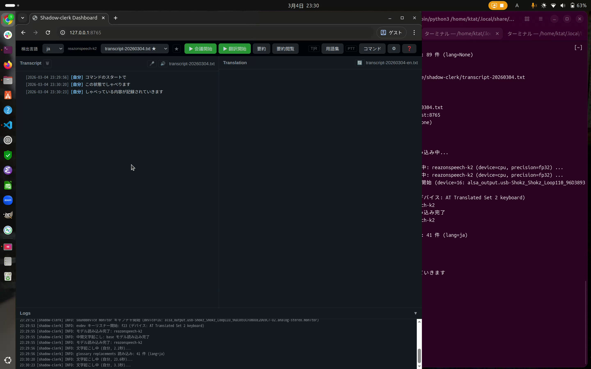

ダッシュボードはツールバー、Transcript / Translation の2ペイン、下部の Logs パネルで構成されています。ツールバーには言語選択、ASR モデル選択、録音制御、各種操作ボタンが並びます。

## リアルタイム文字起こし

デーモンが起動した状態で喋ると、左側の **Transcript** ペインにリアルタイムで内容が記録されていきます。話者ラベル（`[自分]`、`[Mx]` など）とタイムスタンプ付きで表示されます。

音声認識エンジンは以下から選択できます:

- **Whisper**（デフォルト）- 多言語対応
- **ReazonSpeech k2** - 日本語に特化、精度が高く軽量でおすすめ
- **Kotoba-Whisper** - 日本語に特化、large-v3 相当の精度

ダッシュボード左上の言語選択で認識言語を切り替えられます。Auto にすると Whisper による自動言語検出になります。

### 中間文字起こし（Interim Transcription）

`interim_transcription: true` に設定すると、発話途中の内容がリアルタイムに表示されます。確定前のテキストが逐次更新されるため、会議中の「今何を言っているか」がすぐにわかります。中間文字起こし用には軽量モデル（tiny / base）を別途指定できます。

## リアルタイム翻訳

**翻訳開始** ボタンを押すと、右側の **Translation** ペインにリアルタイムで翻訳結果が出力されます。

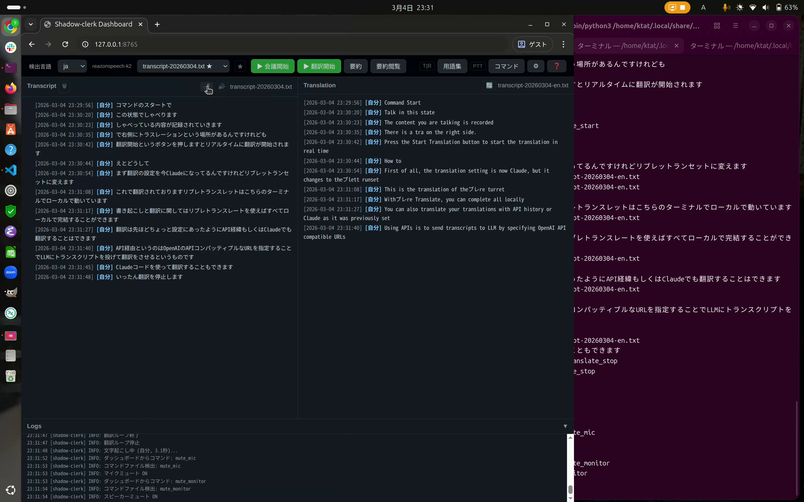

翻訳プロバイダは3種類から選べます:

| プロバイダ         | 特徴                                                                                      |
| ------------------ | ----------------------------------------------------------------------------------------- |
| **LibreTranslate** | ローカルで動作。文字起こしと翻訳をすべてローカルで完結できる                              |
| **Claude**         | Claude Code の subagent 経由で翻訳。API キー不要で高品質                                  |
| **API**            | OpenAI 互換 API エンドポイントを指定して翻訳（ローカル LLM や各種クラウドサービスに対応） |

LibreTranslate を使う場合は、別ターミナルでローカルサーバーを起動しておきます。

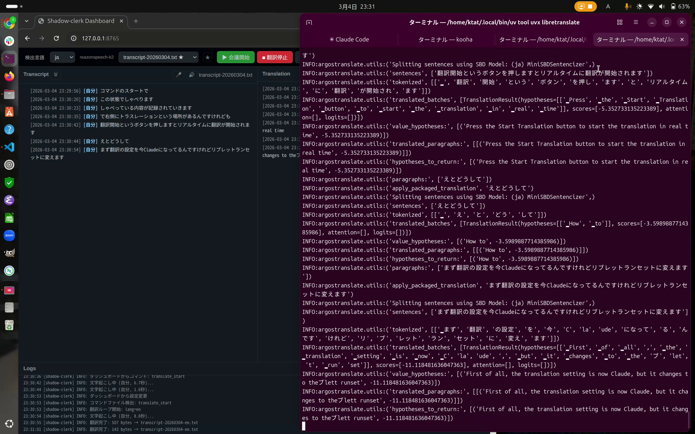

### 誤字訂正（翻訳前補正）

`libretranslate_spell_check: true` に設定すると、音声認識の誤字を T5 モデルで補正してから LibreTranslate に送信します。`spell-check` extra のインストールが必要です。

## マイク・スピーカーミュート

ツールバーの **マイクミュート** / **スピーカーミュート** ボタンで、一時的に文字起こしを停止できます。音声検出自体はバックグラウンドで動き続けますが、トランスクリプトへの書き込みが停止されます。

スピーカーからのシステム音声（会議の相手の声など）もトランスクリプトの対象にできます。

## アクティブファイルナビゲーション（★マーク）

ツールバーのファイル名の横に ★ マークが表示されることがあります。これは現在録音中（アクティブ）のトランスクリプトファイルを示しています。別のファイルを閲覧中でも、★ マークをクリックすると録音中のファイルにすぐ移動できます。

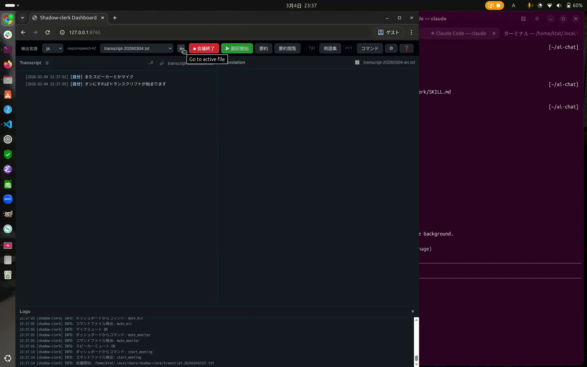

会議を開始すると、アクティブファイルが会議用ファイル（時刻付き）に切り替わり、★ マークもそちらに移動します。会議終了後は日付ファイルに自動的に戻ります。

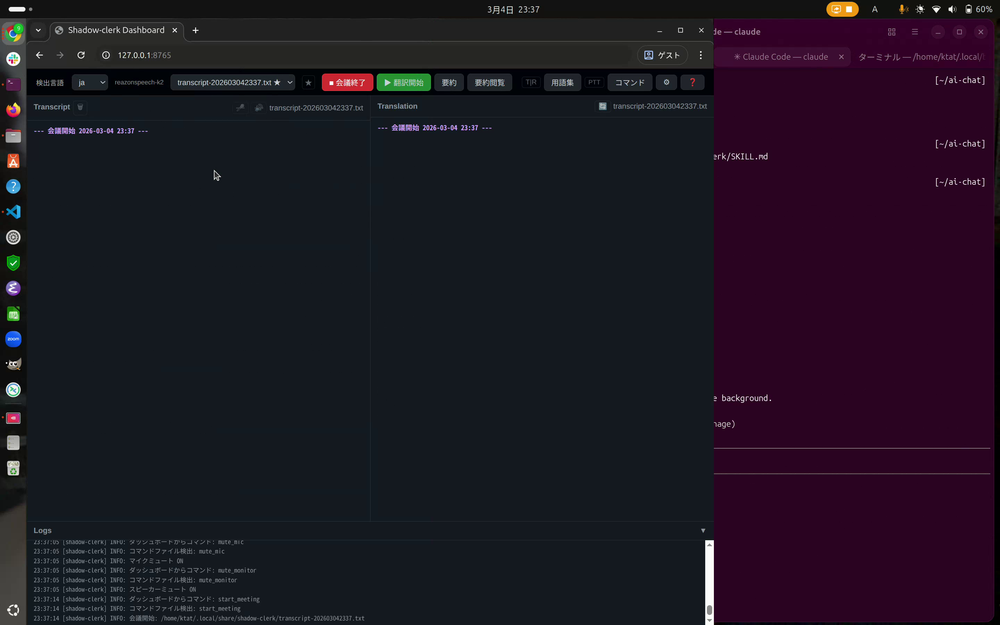

## 会議モード

**会議開始** ボタンで会議モードを開始できます。

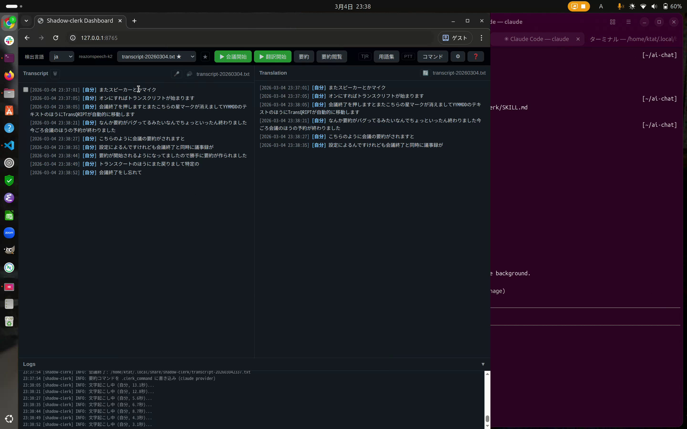

- 会議開始時に新しいトランスクリプトファイル（`YYYYMMDDHHMMSS.txt`）が作成される
- `--- 会議開始 ---` / `--- meeting end ---` マーカーがトランスクリプトに挿入される
- 通常のトランスクリプトは日付単位（`YYYYMMDD.txt`）だが、会議は時刻まで含むファイルに記録される

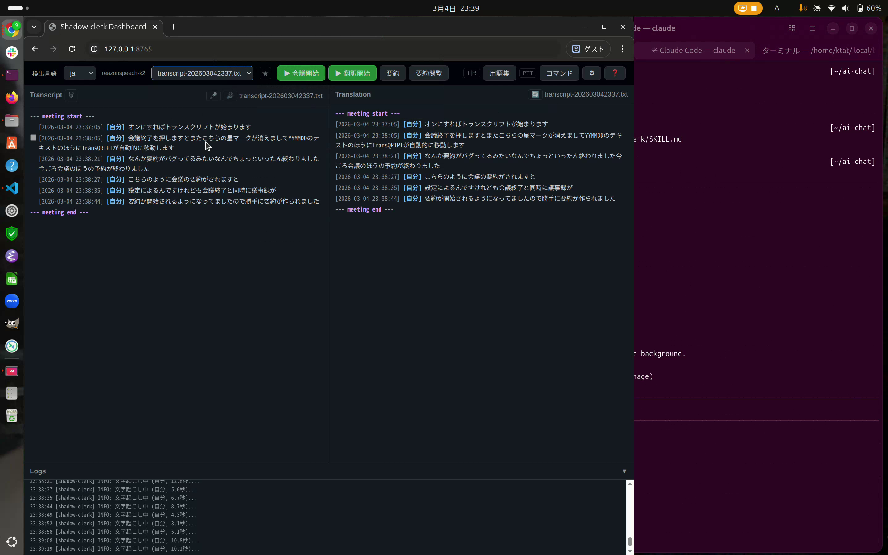

会議終了時には自動要約が生成されます（設定で Auto Summary を有効にしている場合）。

### 後から会議を切り出す

会議開始ボタンを押し忘れた場合でも、日付ファイルのトランスクリプトから特定の時間範囲を2箇所選択し、時計アイコンをクリックすることで、後から会議ファイルとして切り出すことができます。

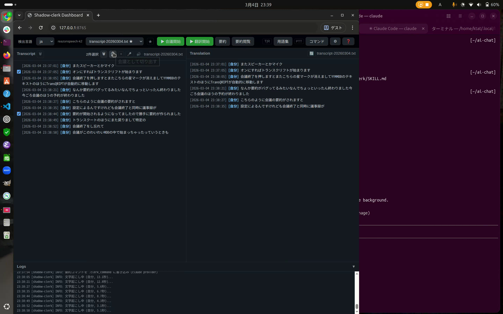

モーダルでは選択した時間範囲が表示され、「新規会議にする」か「既存の会議に追加」を選択できます。

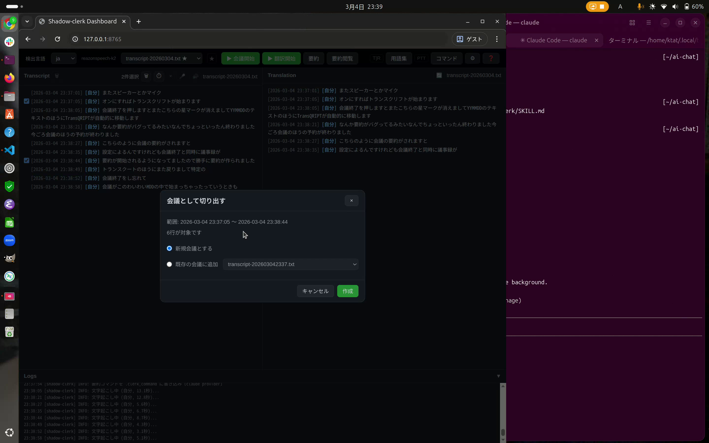

作成ボタンを押すと、新しい会議トランスクリプトファイルが生成されます。

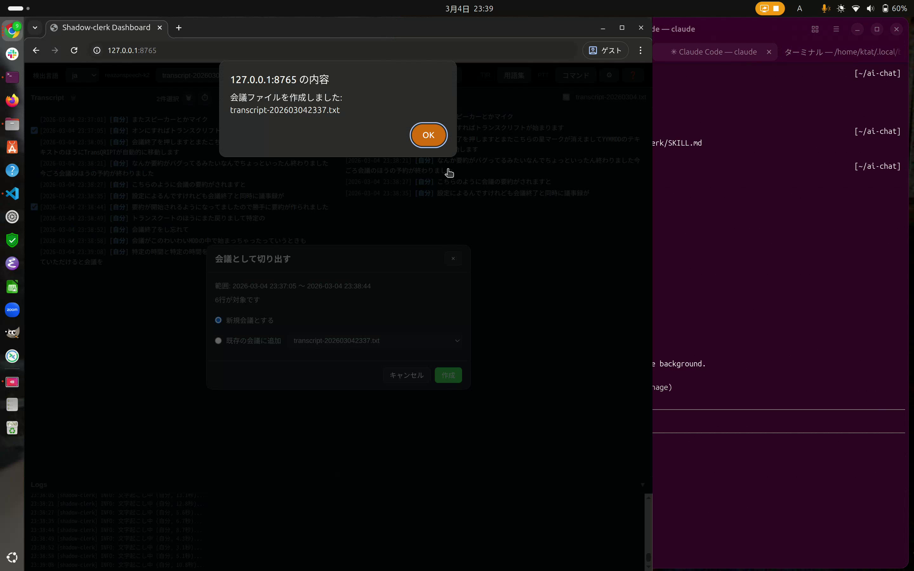

## トランスクリプトの編集

チェックボックスで行を複数選択し、ゴミ箱アイコンをクリックすると削除確認モーダルが表示されます。

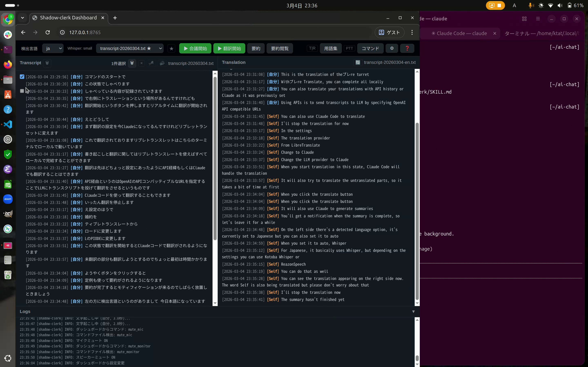

2箇所を選択すると、その間の行をまとめて削除対象にできます。

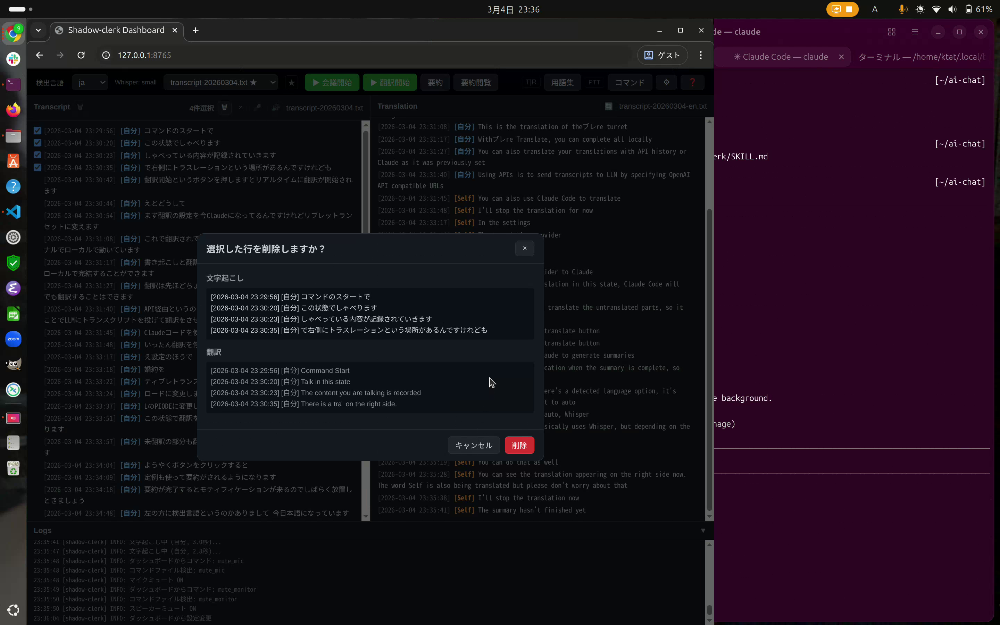

削除モーダルでは、対象となる文字起こしと翻訳の内容がプレビュー表示されます。確認後「削除」ボタンで削除されます。

また、トランスクリプト横のクリアボタンを押すとファイルごと削除する確認モーダルが表示されます。

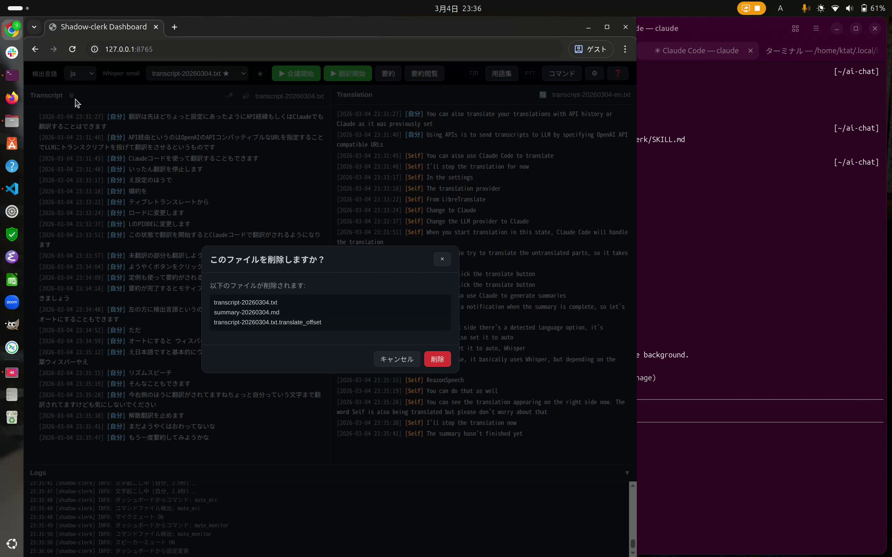

## Claude Code 連携

`clerk-util claude-setup` を実行すると、Claude Code にスキルが登録されます。

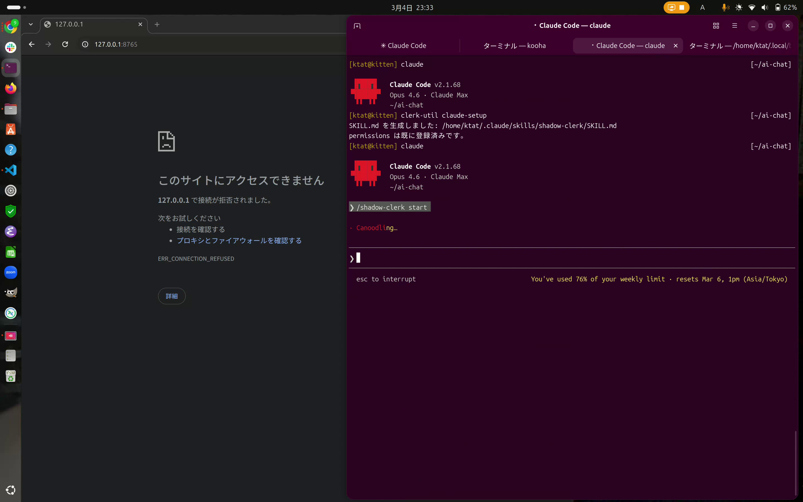

登録後は Claude Code 内から以下のコマンドが使えます:

| コマンド                             | 動作                             |
| ------------------------------------ | -------------------------------- |
| `/shadow-clerk start`                | デーモンをバックグラウンドで起動 |
| `/shadow-clerk stop`                 | デーモンを停止                   |
| `/shadow-clerk`                      | 差分テキストから議事録を更新     |
| `/shadow-clerk full`                 | 全文から議事録を再生成           |
| `/shadow-clerk status`               | 現在の状態を確認                 |
| `/shadow-clerk config show`          | 現在の設定を表示                 |
| `/shadow-clerk config set KEY VALUE` | 設定値を変更                     |

翻訳プロバイダを Claude に設定すると、Claude Code の subagent 経由で翻訳が行われます。翻訳結果は `~/.local/share/shadow-clerk/transcript-YYYYMMDD-<lang>.txt` に保存されます。

## 要約機能

**要約** ボタンをクリックすると、LLM を使ってトランスクリプトの要約が生成されます。要約ソースとして transcript（原文）または translation（翻訳文）を選べます。

会議モードでは、会議終了時に自動的に要約を生成する設定も可能です。

## 音声コマンド

PTT（Push-to-Talk）キーを押しながら音声を発すると、コマンドとして認識されます。

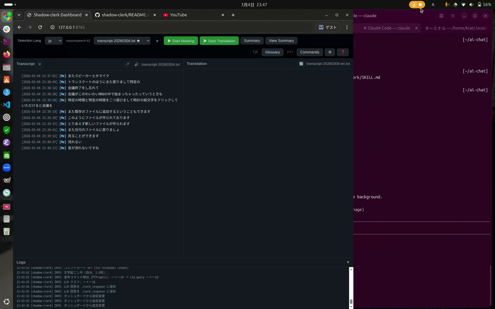

### PTT 方式（推奨）

PTT キー（デフォルト: F23 = Menu キー）を押しながらコマンドを発話します。プレフィックス不要で誤認識が少なく推奨です。

### プレフィックス方式

PTT キーを使わない場合でも、「シェルク、」に続けてコマンドを発話するとハンズフリーで操作できますが、正しく認識されないことが多いので、PTTキーを使うのがおすすめです。
WakeWordは設定で変更できます。

### カスタム音声コマンド

`config.yaml` の `custom_commands` に独自の音声コマンドを登録できます:

```yaml
custom_commands:
  - pattern: "youtube|ユーチューブ"
    action: "xdg-open https://www.youtube.com"
  - pattern: "gmail|メール"
    action: "xdg-open https://mail.google.com"
```

`pattern` は正規表現、`action` は実行するシェルコマンドです。組み込みコマンド（会議開始、翻訳開始など）にマッチしない場合に順番に評価されます。
Dashboardの、「コマンド」からの編集のほうがお手軽です。

## LLM レスポンス

組み込みコマンドにもカスタムコマンドにもマッチしない場合、LLM にフォールバックします。PTT キーを押しながら発話すると、内容が LLM に渡され、応答がダッシュボード上部に表示されます。

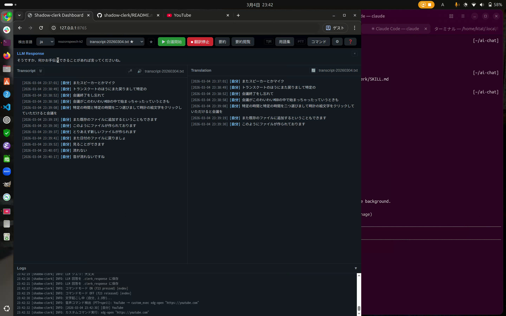

LLM プロバイダとして Claude や OpenAI 互換 API（ローカル LLM や各種クラウドサービス）を設定できます。

## 用語集（Glossary）

ダッシュボードの **Glossary** タブで用語集を管理できます。TSV 形式で専門用語を登録すると、翻訳精度の向上や、音声認識時のテキスト置換（reading ベース）に利用されます。用語集は `~/.local/share/shadow-clerk/glossary.txt` に保存されます。

## データディレクトリ

トランスクリプトや設定は `~/.local/share/shadow-clerk/` に保存されます:

| ファイル                        | 内容                       |
| ------------------------------- | -------------------------- |
| `transcript-YYYYMMDD.txt`       | 日付ごとの文字起こし       |
| `transcript-YYYYMMDDHHMMSS.txt` | 会議セッション用           |
| `transcript-YYYYMMDD-en.txt`    | 翻訳結果（言語コード付き） |
| `summary-YYYYMMDD.md`           | 議事録                     |
| `glossary.txt`                  | 用語集（TSV）              |
| `config.yaml`                   | 設定ファイル               |

## 設定

ツールバーの歯車アイコンから全設定をダッシュボードから変更できます。UI 言語も日本語・英語で切り替え可能です。

### 文字起こし設定

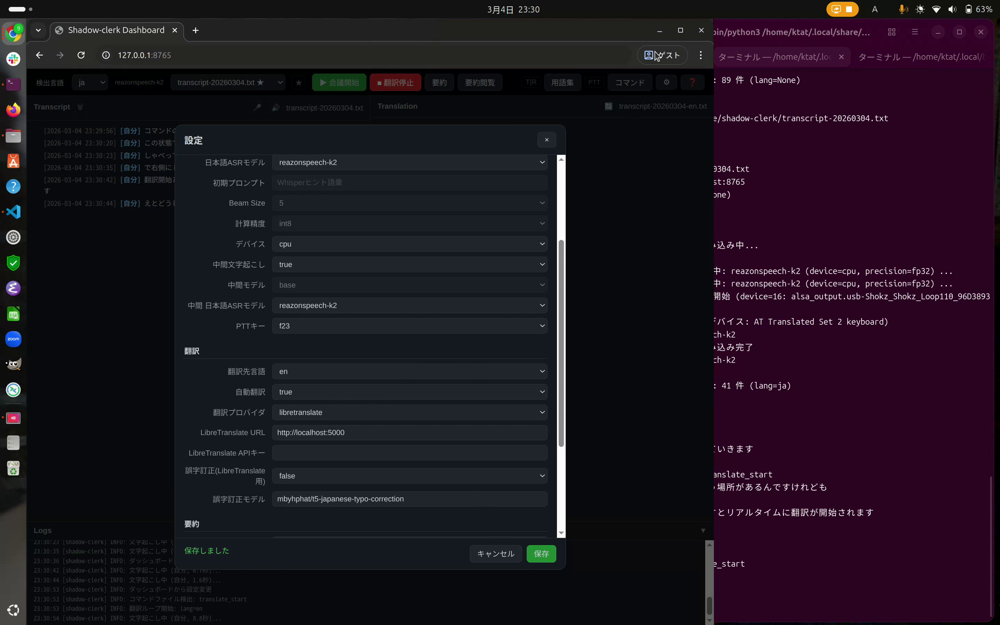

| 設定項目              | 説明                                                                  |
| --------------------- | --------------------------------------------------------------------- |
| Default Language      | デフォルトの認識言語（ja, en など）。ダッシュボード左上からも変更可能 |
| Whisper Model         | Whisper モデルサイズ（tiny / base / small / medium / large）          |
| Japanese ASR Model    | 日本語特化モデル（reazonspeech-k2 / kotoba-whisper / default）        |
| Initial Prompt        | Whisper の初期プロンプト                                              |
| Beam Size             | ビームサーチ幅。大きいほど精度が上がる                                |
| Device                | 推論デバイス（cpu / cuda）                                            |
| Interim Transcription | 中間文字起こし（発話途中のリアルタイム表示）の有効/無効               |
| PTT Key               | Push-to-Talk / コマンド用のキー割り当て（例: F23(メニューキー)）      |

### 翻訳・要約・LLM 設定

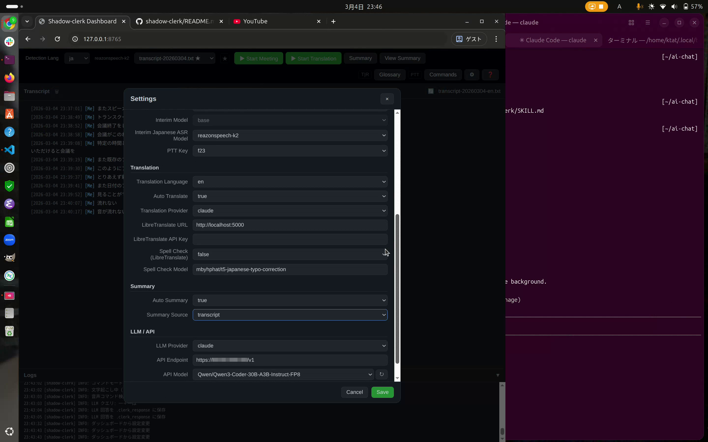

| セクション      | 主な設定項目                                                                          |
| --------------- | ------------------------------------------------------------------------------------- |
| **Translation** | 翻訳先言語、自動翻訳、翻訳プロバイダ（Claude / LibreTranslate / API）、スペルチェック |
| **Summary**     | 自動要約の有効/無効、要約ソース（transcript / translation）                           |
| **LLM / API**   | LLM プロバイダ、API エンドポイント、モデル選択                                        |

## まとめ

Shadow-Clerk の主な機能:

| 機能                       | 説明                                                                               |
| -------------------------- | ---------------------------------------------------------------------------------- |
| **リアルタイム文字起こし** | Whisper / ReazonSpeech / Kotoba-Whisper 対応。中間文字起こしも可能                 |
| **リアルタイム翻訳**       | Claude / LibreTranslate / OpenAI 互換 API。LibreTranslate ならすべてローカルで完結 |
| **会議モード**             | 開始/終了マーカー、自動要約生成、後からの切り出し                                  |
| **要約・LLM 連携**         | Claude / OpenAI 互換 API による要約生成・質問応答                                  |
| **音声コマンド**           | PTT / プレフィックス方式。カスタムコマンド登録、LLM フォールバック                 |
| **Claude Code 連携**       | スキル登録で起動・停止・議事録生成・設定変更を Claude Code から操作                |
| **誤字訂正**               | T5 モデルによる翻訳前の誤字補正                                                    |
| **用語集**                 | TSV 形式で専門用語を管理、翻訳精度向上                                             |
| **Web ダッシュボード**     | 全機能をブラウザから操作、設定変更もリアルタイム反映                               |
| **トランスクリプト管理**   | 行の削除、会議の切り出し、ファイル管理                                             |
