# Shadow-Clerk Feature Tour

Shadow-Clerk は、Web 会議の音声（自分のマイクとスピーカー出力）をリアルタイムに文字起こし・翻訳する常駐デーモンです。会議が終われば議事録を作り、会議中は AI アシスタントに論点を拾わせ、Claude と声で議論することもできます。操作はほぼすべてブラウザのダッシュボードから行います。Linux（PipeWire / PulseAudio）と Windows で動きます。

文字起こしと LibreTranslate による翻訳だけなら、外部 API も Claude Code も要りません。すべてローカルで完結します。それ以外の機能はすべてオプションです。

このツアーのスクリーンショットは、架空のチーム「acme」が架空のおやつ定期便サービス「おやつ便」の週次定例をしている、という設定で撮っています。UI は日本語、翻訳先は英語です。インストール手順や設定キーの一覧は [README](../README.ja.md) にあります。

## 起動

```bash
clerk-daemon -d          # バックグラウンドで起動（ログはデータディレクトリの daemon.log）
clerk-util stop          # 停止
```

`-d` を付けずに `clerk-daemon` と打てばフォアグラウンドで動き、`Ctrl+C` で止まります。起動したらブラウザで <http://localhost:8765> を開きます。

ダッシュボードは次の部分からできています。

- **ヘッダ**: 会議・翻訳の開始/停止、**要約**、**Claude と会議**、用語集、PTT、コマンド、⚙ 設定
- **左ペイン**: **日付** / **会議** / **検索** の3タブでファイルを選ぶ
- **中央**: Transcript と Translation。`T|R` ボタンで両方・片方だけを切り替える
- **右ペイン**: **議事録** / **AI分析** タブ
- **下部パネル**: **AI コンソール** / **Claude と会議** / **ログ**

## リアルタイム文字起こしと翻訳

デーモンが動いていれば、話した内容がそのまま Transcript に流れていきます。マイク側の発言は `[自分]`、スピーカー側（会議の相手）の発言は `[相手]` として、タイムスタンプ付きで記録されます。翻訳を開始すると、隣の Translation に訳が並びます。

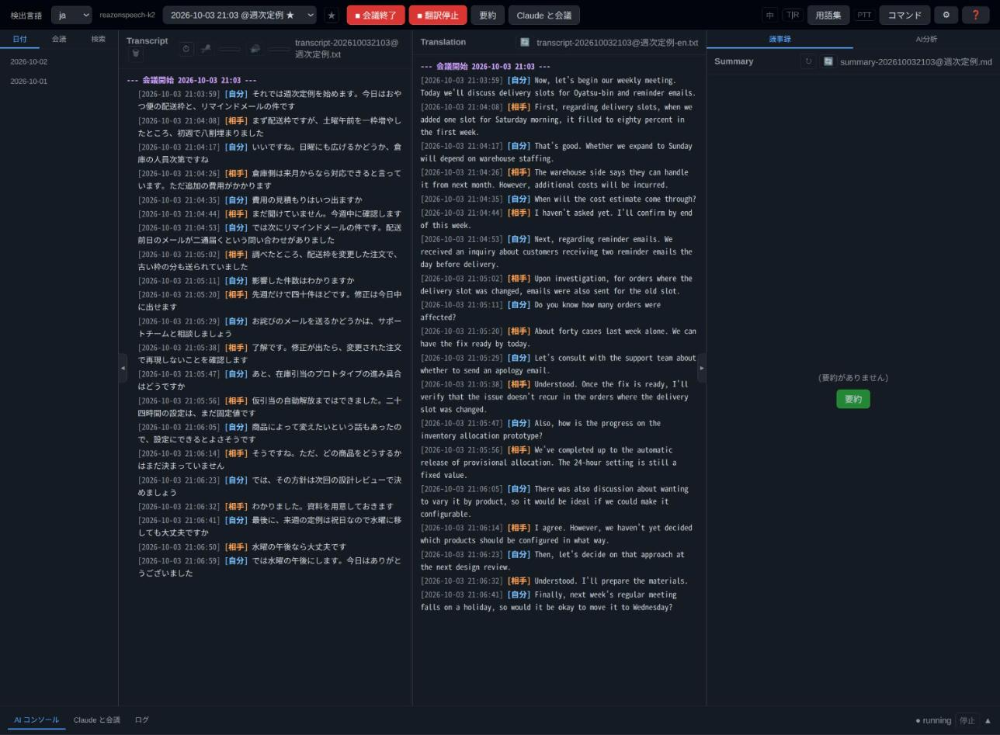

- **音声認識エンジン**: Whisper（既定）のほか、日本語なら ReazonSpeech k2 や Kotoba-Whisper を選べます
- **翻訳プロバイダ**: LibreTranslate（ローカル）、OpenAI 互換 API、Claude（`claude -p`）から選べます
- **中間文字起こし**: `interim_transcription` を有効にすると、発話が確定する前の途中経過も表示されます。軽いモデルを別に指定でき、途中経過の翻訳も出せます
- **誤字訂正**: LibreTranslate の前に T5 モデルで音声認識の誤字を直せます（`spell-check` extra）。LLM で翻訳する場合は、いったん平仮名で読み直させて同音の誤変換を拾わせるステップもあります
- **用語集**: 翻訳と要約は[用語集](#用語集と聞き間違い)を参照します。上の画面では「おやつ便」が「Oyatsu-bin」と訳されています
- **ミュート**: Transcript の上にあるマイク/スピーカーのボタンで、どちらかの書き起こしを一時的に止められます。横のバーは入力レベルで、定常的なノイズや無音のデバイスを色で知らせます

## 会議モード

ヘッダの **会議開始** を押すと会議セッションが始まり、その会議専用の transcript ファイルに記録が切り替わります。ボタンは **会議終了**（赤）に変わり、もう一度押すと終わります。音声コマンド（「会議開始」「会議終了」）や `clerk-util command start_meeting` でも同じことができ、Google カレンダー連携を有効にすれば予定に合わせて自動で始まり、自動で終わります。

- ボタンで始めた会議は名前なし（ad-hoc）で、ファイル名は `transcript-YYYYMMDDHHMM.txt` です。カレンダーの予定や、あとから付けた会議名があると `transcript-YYYYMMDDHHMM@週次定例.txt` のように名前が入ります
- 名前は Transcript 見出しの横の「会議に紐付ける」ボタンから、既存の会議名を選ぶか新しい名前を入れて付けられます
- `auto_translate: true` なら会議開始と同時に翻訳も始まります

**★ で録音中のファイルへ戻る。** ファイル選択のドロップダウンでは、いま録音しているファイルに ★ が付きます。過去のファイルを読んでいる最中でも、隣の ★ ボタンを押せば録音中のファイルに戻れます。会議が始まれば ★ は会議ファイルへ移り、終われば日付ファイルに戻ります。

**議事録。** 会議が終わったら、ヘッダの **要約** で議事録を作れます。`auto_summary: true` なら会議終了時に自動で作られます。結果は右ペインの **議事録** タブに表示され、コピー・再読み込み・再生成ができます。

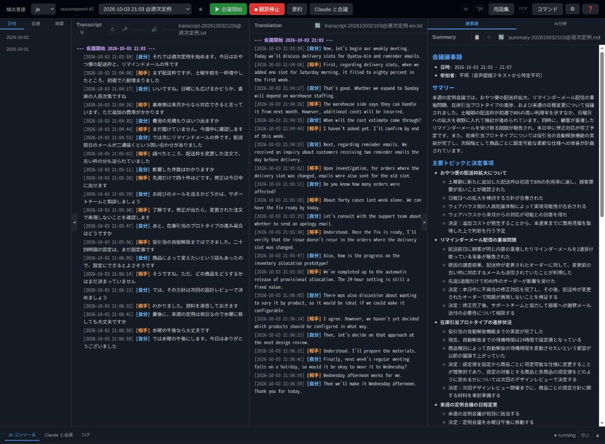

議事録の言語は `summary_language`、長さは `summary_length`（A4 換算で半ページから5ページ）で決まります。データディレクトリに `summary_template.md` を置けば、書式をそれに合わせられます。会議終了時に後述の AI コンソールが動いていれば、議事録はそのアシスタントが書きます（`auto_summary_via_console`、既定で有効）。

## リアルタイム AI 分析

会議中、AI アシスタントを「同席」させて、進行中の議論から論点を拾わせることができます。アシスタントはダッシュボード下部の **AI コンソール** 上で動く本物の Claude Code（または Codex）で、同梱の `/clerk-meeting-helper` スキルを使って transcript を監視します。

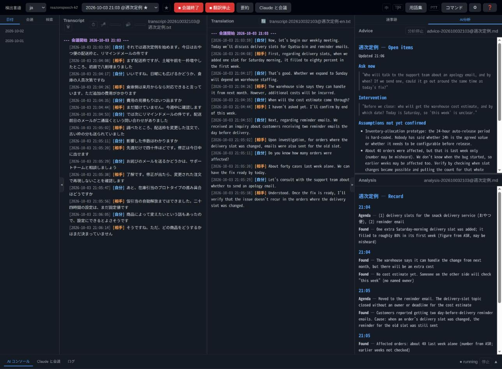

右ペインの **AI分析** タブには2つのファイルが表示されます。

- **Advice**（`advice-*.md`）: いま未解決のもの。「いま確認すべきこと」「進行への介入」「未確認のまま進んでいる前提」「期限・担当が未定」の見出しで、その場でそのまま言える文言として書かれます。毎回まとめ直して上書きされ、解決したものは消えていきます
- **Analysis**（`analysis-*.md`）: 確定した事実。時刻見出しの下に「議題」「判明」「決定」などが追記されていき、あとで議事録の素材になります

スキルは翻訳先の言語で書くので、上の画面では日本語の会議の分析が英語で出ています。

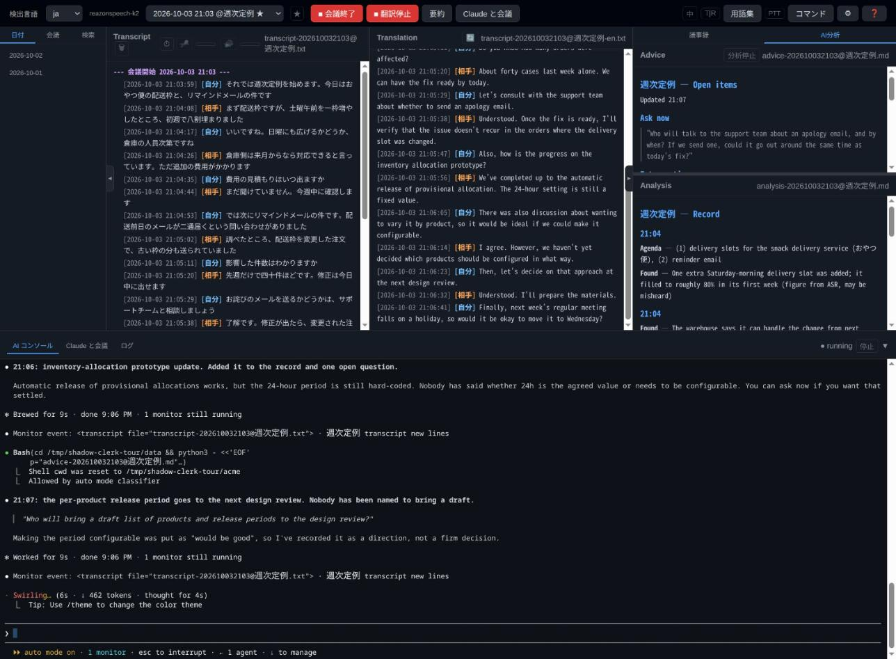

使い方:

1. **Claude Code か Codex を入れておく。** コンソールで起動するコマンドは `ai_assistant_command`（既定は `claude`）で決まります
2. **スキルを入れる。** 初回起動時の「ようこそ」ダイアログから入れるか、コマンドで入れます。`clerk-meeting-helper` と、後述の `clerk-talk` が一緒に入ります

   ```bash
   clerk-util install-skill                  # ~/.claude/skills/ (Claude Code)
   clerk-util install-skill --target agents  # ~/.agents/skills/ (Codex ほか)
   ```

3. **起動する。** `auto_analyze: true` なら会議開始と同時に起動します。手動なら **AI分析** タブの **分析開始** ボタンを押します。アシスタントの準備ができると、`/clerk-meeting-helper` が自動で送り込まれます

アシスタントは新しい発言を受け取るたびに Advice と Analysis を書き換え、コンソールにも何を記録したかを短く報告します。分析対象から外したい話題はデータディレクトリの `forbid-ai-analyze.txt` に書いておけます（設定画面からも編集できます）。

コンソールは会議が終わっても止まりません。同じセッションがそのまま会議の流れを踏まえて議事録を書けるようにするためです。止めるときはコンソールの **停止** ボタンを押します。アシスタントがファイル編集やコマンドを実行するときの許可は、通常の Claude Code の設定に従います。会議ごとに起動ディレクトリを変えたい場合は、会議一覧の ⚙ から指定します。

## Claude と会議

ヘッダの **Claude と会議** を押すと、議題について Claude と声で議論できます。Claude の発言は VOICEVOX で読み上げられ、自分の発言はいつもどおり文字起こしされて Claude に届きます。

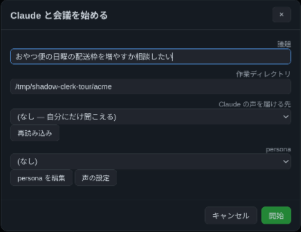

必要なものは Claude Code の CLI と、別プロセスで起動した VOICEVOX エンジン（既定は `http://localhost:50021`）、それにヘッドホンです。ダイアログでは次を決めます。

- **議題**: 空でも構いません。その場合は Claude が最初に何を話したいかを尋ねます
- **作業ディレクトリ**: Claude が会話中に読むファイルの置き場所です
- **persona**: Claude の性格や応答の仕方を名前を付けて保存しておけます。**persona を編集** で追加・変更します
- **声の設定**: VOICEVOX の話者と、話速・音高・抑揚・音量を試聴しながら調整できます

![Claude と会議の最中。文字起こしに [自分] と [Claude] の発言が交互に並び、下部の Claude と会議コンソールで clerk-talk スキルが読み上げと返事待ちを繰り返している](images/06_talk_mode.jpg)

会話中のヘッダには赤い **Claude 会議終了** ボタンと、議題・言語・VOICEVOX の話者が表示されます。

- **transcript に残る**: Claude の発言は `[Claude]` 行として transcript に書かれ、翻訳もされます。あとから議論を読み返せます
- **割り込める**: Claude は応答を短い文に区切って話すので、文の切れ目で割って入れます。「待って」「ストップ」のような制止の言葉（`talk_stop_words`）を言えば読み上げが止まり、どこで止まったかが Claude に伝わります
- **2つの動かし方**: 既定では Claude は下部の **Claude と会議** コンソールで `clerk-talk` スキルとして動きます。ファイル編集やコマンド実行も、通常の許可確認つきで頼めます。`talk_engine: headless` にすると裏で動く `claude -p` に切り替わり、少し速く応答しますが、許可を確認できないので使えるツールは `talk_allowed_tools` に限られます
- **会議アシスタントと併用できる**: `/clerk-meeting-helper` が同じ transcript を分析していれば、`clerk-talk` はその Advice も見ていて、会話が途切れたときに論点として切り出します
- **終わり方**: 会話を終えそうだと感じると Claude は声で確認し、はっきり了承されたときだけ自分で終えます。ダッシュボードのボタンでもいつでも終えられます

**Claude の声を会議アプリに届ける（Linux・PipeWire）。** ダイアログの **Claude の声を届ける先** で会議アプリを選ぶと、Claude の読み上げがそのアプリのマイク入力につながり、相手にも自分の声と一緒に届きます（一覧に出てこなければ **再読み込み**）。このときは相手の発言も `[相手]` として文字起こしされるので、Claude は相手の話も追えます。Claude 自身の声もスピーカー側に入ってきますが、読み上げ中（と終了直後のわずかな間）に始まった行は内容に関わらず捨てるので、自分の声に返事をすることはありません。届ける先を選んでいないときは、talk mode 中はスピーカー側を文字起こししません。この機能には `pw-dump`・`pw-link`・`pw-cat` が必要で、Windows では選べません。

## 過去の記録を探す

左ペインの3つのタブで過去の記録を開けます。

- **日付**: 日ごとの transcript です
- **会議**: 会議名ごとにまとめた会議ファイルです。会議名を選ぶとその回の一覧が開き、各回に付いたバッジで中身が分かります。**T** は翻訳、**S** は議事録、**A** は AI 分析（Advice か Analysis）があることを示します。✏ で会議名を変更でき、並び順は ABC 順と新しい順で切り替えられます。⚙ は会議ごとの AI コンソールの起動ディレクトリです

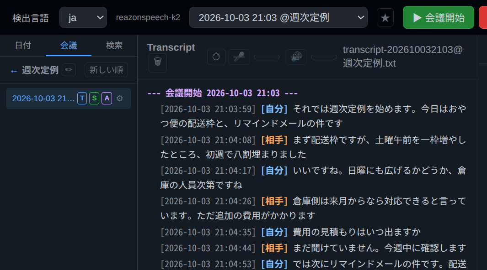

- **検索**: 年・月・日・時で絞り込み、キーワードで transcript・翻訳・議事録を横断検索します。対象は **全て** / **T**（文字起こし）/ **R**（翻訳）/ **S**（要約）から選べます

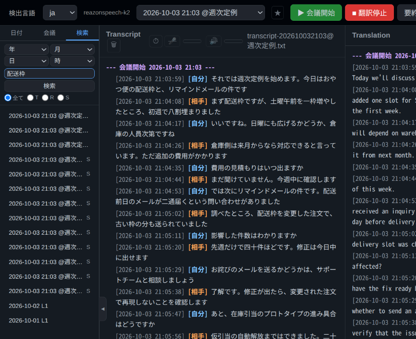

## あとから会議を切り出す

会議開始を押し忘れても、日付ファイルから会議を切り出せます。行のチェックボックスを2つ選ぶとその間が範囲になり、Transcript 見出しの ⏱ アイコンで切り出しダイアログを開きます。

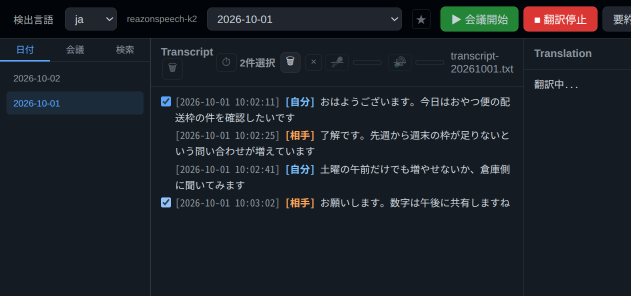

ダイアログでは次のどれかを選びます。

- **沈黙で分割する**: ファイル全体、または選択範囲を、指定した分数以上の沈黙を手がかりに自動で会議に分けます。1日に複数の会議があった日をまとめて整理するのに便利です
- **選択範囲を切り出す**: 選んだ範囲をそのまま1つの会議にします。新規会議にする場合は、名前なし（ad-hoc）・既存の会議名に紐付ける・新しい会議名を作る、から選べます。既存の会議ファイルに追記することもできます

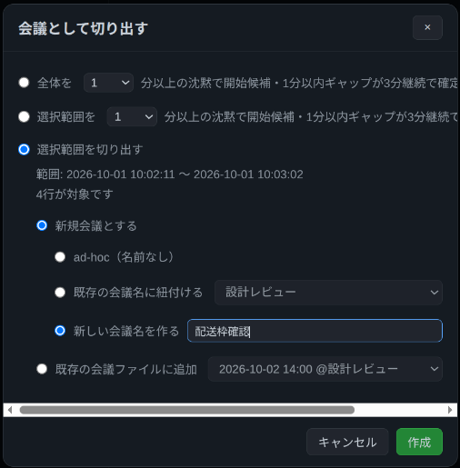

**作成** を押すと会議ファイルができ、会議タブから開けます。

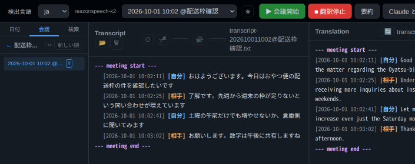

## transcript の編集

雑談や誤認識の行は消せます。チェックボックスで行を選び、ゴミ箱アイコンを押します。

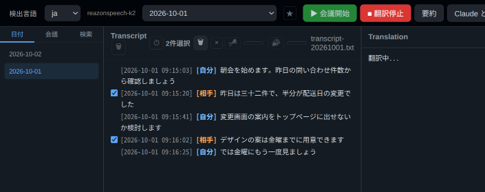

確認ダイアログでは、2行の間を **範囲内のすべてを削除** するか、**選択した行を削除** するかを選べます。対応する文字起こしと翻訳がプレビューされるので、確認してから削除できます。

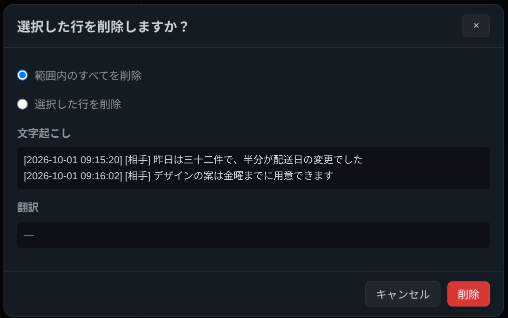

Transcript 見出しのゴミ箱ボタンでは、ファイルごと削除できます。会議ファイルの場合は、完全に削除するか、会議の行を日付ファイルに戻してから削除するかを選べます。

## 音声コマンド

- **PTT（推奨）**: PTT キー（既定は `f23`。キーリマッパーで Menu キーなどに割り当てる前提）を押しながら「会議開始」「翻訳開始」などと話すと、コマンドとして実行されます。ウェイクワードは要りません
- **ウェイクワード**: キーを使わずに「シェルク、会議開始」のように話すこともできます（`sheruku` などの表記揺れも受け付けます）。誤認識が多いので PTT のほうが確実です。ウェイクワードは設定で変えられます
- **カスタムコマンド**: ヘッダの **コマンド** から、正規表現のパターンと実行するシェルコマンドの組を登録できます。PTT で話した内容がパターンに一致すると実行されます

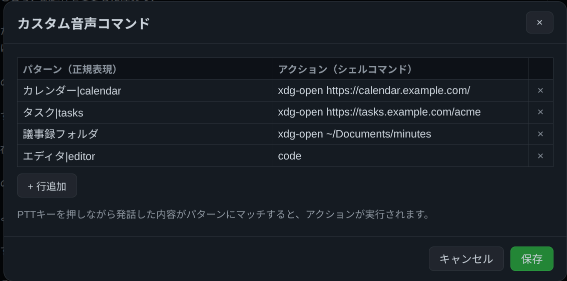

- **LLM への質問**: 組み込みコマンドにもカスタムコマンドにも一致せず、LLM が使える設定なら、話した内容が LLM への質問として送られ、回答がダッシュボードに表示されます

## 用語集と聞き間違い

ヘッダの **用語集** で `glossary.txt` を編集できます。言語ごとの表記（`ja`, `en` …）と `reading`（読み）、`note` の列を持つ TSV です。

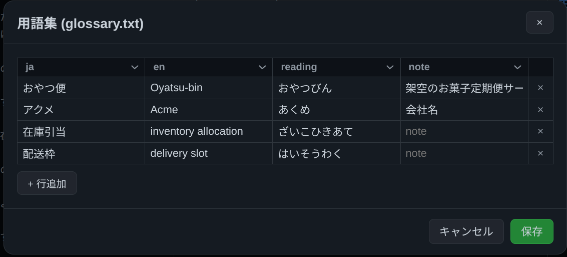

- 翻訳と要約のプロンプトに渡され、訳語の統一や誤変換の修正に使われます
- 文字起こしの結果に `reading` 列の読みがそのまま現れたら、その用語の表記に置き換えます（読みはカンマ区切りで複数書けます）

用語集とは別に、`misheard.tsv` には「実際の語」と「聞き間違えた表記」の対が貯まっていきます。これは transcript には適用されず、`clerk-meeting-helper` と `clerk-talk` の両スキルが発言を読み解く手がかりとして読みます。スキルは会議中に新しい崩れを見つけると、自分でこのファイルに追記していきます。

## 設定

ヘッダの ⚙ で設定ダイアログが開きます。ほとんどの項目はここから変えられ、`config.yaml` に保存されます。

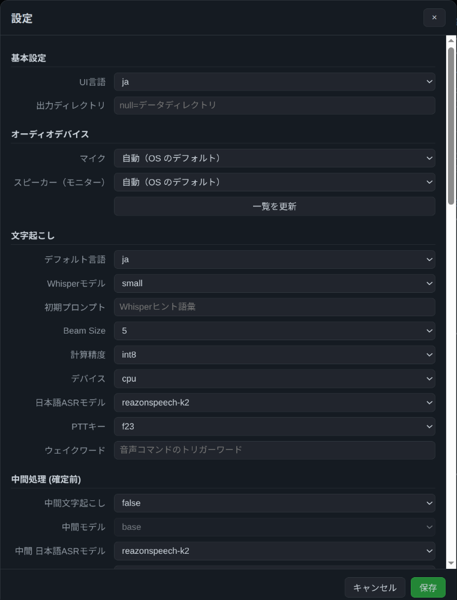

- **基本設定**: UI 言語（日本語/英語）、出力ディレクトリ
- **オーディオデバイス**: マイクとスピーカー（モニター）を名前で選びます。あとから挿したデバイスは **一覧を更新** で現れます
- **文字起こし**: 言語、Whisper モデル、日本語 ASR モデル、PTT キー、ウェイクワードなど
- **中間処理**: 中間文字起こしと、そのモデル

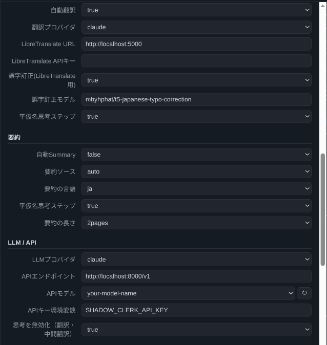

- **翻訳**: 自動翻訳、翻訳プロバイダ、LibreTranslate、誤字訂正、平仮名の読み直しステップ
- **要約**: 自動要約、要約ソース、要約の言語、長さ
- **LLM / API**: LLM プロバイダ（`claude` / `api`）、OpenAI 互換 API のエンドポイントとモデル

すべての設定キーと既定値は README の[設定](../README.ja.md#設定)にあります。`clerk-util read-config` / `clerk-util write-config-value <key> <value>` でコマンドラインからも変えられます。

## Google カレンダーとブラウザのスクリーンショット

**Google カレンダー連携**: `gcal` extra を入れて OAuth 認証すると、デーモンがカレンダーを定期的に確認し、予定の時刻に合わせて会議を自動で開始・終了します。会議ファイルには予定のタイトルが会議名として付き、招待者は参加予定者として議事録の上に表示されます。設定方法は [docs/google-calendar-setup.ja.md](google-calendar-setup.ja.md) を参照してください。

**ブラウザのスクリーンショット**: [`extension/`](../extension/) の Chrome 拡張で表示中のタブ（画面共有など）をキャプチャすると、画像がデータディレクトリに保存され、録音中の transcript に `[画面]` 行が1行加わります。発言と画面が同じ時系列に並ぶので、「この枠のところ」といった発言もあとから読み解けます。詳しくは [extension/README.md](../extension/README.md) にあります。

## データディレクトリ

記録や設定は `~/.local/share/shadow-clerk/`（Windows では `%APPDATA%\shadow-clerk`）に保存されます。主なファイル:

| ファイル | 内容 |
| --- | --- |
| `transcript-YYYYMMDD.txt` | 日付ごとの文字起こし |
| `transcript-YYYYMMDDHHMM[@会議名].txt` | 会議ごとの文字起こし |
| `transcript-…-<lang>.txt` | 翻訳（例: `-en`） |
| `summary-….md` | 議事録 |
| `advice-….md` / `analysis-….md` | AI コンソールの未解決事項 / 確定事項 |
| `glossary.txt` | 用語集（TSV） |
| `misheard.tsv` | スキルが集めた聞き間違いの対 |
| `meeting.yaml` | 会議ごとの設定（AI コンソールの起動ディレクトリなど） |
| `config.yaml` | 設定ファイル |

全体の一覧は README の[ファイル構成](../README.ja.md#ファイル構成)にあります。

## まとめ

| 機能 | 内容 |
| --- | --- |
| リアルタイム文字起こし・翻訳 | Whisper / ReazonSpeech / Kotoba-Whisper、LibreTranslate / OpenAI 互換 API / Claude。ローカルだけでも完結 |
| 会議モードと議事録 | ボタン・音声・カレンダーで開始と終了。議事録は自動でも手動でも |
| リアルタイム AI 分析 | AI コンソールの Claude Code / Codex が会議中に未解決の論点と確定事項を書き出す |
| Claude と会議 | VOICEVOX の声で Claude と議論。Linux + PipeWire なら会議アプリにも参加させられる |
| 記録の整理 | 日付・会議・検索タブ、あとからの会議の切り出し、行やファイルの削除 |
| 音声コマンド | PTT・ウェイクワード・カスタムコマンド・LLM への質問 |
| 用語集と聞き間違い | 翻訳・要約の精度を上げ、スキルが文脈を読み解く手がかりにする |
