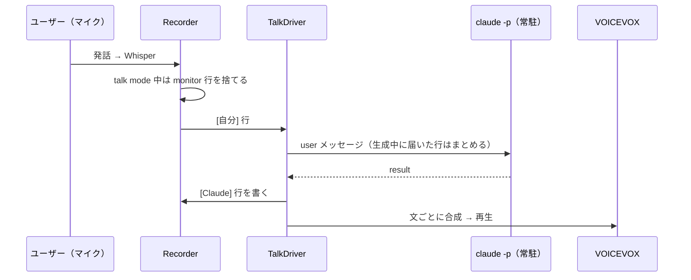

# Claude Talk Mode Implementation Plan

> **For agentic workers:** REQUIRED SUB-SKILL: Use superpowers:subagent-driven-development (recommended) or superpowers:executing-plans to implement this plan task-by-task. Steps use checkbox (`- [ ]`) syntax for tracking.

**Goal:** ダッシュボードのトグルで「Claude と会議」モードに入り、ユーザーの発話（`[自分]` 行）に daemon が常駐させた `claude -p` が応答し、その応答を `[Claude]` 行として transcript に書きつつ VOICEVOX で読み上げる。

**Architecture:** `TalkDriver`（`_daemon_talk.py`）が状態を持ち、Recorder の書き込み箇所から `[自分]` 行を受け取って `ClaudeTalkProcess`（stream-json の常駐 claude）へ送る。応答は `TtsPlayer`（合成と再生のパイプライン）と transcript の両方に流す。talk mode 中は `TalkDriver.is_suppressed("monitor")` で monitor の文字起こしを捨てる。

**Tech Stack:** Python 3.11+, sounddevice, numpy, 標準ライブラリの `urllib` / `wave` / `subprocess`、VOICEVOX エンジン（HTTP、別プロセス）、Claude Code CLI（`claude -p --input-format stream-json --output-format stream-json`）

**Spec:** `improvement/claude-talk-mode.md`

## Global Constraints

- すべての `.py` は `from __future__ import annotations` で始め、全関数に引数と戻り値の型注釈を付ける
- 1ファイル 700 行以内（`_daemon_dashboard_js_console.py` は既に超えているので触らない）
- ログは `logging.getLogger("shadow-clerk")`。`print` はしない
- import は `from shadow_clerk.X import ...`
- ユーザーに見える文字列はすべて `i18n.py` の `t()` を通す（`_i18n_ja.py` と `_i18n_en.py` の両方に足す）。`t()` の kwargs に `key` や Python の組み込み名を使わない
- 固有名詞（会社名・人名・社内の名前）をコード・テスト・ドキュメントに書かない。サードパーティ（VOICEVOX、Claude Code、PipeWire）は可
- 値オブジェクトは `domain/` に `@dataclass(frozen=True)` で置く
- 設定キーは既存に合わせてフラットな `talk_*`。`DEFAULT_CONFIG` に無いキーは `/api/config` の保存で捨てられるので、必ず `DEFAULT_CONFIG` に足す
- 出力デバイスは名前で解決する（index は不安定）
- テストは `uv run python tests/<file>.py`（pytest ではない）。`check(label, ok, detail)` で PASS/FAIL を出し、最後に失敗があれば `sys.exit(1)`
- Python は常に `uv run python`
- コミットメッセージは英語。末尾に `Co-Authored-By: Claude Opus 5.5 <noreply@anthropic.com>`

## Review Focus

1. **Claude の応答に改行や Markdown が混ざる** → transcript の1行形式（`[ts] [Claude] text`）が壊れず、改行・連続空白は1つの空白になる（Task 5 のテスト）
2. **Claude が応答を作っている間にユーザーが続けて話す** → 行が失われず、応答完了後に1メッセージにまとめて送られる。talk mode 終了後に届いた行は無視される（Task 5）
3. **トグルの二重押し・停止中の停止** → 二重起動せず、例外も出ない（Task 5）
4. **会話中に VOICEVOX が落ちる** → 合成スレッドが死なず、`[Claude]` 行の書き込みは続き、エラーが status に出る（Task 2 と Task 5）
5. **`claude` が見つからない／起動直後に落ちる** → talk mode が開始状態で残らず、monitor の抑制も解除される（Task 5）

---

## File Structure

| ファイル | 責務 | 種別 |
|---|---|---|
| `src/shadow_clerk/domain/speaker.py` | `Speaker.CLAUDE` を追加 | Modify |
| `src/shadow_clerk/domain/talk_persona.py` | `TalkPersona` 値オブジェクトと解決ロジック | Create |
| `src/shadow_clerk/domain/__init__.py` | `TalkPersona` を export | Modify |
| `src/shadow_clerk/_daemon_constants.py` | `talk_*` の既定値 | Modify |
| `src/shadow_clerk/_daemon_tts.py` | `TtsBackend` Protocol、文分割、`TtsPlayer`、デバイス再生 | Create |
| `src/shadow_clerk/_daemon_tts_voicevox.py` | VOICEVOX バックエンド | Create |
| `src/shadow_clerk/talk_prompts/ja.md` | 会話役の同梱プロンプト（日本語） | Create |
| `src/shadow_clerk/_daemon_talk_prompt.py` | 会話言語の決定と system prompt の組み立て | Create |
| `src/shadow_clerk/_daemon_talk_claude.py` | 常駐 claude プロセス（stream-json）と argv 組み立て | Create |
| `src/shadow_clerk/_daemon_talk.py` | `TalkDriver`（状態・ターン制御・出力） | Create |
| `src/shadow_clerk/_daemon_recorder_transcribe.py` | 書き込みの共通化、抑制フック、`[自分]` 通知、`TalkDriver` の生成と停止 | Modify |
| `src/shadow_clerk/_daemon_dashboard_base.py` | 共通の JSON ボディ読み取り、ルーティング、`/api/status` に `talk` | Modify |
| `src/shadow_clerk/_daemon_dashboard_ops_console.py` | `_console_body` を共通ヘルパに委譲 | Modify |
| `src/shadow_clerk/_daemon_dashboard_ops_talk.py` | `/api/talk-mode`、`/api/say` | Create |
| `src/shadow_clerk/_daemon_dashboard_handler.py` | talk ops ミックスインを追加 | Modify |
| `src/shadow_clerk/_daemon_dashboard_js_talk.py` | トグル・開始モーダル・persona エディタの JS | Create |
| `src/shadow_clerk/_daemon_dashboard_js.py` | talk JS を連結 | Modify |
| `src/shadow_clerk/_daemon_dashboard_js_core.py` | 話者クラスの共通化（`[Claude]` の色）、status から `updateTalk` | Modify |
| `src/shadow_clerk/_daemon_dashboard_html.py` | トグルボタン、2つのモーダル | Modify |
| `src/shadow_clerk/_daemon_dashboard_css.py` | `--claude` 色、`.sp-c`、persona テーブル | Modify |
| `src/shadow_clerk/_i18n_ja.py` / `_i18n_en.py` | 文言 | Modify |
| `pyproject.toml` | `talk_prompts/*.md` を package-data に | Modify |
| `README.md` / `README.ja.md` / `SPEC.md` | 使い方と設計 | Modify |

---

### Task 1: Domain — `Speaker.CLAUDE` と `TalkPersona`

**Files:**
- Modify: `src/shadow_clerk/domain/speaker.py`
- Create: `src/shadow_clerk/domain/talk_persona.py`
- Modify: `src/shadow_clerk/domain/__init__.py`
- Test: `tests/test_talk_persona.py`

**Interfaces:**
- Produces:
  - `Speaker.CLAUDE`（値 `"Claude"`）
  - `TalkPersona(name: str, instructions: str)`
  - `TalkPersona.all_from_config(raw: object) -> dict[str, TalkPersona]`
  - `TalkPersona.resolve(personas: dict[str, TalkPersona], requested: str | None, default: str | None) -> TalkPersona | None`
    - `requested is None` → `default` の persona（無ければ `None`）
    - `requested == ""` → `None`（明示的に persona なし）
    - 名前 → その persona。無ければ警告ログを出して `default` の persona

- [ ] **Step 1: Write the failing test**

`tests/test_talk_persona.py`:

```python
"""TalkPersona の検証

実行: uv run python tests/test_talk_persona.py
"""
from __future__ import annotations
import sys

from shadow_clerk.domain import Speaker, TalkPersona, TranscriptLine

results: list[bool] = []


def check(label: str, ok: bool, detail: str = "") -> None:
    print(f"[{'PASS' if ok else 'FAIL'}] {label} {detail}")
    results.append(ok)


_RAW = {"devil": "あえて反対の立場から突っ込む", "coach": "  質問で考えを引き出す  ",
        "empty": "   ", 3: "数字の名前", "bad": 42}


def test_from_config() -> None:
    ps = TalkPersona.all_from_config(_RAW)
    check("文字列の記述だけを拾う", set(ps) == {"devil", "coach", "3"}, repr(sorted(ps)))
    check("記述の前後空白を落とす", ps["coach"].instructions == "質問で考えを引き出す")
    check("dict 以外は空", TalkPersona.all_from_config(["x"]) == {})


def test_resolve() -> None:
    ps = TalkPersona.all_from_config(_RAW)
    check("指定なしは既定", TalkPersona.resolve(ps, None, "coach") == ps["coach"])
    check("空文字は persona なし", TalkPersona.resolve(ps, "", "coach") is None)
    check("名前指定", TalkPersona.resolve(ps, "devil", "coach") == ps["devil"])
    check("未知の名前は既定", TalkPersona.resolve(ps, "nope", "coach") == ps["coach"])
    check("既定も無ければ None", TalkPersona.resolve(ps, None, "nope") is None)


def test_claude_speaker() -> None:
    tl = TranscriptLine.parse("[2026-10-02 10:00:00] [Claude] こんにちは")
    check("[Claude] 行を Claude として読む", tl is not None and tl.speaker == Speaker.CLAUDE, repr(tl))


if __name__ == "__main__":
    test_from_config()
    test_resolve()
    test_claude_speaker()
    sys.exit(0 if all(results) else 1)
```

- [ ] **Step 2: Run test to verify it fails**

Run: `uv run python tests/test_talk_persona.py`
Expected: `ImportError: cannot import name 'TalkPersona'`

- [ ] **Step 3: Implement**

`src/shadow_clerk/domain/speaker.py` の `OTHER` の下に追加:

```python
    CLAUDE = "Claude"  # Claude talk mode の発言（音声入力からは来ないので from_source の対象外）
```

`src/shadow_clerk/domain/talk_persona.py`:

```python
"""shadow-clerk domain: Claude talk mode の persona バリューオブジェクト"""
from __future__ import annotations

import logging
from dataclasses import dataclass

logger = logging.getLogger("shadow-clerk")


@dataclass(frozen=True)
class TalkPersona:
    """会話役 Claude の性格・応答の仕方。name は config の key、instructions は自由記述。"""

    name: str
    instructions: str

    @classmethod
    def all_from_config(cls, raw: object) -> dict[str, TalkPersona]:
        """config の talk_personas（name → 記述）から作る。空や文字列以外の記述は捨てる。"""
        if not isinstance(raw, dict):
            return {}
        return {str(k): cls(str(k), v.strip()) for k, v in raw.items()
                if isinstance(v, str) and v.strip()}

    @classmethod
    def resolve(cls, personas: dict[str, TalkPersona], requested: str | None,
                default: str | None) -> TalkPersona | None:
        """None → 既定、"" → persona なし、名前 → その persona（無ければ既定）。"""
        if requested == "":
            return None
        if requested is not None:
            if requested in personas:
                return personas[requested]
            logger.warning("talk: persona %r が見つからないため既定を使います", requested)
        return personas.get(default or "")
```

`src/shadow_clerk/domain/__init__.py`: `from shadow_clerk.domain.talk_persona import TalkPersona` を追加し、`__all__` に `"TalkPersona"` を足す。

- [ ] **Step 4: Run test to verify it passes**

Run: `uv run python tests/test_talk_persona.py`
Expected: 全行 `[PASS]`、終了コード 0

- [ ] **Step 5: Commit**

```bash
git add src/shadow_clerk/domain/speaker.py src/shadow_clerk/domain/talk_persona.py src/shadow_clerk/domain/__init__.py tests/test_talk_persona.py
git commit -m "Add Claude speaker and TalkPersona value object"
```

---

### Task 2: TTS — 再生パイプラインと VOICEVOX バックエンド

**Files:**
- Modify: `src/shadow_clerk/_daemon_constants.py`（`DEFAULT_CONFIG` の末尾、`skill_update_dismissed_version` の後）
- Create: `src/shadow_clerk/_daemon_tts.py`
- Create: `src/shadow_clerk/_daemon_tts_voicevox.py`
- Modify: `src/shadow_clerk/_i18n_ja.py`, `src/shadow_clerk/_i18n_en.py`
- Test: `tests/test_tts.py`

**Interfaces:**
- Produces:
  - `class TtsError(Exception)`
  - `class TtsBackend(Protocol)`: `LANGUAGES: tuple[Language, ...]`, `DEFAULT_LANGUAGE: Language`, `check() -> None`（届かなければ `TtsError`）, `synthesize(text: str) -> tuple[np.ndarray, int]`（float32 モノラル PCM とサンプルレート）, `credit() -> str`
  - `split_sentences(text: str) -> list[str]`
  - `resample(pcm: np.ndarray, src: int, dst: int) -> np.ndarray`
  - `PlayFn = Callable[[np.ndarray, int], None]`
  - `play_on_devices(device_names: list[str]) -> PlayFn`
  - `TtsPlayer(backend: TtsBackend, play: PlayFn, on_error: Callable[[str], None])` — `speak(text: str) -> None`, `close(discard_pending: bool = True) -> None`
  - `VoicevoxBackend(url: str, speaker_id: int, timeout: float = 15.0)`
  - `make_backend(config: dict) -> TtsBackend`
  - `make_player(backend: TtsBackend, config: dict, on_error: Callable[[str], None]) -> TtsPlayer`

- [ ] **Step 1: Write the failing test**

`tests/test_tts.py`:

```python
"""TTS パイプラインと VOICEVOX バックエンドの検証

実行: uv run python tests/test_tts.py
"""
from __future__ import annotations
import io
import json
import sys
import threading
import wave
from http.server import BaseHTTPRequestHandler, ThreadingHTTPServer
from urllib.parse import parse_qs, urlparse

import numpy as np

from shadow_clerk._daemon_tts import TtsError, TtsPlayer, resample, split_sentences
from shadow_clerk._daemon_tts_voicevox import VoicevoxBackend
from shadow_clerk.domain import Language

results: list[bool] = []


def check(label: str, ok: bool, detail: str = "") -> None:
    print(f"[{'PASS' if ok else 'FAIL'}] {label} {detail}")
    results.append(ok)


def test_split() -> None:
    got = split_sentences("こんにちは。調子はどう？\nいいね! 次へ")
    check("句点・疑問符・改行で分ける", got == ["こんにちは。", "調子はどう？", "いいね!", "次へ"], repr(got))
    check("空白だけは空", split_sentences("  \n ") == [])


def test_resample() -> None:
    pcm = np.linspace(-1, 1, 24000, dtype=np.float32)
    out = resample(pcm, 24000, 48000)
    check("長さが比率どおり", len(out) == 48000, str(len(out)))
    check("dtype は float32", out.dtype == np.float32)
    check("同じレートはそのまま", resample(pcm, 24000, 24000) is pcm)


class _FakeBackend:
    LANGUAGES = (Language.JA,)
    DEFAULT_LANGUAGE = Language.JA

    def __init__(self, fail_on: str = "") -> None:
        self.fail_on = fail_on

    def check(self) -> None:
        pass

    def credit(self) -> str:
        return "fake"

    def synthesize(self, text: str) -> tuple[np.ndarray, int]:
        if text == self.fail_on:
            raise TtsError("boom")
        return np.full(10, len(text), dtype=np.float32), 24000


def test_player_order_and_errors() -> None:
    played: list[float] = []
    errors: list[str] = []
    p = TtsPlayer(_FakeBackend(fail_on="だめ。"), lambda pcm, sr: played.append(float(pcm[0])),
                  errors.append)
    p.speak("あ。だめ。いいい。")
    p.close(discard_pending=False)
    check("失敗した文を飛ばして順に再生する", played == [2.0, 4.0], repr(played))
    check("失敗を on_error に通知する", errors == ["boom"], repr(errors))


def _wav_bytes(samples: np.ndarray, sr: int) -> bytes:
    buf = io.BytesIO()
    with wave.open(buf, "wb") as w:
        w.setnchannels(1)
        w.setsampwidth(2)
        w.setframerate(sr)
        w.writeframes((samples * 32767).astype("<i2").tobytes())
    return buf.getvalue()


class _MockVoicevox(BaseHTTPRequestHandler):
    calls: list[str] = []

    def log_message(self, format: str, *args: object) -> None:
        pass

    def _reply(self, body: bytes, ctype: str) -> None:
        self.send_response(200)
        self.send_header("Content-Type", ctype)
        self.send_header("Content-Length", str(len(body)))
        self.end_headers()
        self.wfile.write(body)

    def do_GET(self) -> None:
        u = urlparse(self.path)
        self.calls.append(f"GET {u.path}")
        if u.path == "/version":
            self._reply(b'"0.0.0"', "application/json")
        elif u.path == "/speakers":
            body = [{"name": "テスト話者", "styles": [{"id": 3, "name": "ノーマル"}]}]
            self._reply(json.dumps(body).encode(), "application/json")

    def do_POST(self) -> None:
        u = urlparse(self.path)
        q = parse_qs(u.query)
        length = int(self.headers.get("Content-Length", 0))
        body = self.rfile.read(length)
        self.calls.append(f"POST {u.path} {q.get('text', [''])[0]} {q.get('speaker', [''])[0]}")
        if u.path == "/audio_query":
            self._reply(json.dumps({"q": q["text"][0]}).encode(), "application/json")
        elif u.path == "/synthesis":
            assert json.loads(body)["q"] == "テスト"
            self._reply(_wav_bytes(np.zeros(240, dtype=np.float32), 24000), "audio/wav")


def test_voicevox() -> None:
    srv = ThreadingHTTPServer(("127.0.0.1", 0), _MockVoicevox)
    threading.Thread(target=srv.serve_forever, daemon=True).start()
    url = f"http://127.0.0.1:{srv.server_address[1]}"
    try:
        vv = VoicevoxBackend(url, 3)
        vv.check()
        pcm, sr = vv.synthesize("テスト")
        check("audio_query → synthesis の順に呼ぶ",
              _MockVoicevox.calls[-2:] == ["POST /audio_query テスト 3", "POST /synthesis  3"],
              repr(_MockVoicevox.calls))
        check("WAV を float32 にデコード", sr == 24000 and pcm.dtype == np.float32 and len(pcm) == 240)
        check("クレジットに話者名", vv.credit() == "VOICEVOX:テスト話者", vv.credit())
    finally:
        srv.shutdown()
        srv.server_close()
    try:
        VoicevoxBackend(url, 3, timeout=1).check()
        check("停止中のエンジンは TtsError", False)
    except TtsError:
        check("停止中のエンジンは TtsError", True)


if __name__ == "__main__":
    test_split()
    test_resample()
    test_player_order_and_errors()
    test_voicevox()
    sys.exit(0 if all(results) else 1)
```

- [ ] **Step 2: Run test to verify it fails**

Run: `uv run python tests/test_tts.py`
Expected: `ModuleNotFoundError: No module named 'shadow_clerk._daemon_tts'`

- [ ] **Step 3: Add config defaults**

`src/shadow_clerk/_daemon_constants.py` の `DEFAULT_CONFIG` 末尾（`"skill_update_dismissed_version": "",` の次）に追加:

```python
    # Claude talk mode
    "talk_voicevox_url": "http://localhost:50021",
    "talk_speaker_id": 3,
    "talk_output_devices": [],      # 再生先のデバイス名。空ならデフォルト出力
    "talk_model": "",               # 空なら claude の既定
    "talk_allowed_tools": "WebSearch,WebFetch,Read,Grep,Glob",
    "talk_language": "",            # 空なら translate_language。TTS 非対応ならその既定言語
    "talk_personas": {},            # name → 性格・応答の仕方
    "talk_default_persona": "",
```

- [ ] **Step 4: Implement `_daemon_tts.py`**

```python
"""Shadow-clerk daemon: TTS の共通インターフェースと再生パイプライン"""
from __future__ import annotations

import logging
import queue
import re
import threading
from typing import Callable, Protocol

import numpy as np

from shadow_clerk.domain import Language

logger = logging.getLogger("shadow-clerk")

PlayFn = Callable[[np.ndarray, int], None]

# 句点・感嘆符・疑問符の直後と改行で切る。1文目の再生を早く始めるため
_SENTENCE_BREAK = re.compile(r"(?<=[。！？!?])|\n")


class TtsError(Exception):
    """TTS エンジンに届かない・合成に失敗した"""


class TtsBackend(Protocol):
    LANGUAGES: tuple[Language, ...]
    DEFAULT_LANGUAGE: Language

    def check(self) -> None: ...
    def synthesize(self, text: str) -> tuple[np.ndarray, int]: ...
    def credit(self) -> str: ...


def split_sentences(text: str) -> list[str]:
    return [s.strip() for s in _SENTENCE_BREAK.split(text) if s.strip()]


def resample(pcm: np.ndarray, src: int, dst: int) -> np.ndarray:
    """線形補間でリサンプルする。音声合成の出力を読み上げるだけなので品質はこれで足りる"""
    if src == dst:
        return pcm
    n = int(len(pcm) * dst / src)
    return np.interp(np.linspace(0, len(pcm) - 1, n), np.arange(len(pcm)), pcm).astype(np.float32)


def _resolve_output(name: str) -> int | None:
    import sounddevice as sd
    for i, dev in enumerate(sd.query_devices()):
        if dev["name"] == name and dev["max_output_channels"] > 0:
            return i
    logger.warning("talk: 出力デバイス %r が見つからないためデフォルト出力に出します", name)
    return None


def _play_one(pcm: np.ndarray, sr: int, device: int | None) -> None:
    import sounddevice as sd
    try:
        sd.check_output_settings(device=device, samplerate=sr, channels=1, dtype="float32")
    except Exception:
        target = int(sd.query_devices(device, kind="output")["default_samplerate"])
        pcm, sr = resample(pcm, sr, target), target
    with sd.OutputStream(samplerate=sr, channels=1, dtype="float32", device=device) as stream:
        stream.write(pcm.reshape(-1, 1))


def play_on_devices(device_names: list[str]) -> PlayFn:
    """名前で指定した出力デバイスすべてに同時に再生する関数を返す。空ならデフォルト出力"""
    def play(pcm: np.ndarray, sr: int) -> None:
        targets = [_resolve_output(n) for n in device_names] or [None]
        threads = [threading.Thread(target=_play_one, args=(pcm, sr, d), daemon=True) for d in targets]
        for th in threads:
            th.start()
        for th in threads:
            th.join()
    return play


class TtsPlayer:
    """文を受け取り、合成スレッドと再生スレッドで回す。1文目の再生中に2文目を合成する"""

    def __init__(self, backend: TtsBackend, play: PlayFn, on_error: Callable[[str], None]) -> None:
        self._backend = backend
        self._play = play
        self._on_error = on_error
        self._texts: queue.Queue[str | None] = queue.Queue()
        self._audio: queue.Queue[tuple[np.ndarray, int] | None] = queue.Queue(maxsize=2)
        self._threads = [threading.Thread(target=self._synth_loop, name="tts-synth", daemon=True),
                         threading.Thread(target=self._play_loop, name="tts-play", daemon=True)]
        for th in self._threads:
            th.start()

    def speak(self, text: str) -> None:
        for sentence in split_sentences(text):
            self._texts.put(sentence)

    def close(self, discard_pending: bool = True) -> None:
        if discard_pending:
            while True:
                try:
                    self._texts.get_nowait()
                except queue.Empty:
                    break
        self._texts.put(None)
        for th in self._threads:
            th.join(timeout=30)

    def _synth_loop(self) -> None:
        while (text := self._texts.get()) is not None:
            try:
                self._audio.put(self._backend.synthesize(text))
            except Exception as e:
                logger.warning("talk: 合成に失敗: %s", e)
                self._on_error(str(e))
        self._audio.put(None)

    def _play_loop(self) -> None:
        while (item := self._audio.get()) is not None:
            try:
                self._play(*item)
            except Exception as e:
                logger.warning("talk: 再生に失敗: %s", e)
                self._on_error(str(e))


def make_backend(config: dict) -> TtsBackend:
    from shadow_clerk._daemon_tts_voicevox import VoicevoxBackend
    return VoicevoxBackend(str(config.get("talk_voicevox_url") or ""),
                           int(config.get("talk_speaker_id") or 0))


def make_player(backend: TtsBackend, config: dict, on_error: Callable[[str], None]) -> TtsPlayer:
    return TtsPlayer(backend, play_on_devices(list(config.get("talk_output_devices") or [])), on_error)
```

- [ ] **Step 5: Implement `_daemon_tts_voicevox.py`**

```python
"""Shadow-clerk daemon: VOICEVOX エンジン（HTTP）の TTS バックエンド

エンジンは別プロセスで動かす。LGPL のエンジンはこのリポジトリに含めない。
"""
from __future__ import annotations

import io
import json
import logging
import urllib.error
import urllib.request
import wave
from urllib.parse import urlencode

import numpy as np

from shadow_clerk._daemon_tts import TtsError
from shadow_clerk.domain import Language
from shadow_clerk.i18n import t

logger = logging.getLogger("shadow-clerk")


class VoicevoxBackend:
    LANGUAGES = (Language.JA,)
    DEFAULT_LANGUAGE = Language.JA

    def __init__(self, url: str, speaker_id: int, timeout: float = 15.0) -> None:
        self._url = url.rstrip("/")
        self._speaker = speaker_id
        self._timeout = timeout

    def _request(self, path: str, body: bytes | None = None) -> bytes:
        req = urllib.request.Request(f"{self._url}{path}", data=body,
                                     headers={"Content-Type": "application/json"},
                                     method="POST" if body is not None else "GET")
        try:
            with urllib.request.urlopen(req, timeout=self._timeout) as resp:
                return resp.read()
        except (urllib.error.URLError, OSError) as e:
            raise TtsError(t("talk.voicevox_unreachable", url=self._url, error=str(e))) from e

    def check(self) -> None:
        self._request("/version")

    def synthesize(self, text: str) -> tuple[np.ndarray, int]:
        query = self._request("/audio_query?" + urlencode({"text": text, "speaker": self._speaker}), b"")
        wav = self._request(f"/synthesis?speaker={self._speaker}", query)
        with wave.open(io.BytesIO(wav), "rb") as w:
            frames = np.frombuffer(w.readframes(w.getnframes()), dtype="<i2")
            pcm = frames.reshape(-1, w.getnchannels())[:, 0].astype(np.float32) / 32768.0
            return pcm, w.getframerate()

    def credit(self) -> str:
        """利用規約が求めるクレジット表記（VOICEVOX:キャラ名）。取れなければ VOICEVOX だけ"""
        try:
            for sp in json.loads(self._request("/speakers")):
                if any(st.get("id") == self._speaker for st in sp.get("styles", [])):
                    return f"VOICEVOX:{sp['name']}"
        except (TtsError, ValueError, KeyError, TypeError) as e:
            logger.debug("talk: VOICEVOX の話者名を取れません: %s", e)
        return "VOICEVOX"
```

`_i18n_ja.py` に追加:

```python
    "talk.voicevox_unreachable": "VOICEVOX エンジンに接続できません ({url}): {error}",
```

`_i18n_en.py` に追加:

```python
    "talk.voicevox_unreachable": "Cannot reach the VOICEVOX engine ({url}): {error}",
```

- [ ] **Step 6: Run test to verify it passes**

Run: `uv run python tests/test_tts.py`
Expected: 全行 `[PASS]`

- [ ] **Step 7: Commit**

```bash
git add src/shadow_clerk/_daemon_constants.py src/shadow_clerk/_daemon_tts.py src/shadow_clerk/_daemon_tts_voicevox.py src/shadow_clerk/_i18n_ja.py src/shadow_clerk/_i18n_en.py tests/test_tts.py
git commit -m "Add TTS pipeline with a VOICEVOX backend"
```

---

### Task 3: 会話言語と system prompt

**Files:**
- Create: `src/shadow_clerk/talk_prompts/ja.md`
- Create: `src/shadow_clerk/_daemon_talk_prompt.py`
- Modify: `pyproject.toml`（`[tool.setuptools.package-data]`）
- Test: `tests/test_talk_prompt.py`

**Interfaces:**
- Consumes: `TtsBackend`（Task 2）、`TalkPersona`（Task 1）
- Produces:
  - `requested_language(config: dict) -> str` — `talk_language` → `translate_language` → `""`
  - `resolve_talk_language(requested: str, backend: TtsBackend) -> Language`
  - `build_system_prompt(lang: Language, persona: TalkPersona | None, topic: str) -> str` — 同梱プロンプト → `## Persona` → `## Topic` の順。persona が `None` なら `## Persona` 節なし、topic が空なら `## Topic` 節なし
  - `KICKOFF_MESSAGE: str`

- [ ] **Step 1: Write the failing test**

`tests/test_talk_prompt.py`:

```python
"""会話言語の決定と system prompt の組み立ての検証

実行: uv run python tests/test_talk_prompt.py
"""
from __future__ import annotations
import sys

from shadow_clerk._daemon_talk_prompt import (
    build_system_prompt, requested_language, resolve_talk_language)
from shadow_clerk.domain import Language, TalkPersona

results: list[bool] = []


def check(label: str, ok: bool, detail: str = "") -> None:
    print(f"[{'PASS' if ok else 'FAIL'}] {label} {detail}")
    results.append(ok)


class _JaOnly:
    LANGUAGES = (Language.JA,)
    DEFAULT_LANGUAGE = Language.JA


class _JaEn:
    LANGUAGES = (Language.JA, Language.EN)
    DEFAULT_LANGUAGE = Language.EN


def test_language() -> None:
    check("対応言語はそのまま", resolve_talk_language("en", _JaEn()) == Language.EN)
    check("非対応はバックエンドの既定", resolve_talk_language("en", _JaOnly()) == Language.JA)
    check("未知のコードも既定", resolve_talk_language("xx", _JaEn()) == Language.EN)
    check("空も既定", resolve_talk_language("", _JaOnly()) == Language.JA)
    check("talk_language を優先",
          requested_language({"talk_language": "ja", "translate_language": "en"}) == "ja")
    check("空なら translate_language",
          requested_language({"talk_language": "", "translate_language": "en"}) == "en")


def test_prompt() -> None:
    p = build_system_prompt(Language.JA, TalkPersona("devil", "反対の立場から話す"), "新機能の設計")
    base_end = p.index("## Persona")
    check("同梱プロンプトが先頭", p.startswith("あなたは") and base_end > 0, p[:20])
    check("persona → topic の順", base_end < p.index("反対の立場") < p.index("## Topic") < p.index("新機能の設計"))
    bare = build_system_prompt(Language.JA, None, "")
    check("persona も topic も無ければ節を出さない", "## Persona" not in bare and "## Topic" not in bare)


if __name__ == "__main__":
    test_language()
    test_prompt()
    sys.exit(0 if all(results) else 1)
```

- [ ] **Step 2: Run test to verify it fails**

Run: `uv run python tests/test_talk_prompt.py`
Expected: `ModuleNotFoundError: No module named 'shadow_clerk._daemon_talk_prompt'`

- [ ] **Step 3: Write the bundled prompt**

`src/shadow_clerk/talk_prompts/ja.md`:

```markdown
あなたはユーザーと音声で議論する相手です。あなたの発言は音声合成で読み上げられ、ユーザーの発言は音声認識の結果として届きます。

- 日本語で話す
- 1〜3文で短く話す。長い説明が要るときは区切り、相手の反応を待つ
- Markdown、箇条書き、記号、URL、コードは使わない。読み上げてそのまま伝わる文だけにする
- 質問は一度に1つにする
- ユーザーの発言は音声認識の結果なので、誤認識や言い淀みを含む。意味が通らなければ推測し、重要なところは聞き返す
- 1回の入力に複数の発言がまとめて届くことがある。続けて話された1つの発言として扱う
- 議題から逸れたら戻す。結論が出たら要点を短く確認する
- 議題が示されていなければ、最初に何について話したいかを尋ねる
- 調べものが必要なら使えるツールで調べてから答える。相手を待たせるので、必要なときだけにする
```

`pyproject.toml` の package-data を変更:

```toml
shadow_clerk = ["skills/**/*.md", "talk_prompts/*.md"]
```

- [ ] **Step 4: Implement `_daemon_talk_prompt.py`**

```python
"""Shadow-clerk daemon: Claude talk mode の会話言語と system prompt"""
from __future__ import annotations

import logging
import os

from shadow_clerk._daemon_tts import TtsBackend
from shadow_clerk.domain import Language, TalkPersona

logger = logging.getLogger("shadow-clerk")

_PROMPT_DIR = os.path.join(os.path.dirname(__file__), "talk_prompts")

# 会話の口火。返答の言語は system prompt 側で決まるので英語で足りる
KICKOFF_MESSAGE = ("Start the session. Ask your first question about the topic, "
                   "or ask what to talk about if no topic is given.")


def requested_language(config: dict) -> str:
    return str(config.get("talk_language") or config.get("translate_language") or "")


def resolve_talk_language(requested: str, backend: TtsBackend) -> Language:
    """希望言語を TTS が読めればそれを、読めなければ TTS の既定言語を返す"""
    lang = Language.coerce(requested) if requested else None
    if isinstance(lang, Language) and lang in backend.LANGUAGES:
        return lang
    if requested:
        logger.info("talk: %s は TTS が非対応のため %s で話します",
                    requested, backend.DEFAULT_LANGUAGE.value)
    return backend.DEFAULT_LANGUAGE


def build_system_prompt(lang: Language, persona: TalkPersona | None, topic: str) -> str:
    with open(os.path.join(_PROMPT_DIR, f"{lang.value}.md"), encoding="utf-8") as f:
        parts = [f.read().strip()]
    if persona is not None:
        parts.append(f"## Persona\n\n{persona.instructions}")
    if topic.strip():
        parts.append(f"## Topic\n\n{topic.strip()}")
    return "\n\n".join(parts)
```

- [ ] **Step 5: Run test to verify it passes**

Run: `uv run python tests/test_talk_prompt.py`
Expected: 全行 `[PASS]`

- [ ] **Step 6: Commit**

```bash
git add src/shadow_clerk/talk_prompts/ja.md src/shadow_clerk/_daemon_talk_prompt.py pyproject.toml tests/test_talk_prompt.py
git commit -m "Add talk mode prompt and language resolution"
```

---

### Task 4: 常駐 claude プロセス（stream-json）

**Files:**
- Create: `src/shadow_clerk/_daemon_talk_claude.py`
- Test: `tests/test_talk_claude.py`

**Interfaces:**
- Consumes: `sanitized_env()`（`_daemon_console.py`）
- Produces:
  - `build_claude_argv(config: dict, system_prompt: str) -> list[str]`
  - `ClaudeTalkProcess(argv: list[str], workdir: str, on_reply: Callable[[str], None], on_exit: Callable[[int | None], None])`
    - `start() -> None` — 起動できなければ `OSError` をそのまま投げる
    - `send(text: str) -> None` — user メッセージを1行の JSON で書く
    - `stop() -> None` — 冪等。`stop()` による終了では `on_exit` を呼ばない
    - `on_reply` は `result` イベントごとに1回呼ばれる。成功なら `result` の文字列、エラーなら `""`

stream-json の実測（Claude Code CLI）:
- 入力は1行1メッセージ: `{"type":"user","message":{"role":"user","content":"..."}}`
- 出力は `system`（`init` など）、`assistant`、`rate_limit_event`、`result` が1行ずつ流れる。1ターンの確定は `{"type":"result","subtype":"success","result":"<最終テキスト>",...}`
- `--setting-sources ""` と `--strict-mcp-config` を付けると、ユーザー設定の hooks・プラグイン・MCP を読まずに起動する（OAuth 認証は生きる）。`--tools` で使えるツール自体が絞られる

- [ ] **Step 1: Write the failing test**

`tests/test_talk_claude.py`:

```python
"""常駐 claude プロセスの検証（偽 claude スクリプトを使う）

実行: uv run python tests/test_talk_claude.py
"""
from __future__ import annotations
import os
import sys
import tempfile
import threading

from shadow_clerk._daemon_talk_claude import ClaudeTalkProcess, build_claude_argv

results: list[bool] = []


def check(label: str, ok: bool, detail: str = "") -> None:
    print(f"[{'PASS' if ok else 'FAIL'}] {label} {detail}")
    results.append(ok)


# 受け取った user メッセージごとに init / 非 JSON 行 / assistant / result を返す。
# 引数 "die" なら何も読まずに終了コード 3 で落ちる
_FAKE = r'''
import json, sys
if sys.argv[1:] == ["die"]:
    sys.exit(3)
for line in sys.stdin:
    msg = json.loads(line)["message"]["content"]
    print(json.dumps({"type": "system", "subtype": "init"}), flush=True)
    print("not json", flush=True)
    print(json.dumps({"type": "assistant", "message": {"content": [{"type": "text", "text": "x"}]}}), flush=True)
    if msg == "fail":
        print(json.dumps({"type": "result", "subtype": "error_during_execution", "is_error": True}), flush=True)
    else:
        print(json.dumps({"type": "result", "subtype": "success", "result": "echo:" + msg}), flush=True)
'''


def _fake_script() -> str:
    path = os.path.join(tempfile.mkdtemp(), "fake_claude.py")
    with open(path, "w", encoding="utf-8") as f:
        f.write(_FAKE)
    return path


def test_roundtrip() -> None:
    replies: list[str] = []
    got = threading.Event()

    def on_reply(text: str) -> None:
        replies.append(text)
        if len(replies) == 2:
            got.set()

    exits: list[int | None] = []
    proc = ClaudeTalkProcess([sys.executable, _fake_script()], tempfile.gettempdir(),
                             on_reply, exits.append)
    proc.start()
    proc.send("こんにちは\n改行入り")
    proc.send("fail")
    got.wait(10)
    proc.stop()
    check("result ごとに応答を返す", replies == ["echo:こんにちは\n改行入り", ""], repr(replies))
    check("stop() では on_exit を呼ばない", exits == [], repr(exits))
    proc.stop()
    check("stop() は二度呼べる", True)


def test_exit_notified() -> None:
    done = threading.Event()
    exits: list[int | None] = []

    def on_exit(code: int | None) -> None:
        exits.append(code)
        done.set()

    proc = ClaudeTalkProcess([sys.executable, _fake_script(), "die"], tempfile.gettempdir(),
                             lambda _t: None, on_exit)
    proc.start()
    done.wait(10)
    check("予期しない終了を終了コードつきで通知", exits == [3], repr(exits))


def test_missing_binary() -> None:
    proc = ClaudeTalkProcess(["/nonexistent/claude"], tempfile.gettempdir(), lambda _t: None, lambda _c: None)
    try:
        proc.start()
        check("存在しないコマンドは OSError", False)
    except OSError:
        check("存在しないコマンドは OSError", True)


def test_argv() -> None:
    argv = build_claude_argv({"claude_cli_path": "claude", "talk_allowed_tools": "Read,Grep",
                              "talk_model": "sonnet"}, "PROMPT")
    check("stream-json で起動", argv[:6] == ["claude", "-p", "--input-format", "stream-json",
                                             "--output-format", "stream-json"], repr(argv))
    check("ツールを絞って許可", argv[argv.index("--tools") + 1] == "Read,Grep"
          and argv[argv.index("--allowedTools") + 1] == "Read,Grep")
    check("ユーザー設定を読まない", argv[argv.index("--setting-sources") + 1] == "" and "--strict-mcp-config" in argv)
    check("system prompt とモデル", argv[argv.index("--append-system-prompt") + 1] == "PROMPT"
          and argv[argv.index("--model") + 1] == "sonnet")
    bare = build_claude_argv({"claude_cli_path": "claude", "talk_allowed_tools": "", "talk_model": ""}, "P")
    check("ツールなしなら --allowedTools を付けない",
          bare[bare.index("--tools") + 1] == "" and "--allowedTools" not in bare and "--model" not in bare)


if __name__ == "__main__":
    test_roundtrip()
    test_exit_notified()
    test_missing_binary()
    test_argv()
    sys.exit(0 if all(results) else 1)
```

- [ ] **Step 2: Run test to verify it fails**

Run: `uv run python tests/test_talk_claude.py`
Expected: `ModuleNotFoundError: No module named 'shadow_clerk._daemon_talk_claude'`

- [ ] **Step 3: Implement**

`src/shadow_clerk/_daemon_talk_claude.py`:

```python
"""Shadow-clerk daemon: Claude talk mode の常駐 claude プロセス（stream-json）

AI Console（PTY）とは別に、画面を持たない claude を1本だけ常駐させる。
1行1メッセージの JSON で user 発言を送り、result イベントでターンの確定を受け取る。
"""
from __future__ import annotations

import json
import logging
import subprocess
import threading
from typing import Callable

from shadow_clerk._daemon_console import sanitized_env

logger = logging.getLogger("shadow-clerk")


def build_claude_argv(config: dict, system_prompt: str) -> list[str]:
    tools = str(config.get("talk_allowed_tools") or "")
    # ユーザー設定の hooks・プラグイン・MCP は会話役に要らない。読ませると起動が重く、
    # 余計な指示がコンテキストに入る。OAuth 認証は設定ファイルではないので生きる
    argv = [str(config.get("claude_cli_path") or "claude"), "-p",
            "--input-format", "stream-json", "--output-format", "stream-json", "--verbose",
            "--no-session-persistence", "--setting-sources", "", "--strict-mcp-config",
            "--disable-slash-commands", "--tools", tools,
            "--append-system-prompt", system_prompt]
    if tools:
        argv += ["--allowedTools", tools]
    if config.get("talk_model"):
        argv += ["--model", str(config["talk_model"])]
    return argv


class ClaudeTalkProcess:
    """stream-json で会話する常駐 claude。result イベントごとに on_reply を呼ぶ"""

    def __init__(self, argv: list[str], workdir: str, on_reply: Callable[[str], None],
                 on_exit: Callable[[int | None], None]) -> None:
        self._argv = argv
        self._workdir = workdir
        self._on_reply = on_reply
        self._on_exit = on_exit
        self._proc: subprocess.Popen[str] | None = None
        self._write_lock = threading.Lock()
        self._stopping = False

    def start(self) -> None:
        # stderr を stdout に寄せる: 別パイプにすると読まれないまま詰まって子が止まる
        self._proc = subprocess.Popen(
            self._argv, cwd=self._workdir, env=sanitized_env(), text=True, encoding="utf-8",
            stdin=subprocess.PIPE, stdout=subprocess.PIPE, stderr=subprocess.STDOUT, bufsize=1)
        threading.Thread(target=self._read_loop, name="talk-claude", daemon=True).start()
        logger.info("talk: claude 起動 (pid=%s)", self._proc.pid)

    def send(self, text: str) -> None:
        line = json.dumps({"type": "user", "message": {"role": "user", "content": text}},
                          ensure_ascii=False)
        with self._write_lock:
            if self._proc is None or self._proc.stdin is None:
                return
            try:
                self._proc.stdin.write(line + "\n")
                self._proc.stdin.flush()
            except (BrokenPipeError, OSError, ValueError) as e:
                logger.warning("talk: claude への送信に失敗: %s", e)

    def stop(self) -> None:
        self._stopping = True
        proc = self._proc
        if proc is None or proc.poll() is not None:
            return
        try:
            if proc.stdin is not None:
                proc.stdin.close()
            proc.terminate()
            proc.wait(timeout=3)
        except subprocess.TimeoutExpired:
            proc.kill()
        except OSError as e:
            logger.debug("talk: claude の停止で例外: %s", e)

    def _read_loop(self) -> None:
        proc = self._proc
        assert proc is not None and proc.stdout is not None
        for raw in proc.stdout:
            try:
                ev = json.loads(raw)
            except json.JSONDecodeError:
                logger.debug("talk: claude: %s", raw.rstrip())
                continue
            if isinstance(ev, dict) and ev.get("type") == "result":
                ok = ev.get("subtype") == "success" and isinstance(ev.get("result"), str)
                if not ok:
                    logger.warning("talk: claude のターンが失敗: %s", ev.get("subtype"))
                self._on_reply(ev["result"] if ok else "")
        code = proc.wait()
        if not self._stopping:
            logger.warning("talk: claude が終了 (code=%s)", code)
            self._on_exit(code)
```

- [ ] **Step 4: Run test to verify it passes**

Run: `uv run python tests/test_talk_claude.py`
Expected: 全行 `[PASS]`

- [ ] **Step 5: Commit**

```bash
git add src/shadow_clerk/_daemon_talk_claude.py tests/test_talk_claude.py
git commit -m "Add a resident stream-json claude process for talk mode"
```

---

### Task 5: `TalkDriver`

**Files:**
- Create: `src/shadow_clerk/_daemon_talk.py`
- Modify: `src/shadow_clerk/_i18n_ja.py`, `src/shadow_clerk/_i18n_en.py`
- Test: `tests/test_talk_driver.py`

**Interfaces:**
- Consumes: Task 1〜4 のすべて
- Produces:
  - `class TalkStartError(Exception)`（メッセージはユーザー向け、i18n 済み）
  - `TalkDriver(write_line: Callable[[TranscriptLine], None], *, config_loader: Callable[[], dict] = load_config, backend_factory: Callable[[dict], TtsBackend] = make_backend, player_factory: Callable[[TtsBackend, dict, Callable[[str], None]], TtsPlayer] = make_player, process_factory: Callable[..., ClaudeTalkProcess] = ClaudeTalkProcess, clock: Callable[[], str] = now_timestamp)`
  - `start(topic: str, persona: str | None) -> None` — 失敗は `TalkStartError`。既に開始済みなら何もしない
  - `stop() -> None` — 冪等
  - `is_suppressed(source: str) -> bool`
  - `on_self_line(line: TranscriptLine) -> None`
  - `say(text: str) -> None` — talk mode でなくても使える
  - `snapshot() -> dict` — `{"active", "topic", "persona", "language", "credit", "error"}`
  - `one_line(text: str) -> str`（モジュール関数）、`now_timestamp() -> str`（モジュール関数）

- [ ] **Step 1: Write the failing test**

`tests/test_talk_driver.py`:

```python
"""TalkDriver の検証（claude・TTS は偽物）

実行: uv run python tests/test_talk_driver.py
"""
from __future__ import annotations
import sys
from typing import Callable

import numpy as np

from shadow_clerk._daemon_talk import TalkDriver, TalkStartError, one_line
from shadow_clerk._daemon_tts import TtsError
from shadow_clerk.domain import Language, Speaker, TranscriptLine

results: list[bool] = []


def check(label: str, ok: bool, detail: str = "") -> None:
    print(f"[{'PASS' if ok else 'FAIL'}] {label} {detail}")
    results.append(ok)


class _Backend:
    LANGUAGES = (Language.JA,)
    DEFAULT_LANGUAGE = Language.JA

    def __init__(self, reachable: bool = True) -> None:
        self.reachable = reachable

    def check(self) -> None:
        if not self.reachable:
            raise TtsError("down")

    def credit(self) -> str:
        return "VOICEVOX:test"

    def synthesize(self, text: str) -> tuple[np.ndarray, int]:
        return np.zeros(1, dtype=np.float32), 24000


class _Player:
    def __init__(self, on_error: Callable[[str], None]) -> None:
        self.spoken: list[str] = []
        self.closed = False
        self.on_error = on_error

    def speak(self, text: str) -> None:
        self.spoken.append(text)

    def close(self, discard_pending: bool = True) -> None:
        self.closed = True


class _Proc:
    def __init__(self, argv: list[str], workdir: str, on_reply: Callable[[str], None],
                 on_exit: Callable[[int | None], None], fail: bool = False) -> None:
        self.argv, self.on_reply, self.on_exit, self.fail = argv, on_reply, on_exit, fail
        self.sent: list[str] = []
        self.stopped = False

    def start(self) -> None:
        if self.fail:
            raise FileNotFoundError("claude")

    def send(self, text: str) -> None:
        self.sent.append(text)

    def stop(self) -> None:
        self.stopped = True


_CONFIG = {"translate_language": "en", "talk_language": "", "claude_cli_path": "claude",
           "talk_allowed_tools": "Read", "talk_model": "", "ai_assistant_workdir": "",
           "talk_personas": {"devil": "反対の立場から話す"}, "talk_default_persona": "devil"}


def _driver(reachable: bool = True, proc_fail: bool = False):
    written: list[TranscriptLine] = []
    made: dict = {}

    def player_factory(backend, config, on_error):
        made["player"] = _Player(on_error)
        return made["player"]

    def process_factory(argv, workdir, on_reply, on_exit):
        made["proc"] = _Proc(argv, workdir, on_reply, on_exit, fail=proc_fail)
        return made["proc"]

    d = TalkDriver(written.append, config_loader=lambda: dict(_CONFIG),
                   backend_factory=lambda c: _Backend(reachable), player_factory=player_factory,
                   process_factory=process_factory, clock=lambda: "2026-10-02 10:00:00")
    return d, written, made


def _self(text: str) -> TranscriptLine:
    return TranscriptLine("2026-10-02 10:00:00", Speaker.SELF, text)


def test_start_and_kickoff() -> None:
    d, written, made = _driver()
    d.start("新機能の設計", None)
    proc = made["proc"]
    prompt = proc.argv[proc.argv.index("--append-system-prompt") + 1]
    check("開始すると口火を送る", len(proc.sent) == 1, repr(proc.sent))
    check("既定 persona と議題が prompt に入る", "反対の立場から話す" in prompt and "新機能の設計" in prompt)
    check("monitor を抑制する", d.is_suppressed("monitor") and not d.is_suppressed("mic"))
    snap = d.snapshot()
    check("snapshot に状態", snap["active"] and snap["persona"] == "devil" and snap["language"] == "ja"
          and snap["credit"] == "VOICEVOX:test", repr(snap))
    d.start("二度目", None)
    check("二重開始しない", made["proc"] is proc and len(proc.sent) == 1)


def test_reply_and_batching() -> None:
    d, written, made = _driver()
    d.start("", "")
    proc, player = made["proc"], made["player"]
    check("persona 空文字は persona なし", d.snapshot()["persona"] == "")
    d.on_self_line(_self("一つ目"))
    check("生成中は送らずためる", len(proc.sent) == 1)
    d.on_self_line(_self("二つ目"))
    proc.on_reply("最初の質問です。\n- どう思う？")
    check("応答を1行で書く", [(w.speaker, w.text) for w in written]
          == [(Speaker.CLAUDE, "最初の質問です。 - どう思う？")], repr(written))
    check("応答を読み上げに渡す", player.spoken == ["最初の質問です。 - どう思う？"], repr(player.spoken))
    check("ためた行をまとめて送る", proc.sent[-1] == "一つ目\n二つ目", repr(proc.sent))
    proc.on_reply("")
    check("空の応答は書かない", len(written) == 1)
    d.on_self_line(_self("三つ目"))
    check("待機中ならすぐ送る", proc.sent[-1] == "三つ目", repr(proc.sent))


def test_stop() -> None:
    d, written, made = _driver()
    d.start("x", None)
    proc, player = made["proc"], made["player"]
    d.stop()
    check("停止でプロセスと再生を止める", proc.stopped and player.closed)
    check("停止で抑制を解く", not d.is_suppressed("monitor"))
    d.on_self_line(_self("遅れて届いた"))
    proc.on_reply("遅れた応答")
    check("停止後の行と応答は無視", len(proc.sent) == 1 and written == [], repr(written))
    d.stop()
    check("停止は二度呼べる", True)


def test_start_failures() -> None:
    d, _w, made = _driver(reachable=False)
    try:
        d.start("x", None)
        check("VOICEVOX 不達で TalkStartError", False)
    except TalkStartError:
        check("VOICEVOX 不達で TalkStartError", not d.snapshot()["active"] and "proc" not in made)
    d, _w, made = _driver(proc_fail=True)
    try:
        d.start("x", None)
        check("claude 起動失敗で TalkStartError", False)
    except TalkStartError:
        check("claude 起動失敗で TalkStartError", not d.is_suppressed("monitor") and made["player"].closed)


def test_process_exit_and_tts_error() -> None:
    d, _w, made = _driver()
    d.start("x", None)
    made["player"].on_error("synth failed")
    check("TTS の失敗を status に出す", d.snapshot()["error"] == "synth failed", repr(d.snapshot()))
    made["proc"].on_exit(1)
    snap = d.snapshot()
    check("プロセス終了で talk mode を終える", not snap["active"] and not d.is_suppressed("monitor"))
    check("終了理由を残す", "1" in snap["error"], repr(snap))


def test_one_line() -> None:
    check("改行・連続空白を1つに", one_line(" a\n\n b\t c ") == "a b c")


if __name__ == "__main__":
    test_start_and_kickoff()
    test_reply_and_batching()
    test_stop()
    test_start_failures()
    test_process_exit_and_tts_error()
    test_one_line()
    sys.exit(0 if all(results) else 1)
```

- [ ] **Step 2: Run test to verify it fails**

Run: `uv run python tests/test_talk_driver.py`
Expected: `ModuleNotFoundError: No module named 'shadow_clerk._daemon_talk'`

- [ ] **Step 3: Add i18n strings**

`_i18n_ja.py`:

```python
    "talk.claude_start_failed": "claude を起動できません: {error}",
    "talk.claude_exited": "claude が終了しました (code={code})",
```

`_i18n_en.py`:

```python
    "talk.claude_start_failed": "Cannot start claude: {error}",
    "talk.claude_exited": "claude exited (code={code})",
```

- [ ] **Step 4: Implement**

`src/shadow_clerk/_daemon_talk.py`:

```python
"""Shadow-clerk daemon: Claude talk mode（音声で Claude と議論する）

[自分] 行を常駐 claude に送り、応答を [Claude] 行として transcript に書きつつ読み上げる。
"""
from __future__ import annotations

import datetime
import logging
import os
import threading
from typing import Any, Callable

from shadow_clerk._daemon_config import load_config
from shadow_clerk._daemon_talk_claude import ClaudeTalkProcess, build_claude_argv
from shadow_clerk._daemon_talk_prompt import (
    KICKOFF_MESSAGE, build_system_prompt, requested_language, resolve_talk_language)
from shadow_clerk._daemon_tts import TtsBackend, TtsError, TtsPlayer, make_backend, make_player
from shadow_clerk.domain import Speaker, TalkPersona, TranscriptLine
from shadow_clerk.i18n import t

logger = logging.getLogger("shadow-clerk")


class TalkStartError(Exception):
    """talk mode を開始できなかった。メッセージはそのままユーザーに見せる"""


def one_line(text: str) -> str:
    """transcript の1行形式を壊さないよう、改行と連続空白を1つの空白にまとめる"""
    return " ".join(text.split())


def now_timestamp() -> str:
    return datetime.datetime.now().strftime("%Y-%m-%d %H:%M:%S")


class TalkDriver:
    def __init__(self, write_line: Callable[[TranscriptLine], None], *,
                 config_loader: Callable[[], dict] = load_config,
                 backend_factory: Callable[[dict], TtsBackend] = make_backend,
                 player_factory: Callable[[TtsBackend, dict, Callable[[str], None]], TtsPlayer] = make_player,
                 process_factory: Callable[..., ClaudeTalkProcess] = ClaudeTalkProcess,
                 clock: Callable[[], str] = now_timestamp) -> None:
        self._write_line = write_line
        self._config_loader = config_loader
        self._backend_factory = backend_factory
        self._player_factory = player_factory
        self._process_factory = process_factory
        self._clock = clock
        self._lock = threading.Lock()
        self._active = False
        self._busy = False
        self._pending: list[str] = []
        self._proc: Any = None
        self._player: Any = None
        self._topic = ""
        self._persona: TalkPersona | None = None
        self._language = ""
        self._credit = ""
        self._error = ""

    # --- ライフサイクル ---

    def start(self, topic: str, persona: str | None) -> None:
        with self._lock:
            if self._active:
                return
            config = self._config_loader()
            backend = self._backend_factory(config)
            try:
                backend.check()
            except TtsError as e:
                raise TalkStartError(str(e)) from e
            lang = resolve_talk_language(requested_language(config), backend)
            chosen = TalkPersona.resolve(TalkPersona.all_from_config(config.get("talk_personas")),
                                         persona, config.get("talk_default_persona"))
            argv = build_claude_argv(config, build_system_prompt(lang, chosen, topic))
            workdir = config.get("ai_assistant_workdir") or os.path.expanduser("~")
            player = self._player_factory(backend, config, self._report_error)
            proc = self._process_factory(argv, workdir, self._on_reply, self._on_exit)
            try:
                proc.start()
            except OSError as e:
                player.close()
                raise TalkStartError(t("talk.claude_start_failed", error=str(e))) from e
            self._proc, self._player = proc, player
            self._topic, self._persona, self._language = topic, chosen, lang.value
            self._credit, self._error = backend.credit(), ""
            self._pending.clear()
            self._active = self._busy = True
            proc.send(KICKOFF_MESSAGE)
            logger.info("talk: 開始 (topic=%r, persona=%s, language=%s)",
                        topic, chosen.name if chosen else "-", lang.value)

    def stop(self) -> None:
        with self._lock:
            if not self._active:
                return
            self._active = False
            proc, player = self._proc, self._player
            self._proc = self._player = None
        # 子の終了待ちと再生の後始末はロックの外で。待つ間も on_self_line を止めない
        proc.stop()
        player.close()
        logger.info("talk: 終了")

    # --- Recorder から ---

    def is_suppressed(self, source: str) -> bool:
        """この source の文字起こしを捨てるか。フェーズ1は talk mode 中の monitor（Claude の声）"""
        return self._active and source == "monitor"

    def on_self_line(self, line: TranscriptLine) -> None:
        with self._lock:
            if not self._active:
                return
            if self._busy:
                self._pending.append(line.text)
                return
            self._busy = True
            proc = self._proc
        proc.send(line.text)

    # --- 出力 ---

    def say(self, text: str) -> None:
        """[Claude] 行を書いて読み上げる。talk mode でなければ一時的な再生器を使う"""
        text = one_line(text)
        if not text:
            return
        self._write_line(TranscriptLine(self._clock(), Speaker.CLAUDE, text))
        with self._lock:
            player = self._player
        if player is not None:
            player.speak(text)
            return
        config = self._config_loader()
        temp = self._player_factory(self._backend_factory(config), config, self._report_error)
        temp.speak(text)
        threading.Thread(target=temp.close, kwargs={"discard_pending": False},
                         name="talk-say", daemon=True).start()

    def _on_reply(self, text: str) -> None:
        with self._lock:
            if not self._active:
                return
            batch = "\n".join(self._pending)
            self._pending.clear()
            self._busy = bool(batch)
            proc = self._proc
        if one_line(text):
            self.say(text)
        if batch:
            proc.send(batch)

    def _on_exit(self, code: int | None) -> None:
        self._report_error(t("talk.claude_exited", code=code))
        self.stop()

    def _report_error(self, message: str) -> None:
        self._error = message

    def snapshot(self) -> dict:
        return {"active": self._active, "topic": self._topic,
                "persona": self._persona.name if self._persona else "",
                "language": self._language, "credit": self._credit, "error": self._error}
```

- [ ] **Step 5: Run test to verify it passes**

Run: `uv run python tests/test_talk_driver.py`
Expected: 全行 `[PASS]`

- [ ] **Step 6: Commit**

```bash
git add src/shadow_clerk/_daemon_talk.py src/shadow_clerk/_i18n_ja.py src/shadow_clerk/_i18n_en.py tests/test_talk_driver.py
git commit -m "Add TalkDriver for voice conversations with Claude"
```

---

### Task 6: Recorder への組み込み

**Files:**
- Modify: `src/shadow_clerk/_daemon_recorder_transcribe.py`（`_process_transcribe_item` の 87 行目付近と 157〜161 行目、`_transcribe_thread` の 200〜211 行目、`run()`）
- Test: `tests/test_talk_recorder_hook.py`

**Interfaces:**
- Consumes: `TalkDriver`（Task 5）
- Produces:
  - `Recorder.talk: TalkDriver`（`run()` でスレッドより先に作る）
  - `Recorder._append_transcript_line(tl: TranscriptLine) -> None`（書く時点の `output_path` に追記。日付の切り替えに追従する）

- [ ] **Step 1: Write the failing test**

`tests/test_talk_recorder_hook.py`:

```python
"""Recorder の talk mode フックの検証

実行: uv run python tests/test_talk_recorder_hook.py
"""
from __future__ import annotations
import os
import sys
import tempfile
import threading

import numpy as np

from shadow_clerk._daemon_recorder_transcribe import _RecorderTranscribeMixin
from shadow_clerk.domain import Speaker, TranscriptLine

results: list[bool] = []


def check(label: str, ok: bool, detail: str = "") -> None:
    print(f"[{'PASS' if ok else 'FAIL'}] {label} {detail}")
    results.append(ok)


class _Talk:
    def __init__(self, active: bool) -> None:
        self.active = active
        self.self_lines: list[TranscriptLine] = []

    def is_suppressed(self, source: str) -> bool:
        return self.active and source == "monitor"

    def on_self_line(self, line: TranscriptLine) -> None:
        self.self_lines.append(line)


class _Rec(_RecorderTranscribeMixin):
    def __init__(self, talk: _Talk) -> None:
        self.mute_mic = self.mute_monitor = False
        self._explicit_output = True
        self.output_path = os.path.join(tempfile.mkdtemp(), "transcript-20261002.txt")
        self.transcript_lock = threading.Lock()
        self.transcriber = type("_T", (), {"language": "ja",
                                           "transcribe": staticmethod(lambda seg: "これはテストです")})()
        self.word_replacer = type("_W", (), {"apply": staticmethod(lambda text, lang: text)})()
        self.talk = talk

    def _extract_command_body(self, text: str) -> str | None:
        return None


def _lines(rec: _Rec) -> list[str]:
    if not os.path.exists(rec.output_path):
        return []
    with open(rec.output_path, encoding="utf-8") as f:
        return f.read().splitlines()


def _run(rec: _Rec, source: str) -> None:
    rec._process_transcribe_item(np.zeros(16000, dtype=np.float32), "2026-10-02 10:00:00",
                                 source, False, {"mic": "自分", "monitor": "相手"}, None)


def test_suppress_monitor() -> None:
    talk = _Talk(active=True)
    rec = _Rec(talk)
    _run(rec, "monitor")
    check("talk mode 中の monitor は書かない", _lines(rec) == [], repr(_lines(rec)))
    _run(rec, "mic")
    check("mic は書く", _lines(rec) == ["[2026-10-02 10:00:00] [自分] これはテストです"], repr(_lines(rec)))
    check("[自分] 行を通知する", [tl.speaker for tl in talk.self_lines] == [Speaker.SELF])


def test_inactive() -> None:
    talk = _Talk(active=False)
    rec = _Rec(talk)
    _run(rec, "monitor")
    check("talk mode でなければ monitor も書く", _lines(rec) == ["[2026-10-02 10:00:00] [相手] これはテストです"])
    check("[相手] 行は通知しない", talk.self_lines == [])


def test_append_line() -> None:
    rec = _Rec(_Talk(active=False))
    rec._append_transcript_line(TranscriptLine("2026-10-02 10:00:01", Speaker.CLAUDE, "やあ"))
    check("[Claude] 行を追記できる", _lines(rec) == ["[2026-10-02 10:00:01] [Claude] やあ"])


if __name__ == "__main__":
    test_suppress_monitor()
    test_inactive()
    test_append_line()
    sys.exit(0 if all(results) else 1)
```

- [ ] **Step 2: Run test to verify it fails**

Run: `uv run python tests/test_talk_recorder_hook.py`
Expected: 「talk mode 中の monitor は書かない」が `[FAIL]`、または `_append_transcript_line` の `AttributeError`

- [ ] **Step 3: Implement**

`_daemon_recorder_transcribe.py`:

1. import に追加: `from shadow_clerk._daemon_talk import TalkDriver`

2. `_TRAILING_PUNCT` の定義の後（`_is_noise_text` の前）にメソッドを追加:

```python
    def _append_transcript_line(self, tl: TranscriptLine) -> None:
        """transcript に1行追記する。日付が変わって output_path が切り替わっても、書く時点の値を使う"""
        with self.transcript_lock:
            with open(self.output_path, "a", encoding="utf-8") as f:
                f.write(tl.format())
                f.flush()
```

3. `_process_transcribe_item` のミュート判定を変更:

```python
        # ミュート中のソースと、talk mode が捨てるソース（Claude の声）はスキップ（コマンドモード中は除く）
        is_muted = ((source == "mic" and self.mute_mic) or (source == "monitor" and self.mute_monitor)
                    or self.talk.is_suppressed(source))
```

4. 同じ関数の書き込み部分を置き換える:

```python
        tl = TranscriptLine(timestamp=timestamp, speaker=file_speaker, text=text)
        self._append_transcript_line(tl)
        if file_speaker == Speaker.SELF:
            self.talk.on_self_line(tl)
```

5. `_transcribe_thread` の終了時の残り処理で、`file_speaker = Speaker.from_source(source)` の直前に `if self.talk.is_suppressed(source): continue` を入れ、`with self.transcript_lock: ... f.flush()` の4行を `self._append_transcript_line(tl)` に置き換える

6. `run()` で、`self.mic_segmenter = VADSegmenter()` の前に:

```python
        self.talk = TalkDriver(self._append_transcript_line)
```

   メインスレッドの待機ループを抜けた直後（`logger.info("スレッド終了待機中...")` の前）に:

```python
        self.talk.stop()
```

- [ ] **Step 4: Run tests to verify they pass**

Run: `uv run python tests/test_talk_recorder_hook.py && uv run python -m py_compile src/shadow_clerk/_daemon_recorder_transcribe.py`
Expected: 全行 `[PASS]`、py_compile はエラーなし

- [ ] **Step 5: Commit**

```bash
git add src/shadow_clerk/_daemon_recorder_transcribe.py tests/test_talk_recorder_hook.py
git commit -m "Hook talk mode into the transcription pipeline"
```

---

### Task 7: API — `/api/talk-mode` と `/api/say`

**Files:**
- Modify: `src/shadow_clerk/_daemon_dashboard_base.py`（共通ヘルパ、ルーティング、`/api/status`）
- Modify: `src/shadow_clerk/_daemon_dashboard_ops_console.py`（`_console_body` を委譲）
- Create: `src/shadow_clerk/_daemon_dashboard_ops_talk.py`
- Modify: `src/shadow_clerk/_daemon_dashboard_handler.py`
- Test: `tests/test_talk_api.py`

**Interfaces:**
- Consumes: `Recorder.talk`（Task 6）、`TalkStartError`（Task 5）
- Produces:
  - `read_local_json_body(handler: Any, label: str) -> dict | None`（`_daemon_dashboard_base.py`）
  - `GET /api/talk-mode` → `TalkDriver.snapshot()`
  - `POST /api/talk-mode {on: bool, topic?: str, persona?: str | null}` → `{status: "ok", talk: snapshot}` または `{status: "error", message}`
  - `POST /api/say {text: str}` → `{status: "ok"}` または `{status: "error", message}`
  - `/api/status` に `"talk": snapshot | null`

- [ ] **Step 1: Write the failing test**

`tests/test_talk_api.py`:

```python
"""talk mode API の検証

実行: uv run python tests/test_talk_api.py
"""
from __future__ import annotations
import io
import json
import os
import sys
import tempfile

os.environ.setdefault(
    "SHADOW_CLERK_DATA_DIR", os.path.join(tempfile.gettempdir(), "shadow-clerk-talk-api-test"))
os.makedirs(os.environ["SHADOW_CLERK_DATA_DIR"], exist_ok=True)

from shadow_clerk._daemon_dashboard_ops_talk import _DashboardHandlerTalkOps as Ops  # noqa: E402
from shadow_clerk._daemon_talk import TalkStartError  # noqa: E402

results: list[bool] = []


def check(label: str, ok: bool, detail: str = "") -> None:
    print(f"[{'PASS' if ok else 'FAIL'}] {label} {detail}")
    results.append(ok)


class _Talk:
    def __init__(self) -> None:
        self.calls: list[tuple] = []

    def start(self, topic: str, persona: str | None) -> None:
        if topic == "boom":
            raise TalkStartError("VOICEVOX down")
        self.calls.append(("start", topic, persona))

    def stop(self) -> None:
        self.calls.append(("stop",))

    def say(self, text: str) -> None:
        self.calls.append(("say", text))

    def snapshot(self) -> dict:
        return {"active": bool(self.calls)}


class _FakeHandler(Ops):
    def __init__(self, body: object = None, client: str = "127.0.0.1") -> None:
        raw = json.dumps(body if body is not None else {}).encode("utf-8")
        self.client_address = (client, 12345)
        self.headers = {"Content-Length": str(len(raw))}
        self.rfile = io.BytesIO(raw)
        self.sent: dict = {}
        self.talk = _Talk()
        self.recorder = type("_Rec", (), {"talk": self.talk})()

    def _send_json(self, data: dict) -> None:
        self.sent = data


def test_start_stop() -> None:
    h = _FakeHandler({"on": True, "topic": "設計", "persona": "devil"})
    h._set_talk_mode()
    check("開始", h.talk.calls == [("start", "設計", "devil")] and h.sent["status"] == "ok", repr(h.sent))
    h = _FakeHandler({"on": True})
    h._set_talk_mode()
    check("persona 省略は None", h.talk.calls == [("start", "", None)], repr(h.talk.calls))
    h = _FakeHandler({"on": False})
    h._set_talk_mode()
    check("停止", h.talk.calls == [("stop",)])


def test_start_error() -> None:
    h = _FakeHandler({"on": True, "topic": "boom"})
    h._set_talk_mode()
    check("開始失敗はメッセージを返す", h.sent == {"status": "error", "message": "VOICEVOX down"}, repr(h.sent))


def test_validation() -> None:
    for body, label in [({"on": "yes"}, "on が bool でない"), ({"on": True, "topic": 1}, "topic が文字列でない"),
                        ({"on": True, "topic": "x" * 501}, "topic が長すぎる"),
                        ({"on": True, "persona": 3}, "persona が文字列でない")]:
        h = _FakeHandler(body)
        h._set_talk_mode()
        check(f"{label}は拒否", h.sent.get("status") == "error" and h.talk.calls == [], repr(h.sent))
    for body, label in [({"text": ""}, "空の text"), ({"text": "x" * 2001}, "長すぎる text"), ({"text": 1}, "数値の text")]:
        h = _FakeHandler(body)
        h._say()
        check(f"{label}は拒否", h.sent.get("status") == "error" and h.talk.calls == [], repr(h.sent))


def test_say_and_remote() -> None:
    h = _FakeHandler({"text": "テストです"})
    h._say()
    check("say を渡す", h.talk.calls == [("say", "テストです")] and h.sent["status"] == "ok")
    h = _FakeHandler({"text": "x"}, client="10.0.0.9")
    h._say()
    check("外部からは拒否", h.sent.get("status") == "error" and h.talk.calls == [])
    h = _FakeHandler(client="10.0.0.9")
    h._serve_talk_mode()
    check("GET も外部からは拒否", h.sent.get("status") == "error")


if __name__ == "__main__":
    test_start_stop()
    test_start_error()
    test_validation()
    test_say_and_remote()
    sys.exit(0 if all(results) else 1)
```

- [ ] **Step 2: Run test to verify it fails**

Run: `uv run python tests/test_talk_api.py`
Expected: `ModuleNotFoundError: No module named 'shadow_clerk._daemon_dashboard_ops_talk'`

- [ ] **Step 3: Extract the shared body reader**

`_daemon_dashboard_base.py` の `is_same_origin_request` の後に追加（`_console_body` の本体を移し、文言の `console` を `label` にする）:

```python
def read_local_json_body(handler: Any, label: str) -> dict | None:
    """localhost 判定・Origin 判定・JSON ボディの読み取り。不正なら None を返して応答済みにする"""
    client = handler.client_address[0] if handler.client_address else ""
    if not is_localhost_client(handler.client_address):
        logger.warning("%s: 拒否 (client=%s)", label, client)
        handler._send_json({"status": "error", "message": f"{label} API is localhost only"})
        return None
    if not is_same_origin_request(handler.headers):
        # client_address ベースの localhost 判定は、ユーザー自身が開いた
        # 任意のページからのクロスオリジン fetch に対しては無力
        # (ブラウザから見れば送信元は常にこのマシンの 127.0.0.1)。
        # Origin ヘッダで自分自身へのリクエストかを見る
        logger.warning("%s: 拒否 (cross-origin, origin=%s)", label, handler.headers.get("Origin"))
        handler._send_json({"status": "error", "message": "cross-origin request rejected"})
        return None
    try:
        length = int(handler.headers.get("Content-Length", 0))
        data = json.loads(handler.rfile.read(length) or b"{}")
    except (json.JSONDecodeError, ValueError, TypeError, AttributeError):
        handler._send_json({"status": "error", "message": "invalid request body"})
        return None
    if not isinstance(data, dict):
        handler._send_json({"status": "error", "message": "request body must be a JSON object"})
        return None
    return data
```

`_daemon_dashboard_ops_console.py` の `_console_body` を置き換え（import に `read_local_json_body` を足し、不要になった `json` の import は他で使っていなければ消す）:

```python
    def _console_body(self) -> dict | None:
        """localhost 判定・Origin 判定・JSON ボディの読み取り。PTY へ任意のキー入力を送れるので Origin も見る"""
        return read_local_json_body(self, "console")
```

Run: `uv run python tests/test_console_ops.py`
Expected: 全行 `[PASS]`（文言は変わっていない）

- [ ] **Step 4: Implement the talk ops**

`src/shadow_clerk/_daemon_dashboard_ops_talk.py`:

```python
"""Shadow-clerk daemon: ダッシュボード Claude talk mode エンドポイント"""
from __future__ import annotations

import logging

from shadow_clerk._daemon_dashboard_base import is_localhost_client, read_local_json_body
from shadow_clerk._daemon_talk import TalkStartError

logger = logging.getLogger("shadow-clerk")

_MAX_TOPIC_CHARS = 500
_MAX_SAY_CHARS = 2000


class _DashboardHandlerTalkOps:
    """Claude talk mode の操作（ミックスイン）"""

    def _serve_talk_mode(self) -> None:
        """GET /api/talk-mode"""
        if not is_localhost_client(self.client_address):
            self._send_json({"status": "error", "message": "talk API is localhost only"})
            return
        self._send_json(self.recorder.talk.snapshot())

    def _set_talk_mode(self) -> None:
        """POST /api/talk-mode {on, topic?, persona?} — persona は null で既定、"" で persona なし"""
        data = read_local_json_body(self, "talk")
        if data is None:
            return
        on, topic, persona = data.get("on"), data.get("topic", ""), data.get("persona")
        if not isinstance(on, bool):
            self._send_json({"status": "error", "message": "on must be a boolean"})
            return
        if not isinstance(topic, str) or len(topic) > _MAX_TOPIC_CHARS:
            self._send_json({"status": "error", "message": "topic must be a short string"})
            return
        if persona is not None and not isinstance(persona, str):
            self._send_json({"status": "error", "message": "persona must be a string"})
            return
        talk = self.recorder.talk
        if not on:
            talk.stop()
        else:
            try:
                talk.start(topic.strip(), persona)
            except TalkStartError as e:
                self._send_json({"status": "error", "message": str(e)})
                return
        self._send_json({"status": "ok", "talk": talk.snapshot()})

    def _say(self) -> None:
        """POST /api/say {text} — [Claude] 行を書いて読み上げる（talk mode でなくても使える）"""
        data = read_local_json_body(self, "talk")
        if data is None:
            return
        text = data.get("text")
        if not isinstance(text, str) or not text.strip() or len(text) > _MAX_SAY_CHARS:
            self._send_json({"status": "error", "message": "text must be a non-empty short string"})
            return
        self.recorder.talk.say(text)
        self._send_json({"status": "ok"})
```

ルーティング（`_daemon_dashboard_base.py`）:
- `do_GET` の `elif path == "/api/misheard":` の前に:

```python
        elif path == "/api/talk-mode":
            self._serve_talk_mode()
```

- `do_POST` の `elif path == "/api/misheard":` の前に:

```python
        elif path == "/api/talk-mode":
            self._set_talk_mode()
        elif path == "/api/say":
            self._say()
```

- `/api/status` の `_send_json({...})` に1行追加（`"ptt": ...` の後）:

```python
            "talk": self.recorder.talk.snapshot() if getattr(self.recorder, "talk", None) else None,
```

`_daemon_dashboard_handler.py`: `from shadow_clerk._daemon_dashboard_ops_talk import _DashboardHandlerTalkOps` を足し、`DashboardHandler` の基底に `_DashboardHandlerTalkOps,` を `_DashboardHandlerBase` の前に加える。

- [ ] **Step 5: Run tests to verify they pass**

Run: `uv run python tests/test_talk_api.py && uv run python tests/test_console_ops.py && uv run python tests/test_skill_api.py`
Expected: すべて `[PASS]`

- [ ] **Step 6: Commit**

```bash
git add src/shadow_clerk/_daemon_dashboard_base.py src/shadow_clerk/_daemon_dashboard_ops_console.py src/shadow_clerk/_daemon_dashboard_ops_talk.py src/shadow_clerk/_daemon_dashboard_handler.py tests/test_talk_api.py
git commit -m "Add talk mode and say endpoints"
```

---

### Task 8: ダッシュボード UI

**Files:**
- Create: `src/shadow_clerk/_daemon_dashboard_js_talk.py`
- Modify: `src/shadow_clerk/_daemon_dashboard_js.py`
- Modify: `src/shadow_clerk/_daemon_dashboard_js_core.py`（`fmtLine` / `fmtTranscriptLine` の 50・58 行目、`fetchStatus`）
- Modify: `src/shadow_clerk/_daemon_dashboard_html.py`（ヘッダの 34〜37 行目、`customCmdModal` の後）
- Modify: `src/shadow_clerk/_daemon_dashboard_css.py`
- Modify: `src/shadow_clerk/_i18n_ja.py`, `src/shadow_clerk/_i18n_en.py`

**Interfaces:**
- Consumes: `/api/talk-mode`、`/api/status` の `talk`、`/api/config` の `talk_personas` / `talk_default_persona`（Task 2・7）
- Produces: JS 関数 `updateTalk(s)`, `togTalk()`, `startTalk()`, `closeTalk()`, `openPersonas()`, `savePersonas()`, `closePersonas()`, `personaAddRow(name, text, isDefault)`, `spCls(sp, mic)`

JS は Python の文字列リテラルに埋め込まれる。既存ファイルと同じく、JS 内のバックスラッシュは二重にする（このタスクのコードには正規表現がないので、`×` だけ `\\u00d7` と書く）。

- [ ] **Step 1: i18n strings**

`_i18n_ja.py`:

```python
    "dash.talk_start": "Claude と会議",
    "dash.talk_stop": "Claude 会議終了",
    "dash.talk_title": "Claude と会議を始める",
    "dash.talk_topic": "議題",
    "dash.talk_topic_ph": "空なら Claude が最初に尋ねます",
    "dash.talk_persona": "persona",
    "dash.talk_persona_none": "(なし)",
    "dash.talk_edit_personas": "persona を編集",
    "dash.talk_begin": "開始",
    "dash.personas_title": "persona",
    "dash.persona_name": "名前",
    "dash.persona_text": "性格・応答の仕方",
    "dash.persona_default": "既定",
```

`_i18n_en.py`:

```python
    "dash.talk_start": "Talk with Claude",
    "dash.talk_stop": "End Claude talk",
    "dash.talk_title": "Start a talk with Claude",
    "dash.talk_topic": "Topic",
    "dash.talk_topic_ph": "Leave empty and Claude will ask",
    "dash.talk_persona": "Persona",
    "dash.talk_persona_none": "(none)",
    "dash.talk_edit_personas": "Edit personas",
    "dash.talk_begin": "Start",
    "dash.personas_title": "Personas",
    "dash.persona_name": "Name",
    "dash.persona_text": "Personality / how to respond",
    "dash.persona_default": "Default",
```

- [ ] **Step 2: HTML**

ヘッダの `<button onclick=\"genSummary()\">...` の行の後に:

```python
    "    <button id=\"btnTalk\" onclick=\"togTalk()\">{{i18n:dash.talk_start}}</button>\n"
    "    <span id=\"talkInfo\" style=\"font-size:11px;color:var(--muted)\"></span>\n"
```

`customCmdModal` の閉じ `</div>` の後に2つのモーダル:

```python
    "<div class=\"modal-overlay\" id=\"talkModal\" onclick=\"if(event.target===this)closeTalk()\">\n"
    "  <div class=\"modal\" style=\"max-width:520px;\">\n"
    "    <div class=\"modal-head\"><span>{{i18n:dash.talk_title}}</span><button onclick=\"closeTalk()\">&times;</button></div>\n"
    "    <div class=\"modal-body\" style=\"display:block;\">\n"
    "      <label style=\"display:block;font-size:12px;\">{{i18n:dash.talk_topic}}</label>\n"
    "      <input type=\"text\" id=\"talkTopic\" maxlength=\"500\" placeholder=\"{{i18n:dash.talk_topic_ph}}\" style=\"width:100%;box-sizing:border-box;\">\n"
    "      <label style=\"display:block;font-size:12px;margin-top:8px;\">{{i18n:dash.talk_persona}}</label>\n"
    "      <select id=\"talkPersonaSel\"></select>\n"
    "      <button onclick=\"openPersonas()\" style=\"font-size:12px;\">{{i18n:dash.talk_edit_personas}}</button>\n"
    "      <div id=\"talkErr\" style=\"color:var(--red,#e55);font-size:12px;margin-top:8px;\"></div>\n"
    "    </div>\n"
    "    <div class=\"modal-foot\">\n"
    "      <button onclick=\"closeTalk()\">{{i18n:dash.cancel}}</button>\n"
    "      <button class=\"pri\" onclick=\"startTalk()\">{{i18n:dash.talk_begin}}</button>\n"
    "    </div>\n"
    "  </div>\n"
    "</div>\n"
    "<div class=\"modal-overlay\" id=\"personaModal\" onclick=\"if(event.target===this)closePersonas()\">\n"
    "  <div class=\"modal\" style=\"max-width:760px;\">\n"
    "    <div class=\"modal-head\"><span>{{i18n:dash.personas_title}}</span><button onclick=\"closePersonas()\">&times;</button></div>\n"
    "    <div class=\"modal-body\" style=\"display:block;max-height:60vh;overflow-y:auto;\">\n"
    "      <table id=\"personaTable\" style=\"width:100%;border-collapse:collapse;font-size:13px;\">\n"
    "        <thead><tr><th style=\"width:140px\">{{i18n:dash.persona_name}}</th><th>{{i18n:dash.persona_text}}</th><th style=\"width:40px\">{{i18n:dash.persona_default}}</th><th style=\"width:30px\"></th></tr></thead>\n"
    "        <tbody id=\"personaBody\"></tbody>\n"
    "      </table>\n"
    "      <div style=\"margin-top:8px;\"><button onclick=\"personaAddRow()\" style=\"font-size:12px;\">{{i18n:dash.add_row}}</button></div>\n"
    "    </div>\n"
    "    <div class=\"modal-foot\">\n"
    "      <span class=\"saved\" id=\"personaSaved\">{{i18n:dash.saved}}</span>\n"
    "      <button onclick=\"closePersonas()\">{{i18n:dash.cancel}}</button>\n"
    "      <button class=\"pri\" onclick=\"savePersonas()\">{{i18n:dash.save}}</button>\n"
    "    </div>\n"
    "  </div>\n"
    "</div>\n"
```

- [ ] **Step 3: CSS**

`_daemon_dashboard_css.py` の先頭の `:root` で `--other: #ffa657;` の次に `  --claude: #d2a8ff;` を足し、`.sp-o` の次の行に:

```css
.sp-c { color:var(--claude); font-weight:600; }
```

`#customCmdTable` の各セレクタ（438〜452 行目）に `#personaTable` を並べる（例: `#customCmdTable th, #customCmdTable td, #personaTable th, #personaTable td {`）。textarea 用に追加:

```css
#personaTable td textarea { width:100%; box-sizing:border-box; border:none; background:transparent; color:inherit; font:inherit; resize:vertical; }
#personaTable td.pd { text-align:center; }
```

- [ ] **Step 4: JS core**

`_daemon_dashboard_js_core.py` の `fmtLine` の前に:

```js
function spCls(sp,mic){return (sp===mic||sp==='自分')?'sp-s':sp==='Claude'?'sp-c':'sp-o';}
```

`fmtLine` と `fmtTranscriptLine` の `const c=(sp===mic||sp==='自分')?'sp-s':'sp-o';` を両方とも `const c=spCls(sp,mic);` にする。

`fetchStatus` の `if(d.ptt!==undefined)updatePTT(d.ptt);` の次に:

```js
    if(d.talk)updateTalk(d.talk);
```

- [ ] **Step 5: JS talk**

`src/shadow_clerk/_daemon_dashboard_js_talk.py`:

```python
"""Shadow-clerk daemon: ダッシュボード JavaScript（Claude talk mode）"""

_JS_TEMPLATE_TALK = r"""
/* --- Claude talk mode --- */
let talkActive=false;
function updateTalk(s){
  talkActive=!!s.active;
  const b=document.getElementById('btnTalk');
  if(b){b.textContent=I18N[talkActive?'dash.talk_stop':'dash.talk_start'];b.classList.toggle('pri',talkActive);}
  const info=document.getElementById('talkInfo');if(!info)return;
  const parts=talkActive?[s.topic,s.persona,s.language,s.credit].filter(x=>x):[];
  if(s.error)parts.push('⚠ '+s.error);
  info.textContent=parts.join(' / ');
}
async function talkPost(body){
  try{const r=await(await fetch('/api/talk-mode',{method:'POST',headers:{'Content-Type':'application/json'},body:JSON.stringify(body)})).json();
    if(r.talk)updateTalk(r.talk);return r;}
  catch(e){return {status:'error',message:String(e)};}
}
async function fillPersonaSel(){
  let ps={},def='';
  try{const c=await(await fetch('/api/config')).json();ps=c.talk_personas||{};def=c.talk_default_persona||'';}catch(e){}
  const sel=document.getElementById('talkPersonaSel');sel.innerHTML='';
  const none=document.createElement('option');none.value='';none.textContent=I18N['dash.talk_persona_none'];sel.appendChild(none);
  Object.keys(ps).forEach(n=>{const o=document.createElement('option');o.value=n;o.textContent=n;sel.appendChild(o);});
  sel.value=(def in ps)?def:'';
}
async function togTalk(){
  if(talkActive){await talkPost({on:false});return;}
  await fillPersonaSel();
  document.getElementById('talkTopic').value='';
  document.getElementById('talkErr').textContent='';
  document.getElementById('talkModal').classList.add('open');
}
function closeTalk(){document.getElementById('talkModal').classList.remove('open');}
async function startTalk(){
  const r=await talkPost({on:true,topic:document.getElementById('talkTopic').value.trim(),
                          persona:document.getElementById('talkPersonaSel').value});
  if(r.status==='ok')closeTalk();else document.getElementById('talkErr').textContent=r.message||'';
}
function personaAddRow(name,text,isDefault){
  const tr=document.createElement('tr');
  const n=document.createElement('input');n.type='text';n.value=name||'';
  const ta=document.createElement('textarea');ta.rows=3;ta.value=text||'';
  const rd=document.createElement('input');rd.type='radio';rd.name='personaDef';rd.checked=!!isDefault;
  const del=document.createElement('td');del.className='gl-del';del.textContent='×';del.onclick=()=>tr.remove();
  [n,ta,rd].forEach((el,i)=>{const td=document.createElement('td');if(i===2)td.className='pd';td.appendChild(el);tr.appendChild(td);});
  tr.appendChild(del);document.getElementById('personaBody').appendChild(tr);
}
async function openPersonas(){
  let ps={},def='';
  try{const c=await(await fetch('/api/config')).json();ps=c.talk_personas||{};def=c.talk_default_persona||'';}catch(e){}
  document.getElementById('personaBody').innerHTML='';
  Object.entries(ps).forEach(([n,tx])=>personaAddRow(n,tx,n===def));
  if(!Object.keys(ps).length)personaAddRow();
  document.getElementById('personaSaved').style.display='none';
  document.getElementById('personaModal').classList.add('open');
}
function closePersonas(){document.getElementById('personaModal').classList.remove('open');}
async function savePersonas(){
  const ps={};let def='';
  document.querySelectorAll('#personaBody tr').forEach(tr=>{
    const n=tr.querySelector('input[type=text]').value.trim(),tx=tr.querySelector('textarea').value.trim();
    if(!n||!tx)return;ps[n]=tx;if(tr.querySelector('input[type=radio]').checked)def=n;
  });
  try{
    const cfg=await(await fetch('/api/config')).json();
    cfg.talk_personas=ps;cfg.talk_default_persona=def;
    await fetch('/api/config',{method:'POST',headers:{'Content-Type':'application/json'},body:JSON.stringify(cfg)});
    const s=document.getElementById('personaSaved');s.style.display='inline';setTimeout(()=>s.style.display='none',2000);
    if(document.getElementById('talkModal').classList.contains('open'))await fillPersonaSel();
  }catch(e){}
}
"""
```

この JS は raw 文字列（`r"""`）なので、`⚠` / `×` は JS 側でエスケープとして解釈される。

`_daemon_dashboard_js.py`: `from shadow_clerk._daemon_dashboard_js_talk import _JS_TEMPLATE_TALK` を足し、`_JS_TEMPLATE` の末尾に `+ _JS_TEMPLATE_TALK` を加える。

- [ ] **Step 6: Verify**

Run:

```bash
for f in _daemon_dashboard_js_talk _daemon_dashboard_js _daemon_dashboard_js_core _daemon_dashboard_html _daemon_dashboard_css _i18n_ja _i18n_en; do uv run python -m py_compile src/shadow_clerk/$f.py || exit 1; done
uv run python -c "from shadow_clerk._daemon_dashboard_html import _HTML_TEMPLATE as h; assert 'togTalk' in h and 'personaModal' in h and 'spCls' in h; print('ok')"
wc -l src/shadow_clerk/_daemon_dashboard_js_core.py src/shadow_clerk/_daemon_dashboard_html.py src/shadow_clerk/_i18n_ja.py
```

Expected: `ok`。どのファイルも 700 行以下。

daemon を再起動し（`restart-daemon-detached` のメモどおり `setsid` で切り離す。会議中は避ける）、ダッシュボードで次を目で確かめる:
- ヘッダに「Claude と会議」ボタンがある
- 押すとモーダルが開き、persona の選択肢と「persona を編集」が出る
- persona を2つ保存し、既定に指定したものが開始モーダルで最初から選ばれている
- VOICEVOX を止めた状態で「開始」を押すと、モーダルに接続エラーが出る
- `curl -s -X POST localhost:8765/api/say -d '{"text":"テストです"}'` で `[Claude] テストです` が紫系の色で出る（VOICEVOX 停止中でも行は出て、ヘッダに警告が出る）

- [ ] **Step 7: Commit**

```bash
git add src/shadow_clerk/_daemon_dashboard_js_talk.py src/shadow_clerk/_daemon_dashboard_js.py src/shadow_clerk/_daemon_dashboard_js_core.py src/shadow_clerk/_daemon_dashboard_html.py src/shadow_clerk/_daemon_dashboard_css.py src/shadow_clerk/_i18n_ja.py src/shadow_clerk/_i18n_en.py
git commit -m "Add talk mode toggle and persona editor to the dashboard"
```

---

### Task 9: ドキュメントと最終確認

**Files:**
- Modify: `README.md`（`## Usage` の中、`### Meeting minutes` の前に `### Talk with Claude`）
- Modify: `README.ja.md`（`## 使い方` の中、`### 議事録生成` の前に `### Claude と会議`）
- Modify: `SPEC.md`（`### モジュール F: AI Console` の後に `### モジュール G`、`### スレッドアーキテクチャ` と `## 設定ファイル` に追記）
- Modify: `improvement/claude-talk-mode.md`（実装とずれた点があれば直す）

- [ ] **Step 1: README（英語）**

`README.md` に追加:

````markdown
### Talk with Claude

Talk mode lets you discuss a topic with Claude by voice. Claude asks questions and replies
through text-to-speech; your answers are transcribed as usual. Both sides are written to the
transcript (`[Claude]` lines are Claude's), so you can read the discussion back later.

Requirements:

- [Claude Code](https://claude.com/claude-code) CLI (`claude_cli_path`)
- A running [VOICEVOX](https://voicevox.hiroshiba.jp/) engine (default `http://localhost:50021`).
  The engine runs as a separate process and is not bundled. Follow the terms of the voice you
  use; the dashboard shows the required credit (`VOICEVOX:<name>`) while talk mode is on.
- Headphones. While talk mode is on, the monitor channel is not transcribed, so Claude's own
  voice does not come back as `[Others]` lines.

Click **Talk with Claude** in the dashboard header, enter a topic (or leave it empty), pick a
persona, and start. Claude runs headless (`claude -p`), separately from the AI Console, so the
meeting helper can keep running at the same time. You can also make Claude speak any text:

```bash
curl -s -X POST localhost:8765/api/say -d '{"text":"Hello"}'
```

| Key | Default | Description |
|---|---|---|
| `talk_voicevox_url` | `http://localhost:50021` | VOICEVOX engine |
| `talk_speaker_id` | `3` | VOICEVOX style ID |
| `talk_output_devices` | `[]` | Output device names (empty = default output) |
| `talk_model` | `""` | Model for the talk session (empty = claude default) |
| `talk_allowed_tools` | `WebSearch,WebFetch,Read,Grep,Glob` | Tools Claude may use while talking (`""` = none) |
| `talk_language` | `""` | Conversation language (empty = `translate_language`). Falls back to the TTS default when unsupported (VOICEVOX: Japanese only) |
| `talk_personas` | `{}` | Name → personality / how to respond. Edit from the start dialog |
| `talk_default_persona` | `""` | Persona selected by default |
````

- [ ] **Step 2: README（日本語）**

`README.ja.md` に追加:

````markdown
### Claude と会議

talk mode では、議題について Claude と声で議論できます。Claude は質問や応答を音声合成で話し、
あなたの発言はこれまでどおり文字起こしされます。両方が transcript に残る（Claude の発言は
`[Claude]` 行）ので、あとから議論を読み返せます。

必要なもの:

- [Claude Code](https://claude.com/claude-code) の CLI（`claude_cli_path`）
- 起動済みの [VOICEVOX](https://voicevox.hiroshiba.jp/) エンジン（既定 `http://localhost:50021`）。
  エンジンは別プロセスで動かし、shadow-clerk には同梱しません。使う音声の利用規約に従ってください。
  talk mode 中は、必要なクレジット表記（`VOICEVOX:<キャラ名>`）をダッシュボードに出します。
- ヘッドホン。talk mode 中は monitor 側を文字起こししないので、Claude 自身の声が `[相手]` 行として戻ってくることはありません。

ダッシュボードのヘッダの **Claude と会議** を押し、議題を入れて（空でも可）persona を選び、開始します。
Claude は AI コンソールとは別に、画面を持たない `claude -p` として動くので、会議アシスタントと同時に使えます。
任意の文を Claude の発言として読み上げることもできます:

```bash
curl -s -X POST localhost:8765/api/say -d '{"text":"こんにちは"}'
```

| キー | 既定値 | 説明 |
|---|---|---|
| `talk_voicevox_url` | `http://localhost:50021` | VOICEVOX エンジン |
| `talk_speaker_id` | `3` | VOICEVOX のスタイル ID |
| `talk_output_devices` | `[]` | 再生先のデバイス名（空ならデフォルト出力） |
| `talk_model` | `""` | 会話役のモデル（空なら claude の既定） |
| `talk_allowed_tools` | `WebSearch,WebFetch,Read,Grep,Glob` | 会話中に使えるツール（`""` でなし） |
| `talk_language` | `""` | 会話の言語（空なら `translate_language`）。TTS が非対応ならその既定言語（VOICEVOX は日本語のみ） |
| `talk_personas` | `{}` | 名前 → 性格・応答の仕方。開始モーダルから編集する |
| `talk_default_persona` | `""` | 最初から選ばれている persona |
````

- [ ] **Step 3: SPEC.md**

`### モジュール F: AI Console ...` の節の後に追加:

````markdown
### モジュール G: Claude talk mode（音声で Claude と議論する、`_daemon_talk.py`）

- `TalkDriver`（`_daemon_talk.py`）: 状態とターン制御。`[自分]` 行を受け取り、Claude が応答を生成中なら溜めて、応答の確定後にまとめて送る。応答は `[Claude]` 行として transcript に書き（改行は空白にまとめる）、`TtsPlayer` に渡す。talk mode 中は `is_suppressed("monitor")` が真になり、monitor の文字起こしを捨てる
- `ClaudeTalkProcess`（`_daemon_talk_claude.py`）: `claude -p --input-format stream-json --output-format stream-json` を常駐させる。`--setting-sources ""` と `--strict-mcp-config` でユーザーの hooks・プラグイン・MCP を読ませず、`--tools` で使えるツールを絞る。`result` イベントでターンの確定を受け取る
- `_daemon_talk_prompt.py`: 会話言語の決定（`talk_language` → `translate_language`。TTS が非対応なら TTS の既定言語）と system prompt の組み立て（同梱 `talk_prompts/<lang>.md` → `## Persona` → `## Topic`）
- `TtsPlayer` / `TtsBackend`（`_daemon_tts.py`）: 文単位に分け、合成スレッドと再生スレッドでパイプライン化する。バックエンドは対応言語と既定言語を持つ。最初のバックエンドは `VoicevoxBackend`（`_daemon_tts_voicevox.py`、HTTP）
- `TalkPersona`（`domain/talk_persona.py`）: `talk_personas` の1件。`null` → 既定、`""` → なし、名前 → その persona（無ければ既定）
- API: `GET/POST /api/talk-mode`、`POST /api/say`（`_daemon_dashboard_ops_talk.py`、localhost のみ）。状態は `/api/status` の `talk`


````

`### スレッドアーキテクチャ` の図・表に `talk-claude`（claude の stdout 読み取り）、`tts-synth`（合成）、`tts-play`（再生）を足す。`## 設定ファイル (config.yaml)` の YAML 例の `# --- AI Console ---` の後に:

```yaml
# --- Claude talk mode ---
talk_voicevox_url: http://localhost:50021
talk_speaker_id: 3
talk_output_devices: []
talk_model: ""
talk_allowed_tools: WebSearch,WebFetch,Read,Grep,Glob
talk_language: ""
talk_personas: {}
talk_default_persona: ""
```

- [ ] **Step 4: Full verification**

Run:

```bash
for t in tests/test_talk_persona.py tests/test_tts.py tests/test_talk_prompt.py tests/test_talk_claude.py tests/test_talk_driver.py tests/test_talk_recorder_hook.py tests/test_talk_api.py tests/test_console_ops.py tests/test_skill_api.py; do uv run python $t > /dev/null || echo "FAILED: $t"; done
make dupcheck
make mypy
wc -l src/shadow_clerk/*.py | awk '$1 > 700'
```

Expected: `FAILED:` が出ない。dupcheck は新しい重複を出さない（既存の指摘から増えていない）。mypy は新しいエラーなし。700 行超えは `_daemon_dashboard_js_console.py` と `total` だけ。

手動の通し確認（VOICEVOX を起動した状態で）:
1. daemon を `setsid` で再起動する
2. ダッシュボードで「Claude と会議」→ 議題「週次定例の進め方」→ 開始
3. Claude の最初の質問が聞こえ、`[Claude]` 行が出る
4. 答えると `[自分]` 行が出て、数秒で Claude が応答する
5. Claude が話している間に話しても再生は止まらず、その発言が次のターンに入る
6. ヘッダのボタンで終了 → monitor の文字起こしが再開する（相手側の音を流して `[相手]` 行が出る）
7. AI Console で meeting-helper を同時に動かしても、両方とも動き続ける

- [ ] **Step 5: Commit**

```bash
git add README.md README.ja.md SPEC.md improvement/claude-talk-mode.md improvement/claude-talk-mode-plan.md
git commit -m "Document Claude talk mode"
```
