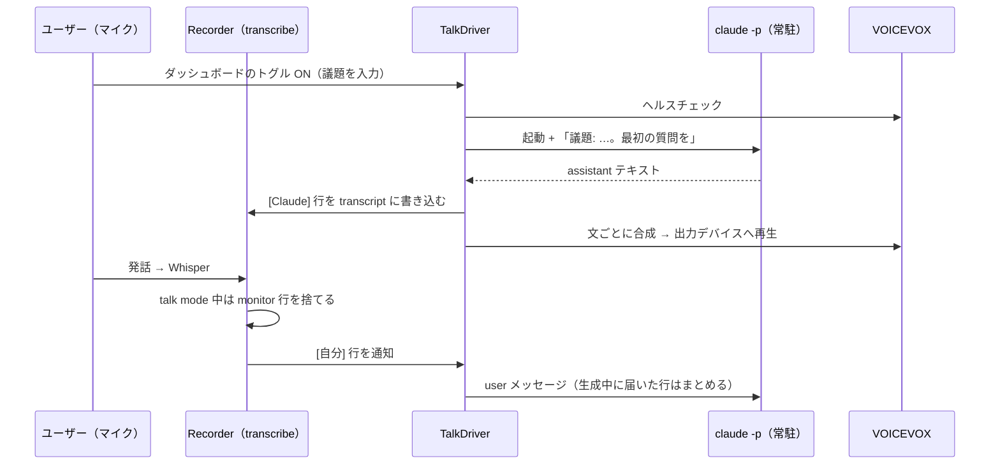
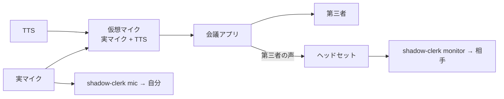

# Claude Talk Mode（Claude と口頭で議論する）

> 会話役（`claude -p` の常駐プロセス）は `improvement/claude-talk-skill.md` で AI Console 上の skill に置き換える。

## Problem

Claude と議論したいとき、キーボードで打つより口頭のほうが速く、考えながら話せる。
shadow-clerk はすでにマイク入力をリアルタイムに文字起こししているので、
Claude の応答を音声で返す経路さえあれば、音声で往復する議論ができる。

## Goal

- 「Claude と会議」モードで、Claude が議題について質問し、ユーザーが口頭で答え、
  Claude が音声で応答する、を繰り返す
- 議論の全体が transcript に残り、あとから読み返せる
- 1往復の遅延が会話として成り立つ範囲（数秒）に収まる
- 既存の AI コンソール（`clerk-meeting-helper` など）と同時に使える

## Scope

| フェーズ | 内容 |
|---|---|
| **1（本 spec の実装範囲）** | ユーザーと Claude の二者。TTS はヘッドセットに再生し、talk mode 中は monitor の文字起こしを捨てる |
| 2（設計上の余地のみ） | オンライン会議に第三者が参加。TTS を仮想マイクに流して会議アプリへ届ける |

Non-goals: 英語 TTS バックエンドの実装、仮想マイクの自動作成。

追加（実装後のフィードバック）: 制止の言葉（`talk_stop_words`）による再生停止、text ブロックごとの逐次読み上げ、応答が遅いときのつなぎ（`talk_filler_sec`）、声の設定（話者・話速・音高・抑揚・音量）。

## Architecture



会話役の Claude は AI コンソール（PTY）ではなく、daemon が常駐させる
ヘッドレスの `claude` プロセスとする。理由:

- AI コンソールはシングルトン（`get_console()`）で、meeting-helper と同時に使えない
- ターンの判定を daemon が直接持てるので、Monitor → Claude ターンを挟むより遅延が小さく決定的
- 会話内容は transcript とダッシュボードに出るので、ターミナル表示は要らない

## Components

### Domain

- `domain/speaker.py`: `Speaker.CLAUDE = "Claude"` を追加する。`from_source()` には対応させない
  （Claude 行は音声入力から来ないため）
- 既存の `TranscriptLine` をそのまま使って `[Claude]` 行を書く
- `domain/talk_persona.py`: `TalkPersona(name: str, instructions: str)`（frozen dataclass）。config の dict から作る `from_config()` と、
  選択を解決する `resolve(personas, requested, default) -> TalkPersona | None` を持つ

### TTS（`_daemon_tts.py`, `_daemon_tts_voicevox.py`）

- バックエンドのインターフェース: `synthesize(text: str) -> tuple[np.ndarray, int]`（PCM とサンプルレート）
- バックエンドは対応言語と既定言語をクラス属性で持つ（`LANGUAGES: tuple[Language, ...]`, `DEFAULT_LANGUAGE: Language`）。
  VOICEVOX は `(ja,)` / `ja`
- 最初のバックエンドは VOICEVOX（HTTP エンジン、既定 `http://localhost:50021`）
  - `POST /audio_query?text=…&speaker=N` → `POST /synthesis?speaker=N` で WAV を得る
  - エンジンは別プロセスなので、LGPL のエンジンはこのリポジトリに含まれない
  - キャラクターごとのクレジット表記（`VOICEVOX:<キャラ名>`）を、ダッシュボードの talk mode 表示と README に出す
- 再生キュー（専用スレッド1本）: 受け取った順に合成・再生する。再生は `sounddevice` で、
  設定した出力デバイスのリストすべてに出す。デバイスは `AudioDevice.name` で解決する（index は不安定）
- 合成と再生をパイプラインにし、1文目を再生している間に2文目を合成する

### TalkDriver（`_daemon_talk.py`）

- 状態: `active`, `topic`, `claude` プロセス, 入力キュー, `busy`（応答を生成中）
- **開始**: VOICEVOX のヘルスチェック → monitor をミュート → `claude` を起動 → 初回メッセージを送る
  ```
  claude -p --input-format stream-json --output-format stream-json --verbose \
    --append-system-prompt <同梱プロンプト + persona + 議題> \
    --no-session-persistence --setting-sources "" --strict-mcp-config --disable-slash-commands \
    --tools <talk_allowed_tools> --allowedTools <talk_allowed_tools> [--model <talk_model>]
  ```
  `--tools` で使えるツール自体を絞り、`--allowedTools` で確認なしに許可する。`--setting-sources ""` と `--strict-mcp-config` で、ユーザー設定の hooks・プラグイン・MCP を読ませない（会話役に余計なコンテキストを入れず、起動を軽くする。OAuth 認証はそのまま使える）。コマンドは `claude_cli_path`。`ConsoleSession` と同じ
  `sanitized_env()` を使う
- **入力**: Recorder が `[自分]` 行を書いた直後に `on_self_line(TranscriptLine)` を呼ぶ。
  `busy` でなければすぐ送り、`busy` のあいだはためておき、応答が完了（`result` イベント）
  したらまとめて1メッセージにして送る
- **出力**: `assistant` イベントのテキストを集め、`result` で確定したら
  - transcript に `[Claude]` 行を1行書く（`transcript_lock` を取る）
  - 文単位（`。！？!?` と改行）に分けて TTS キューへ積む
  - ダッシュボードの transcript 表示は、既存の FileWatcher がファイルの追記を拾って SSE で流すので、別途 broadcast しない
  - 改行や連続する空白は1つの空白にまとめ、transcript の1行形式を壊さない
- **終了**: トグル OFF、daemon 停止、claude プロセスの終了のいずれかで、プロセスを止めて
  monitor のミュートを戻す。プロセスが予期せず終了したときはダッシュボードに通知する

### 会話言語の決定

1. 希望言語 = `talk_language`。空なら翻訳先言語の設定（`/api/session` の `language` と同じ値）
2. 希望言語がバックエンドの `LANGUAGES` に含まれればそれを使い、含まれなければバックエンドの `DEFAULT_LANGUAGE` を使う
3. 決まった言語のプロンプト（`talk_prompts/<lang>.md`）を使う。フォールバックしたときはその旨をログに出し、
   ダッシュボードの talk mode 表示にも会話言語を出す

言語は既存の `domain/language.py` の `Language` で扱う。決定ロジックは `resolve_talk_language(requested, backend)`
として1関数にまとめる。バックエンドを足すときは、その対応言語ぶんのプロンプトも一緒に同梱する。

### 同梱プロンプト（`src/shadow_clerk/talk_prompts/<lang>.md`、フェーズ1は `ja` のみ。package-data に追加する）

- 音声で話す。1〜3文で短く、Markdown や箇条書きは使わない。質問は一度に1つにする
- 入力は音声認識の結果であり、誤認識を含む前提で解釈する
- 議題から逸れたら戻す。結論が出たら確認する
- 会話は「会話言語の決定」で決めた言語で行う

**性格・応答の仕方（`talk_personas`）**: 名前 → 自由記述の key-value で複数持ち、talk mode の開始時に1つ選ぶ。
選んだ persona の記述を、同梱プロンプトのあとに「性格と応答の仕方」の節として足す。
選択の解決: 指定なし（`null`）なら `talk_default_persona`、空文字なら明示的に persona なし、名前ならその persona（存在しなければ既定）。
存在しない名前が指定されたときは、既定へ落とした旨をログに出す。
同梱プロンプトを置き換えはしない。短く話す、Markdown を使わない、といった音声向けの制約は TTS のために常に必要なので、
persona で上書きできない部分として同梱側に残す。persona は会話言語に関係なくそのまま渡す（どの言語で書かれていても Claude は解釈できる）。
talk mode の開始時に読み込むので、変更は次回の開始から反映される

### Recorder の変更（`_daemon_recorder_transcribe.py`）

書き込み直前（`Speaker.from_source(source)` のあと）と直後に、talk mode 用のフックを入れる。

- 直前: `talk.is_suppressed(source)` が真ならスキップする。フェーズ1では「talk mode 中の monitor」で真になる。
  判定はこの関数1か所に閉じ込め、フェーズ2で「再生中の時間窓 × 読み上げ文との類似度」に差し替えられるようにする
- 直後: `file_speaker == Speaker.SELF` なら `talk.on_self_line(tl)` を呼ぶ
- 終了時にキューの残りを処理する経路（`_transcribe_thread` の末尾）にも同じ抑制を入れる

### API（`_daemon_dashboard_ops_talk.py`）

すべて localhost に限定する（`is_localhost_client`）。

| Method | Path | Body / 応答 |
|---|---|---|
| `GET` | `/api/talk-mode` | `{active, topic, persona, language, speaker_credit}` |
| `POST` | `/api/talk-mode` | `{on: bool, topic?: str, persona?: str}` → 開始 / 終了。VOICEVOX に届かない・claude を起動できないときは `{status: "error", message}` |
| `POST` | `/api/say` | `{text: str}` → `[Claude]` 行を書いて TTS に積む。talk mode でなくても使える（手動での確認用） |

### Dashboard

- 「Claude と会議」トグルボタン（ON にすると、議題の入力と persona の選択（`talk_default_persona` を初期選択）を行うモーダルを開く）
- persona の一覧エディタ（名前と複数行テキストの追加・編集・削除、既定の persona の指定）を、開始モーダルの「persona を編集」から開く
- talk mode の状態（議題・persona・会話言語・クレジット・エラー）は `/api/status` の `talk` に載せ、既存の status ポーリングで反映する
- talk mode 中の表示: 議題、VOICEVOX のクレジット、エラー通知
- `[Claude]` 行は既存の transcript 表示に、専用の色で出す
- 文言はすべて `i18n.py` の `t()` / `{{i18n:key}}` を通す

### Config（`talk_*`）

| キー | 既定値 | 説明 |
|---|---|---|
| `talk_voicevox_url` | `http://localhost:50021` | VOICEVOX エンジン |
| `talk_speaker_id` | `3` | VOICEVOX の話者 ID |
| `talk_personas` | `{}` | 名前 → 性格・応答の仕方（自由記述）。選んだものが同梱プロンプトに追記される |
| `talk_default_persona` | `""` | 開始時に既定で選ばれる persona の名前 |
| `talk_language` | `""`（翻訳先言語に従う） | 会話の希望言語。バックエンドが未対応ならその既定言語になる |
| `talk_output_devices` | `[]`（空ならデフォルトの出力） | 再生先デバイス名のリスト |
| `talk_model` | `""`（claude の既定） | 会話役のモデル |
| `talk_allowed_tools` | `WebSearch,WebFetch,Read,Grep,Glob` | 会話役に許可するツール |

## Error Handling

| 事象 | 挙動 |
|---|---|
| 開始時に VOICEVOX に届かない | talk mode を開始せず、`{status: "error", message}` を返してモーダルに表示する |
| 会話中に VOICEVOX が落ちた | `[Claude]` 行の書き込みは続け、再生だけを諦めて通知する |
| `claude` が見つからない、または予期せず終了した | talk mode を終了し、monitor のミュートを戻して通知する |
| 出力デバイスが見つからない | デフォルトの出力に落とし、警告ログを出す |

## Phase 2 Notes（オンライン会議で第三者が参加する場合）



- `talk_output_devices` に仮想マイクのシンクを指定する。仮想マイクの作成（PipeWire の null-sink と loopback）は
  ユーザー側の環境設定とし、手順は README に書く
- shadow-clerk は引き続き実マイクを録り、会議アプリは自分のマイク音声を返さないので、Claude の声はどちらのチャンネルにも混ざらない。
  このため monitor のミュートは不要になり、`is_suppressed()` は偽を返す
- 手元のヘッドセットでも Claude の声を聞く場合は、それが monitor に入る。そのときは `is_suppressed()` を
  「再生中の時間窓 × 読み上げ文とのあいまい一致」で判定する実装に差し替える
- 会話役のプロンプトに「相手」行も入力として渡し、発言者を区別させる

## Testing

既存と同じく、`uv run python tests/<file>.py` で実行する（フレームワークなし、`check()` で PASS/FAIL を出す）。

| ファイル | 対象 |
|---|---|
| `tests/test_talk_persona.py` | `TalkPersona` の生成と解決（`null` → 既定、`""` → なし、未知の名前 → 既定） |
| `tests/test_tts.py` | 文分割、`TtsPlayer` のパイプラインと失敗時の継続、VOICEVOX バックエンド（モック HTTP サーバー）、リサンプル |
| `tests/test_talk_prompt.py` | `resolve_talk_language()` のフォールバック、system prompt の組み立て順 |
| `tests/test_talk_claude.py` | 偽 claude スクリプトでの stream-json 往復、プロセス終了の通知、argv の組み立て |
| `tests/test_talk_driver.py` | 送信・まとめ送り・`[Claude]` 行の書き込み・TTS への受け渡し・開始失敗・二重開始・プロセス終了 |
| `tests/test_talk_recorder_hook.py` | talk mode 中に monitor 行が書かれないこと、`[自分]` 行が通知されること |
| `tests/test_talk_api.py` | `/api/talk-mode` と `/api/say` の入力検証と localhost 制限 |

- 手動: VOICEVOX を起動 → ダッシュボードでトグル ON → 議題を入力 → 1往復して transcript とダッシュボード表示を確認する
- 実装後に `make dupcheck` を流す。各ファイルは 700 行以内に収める
