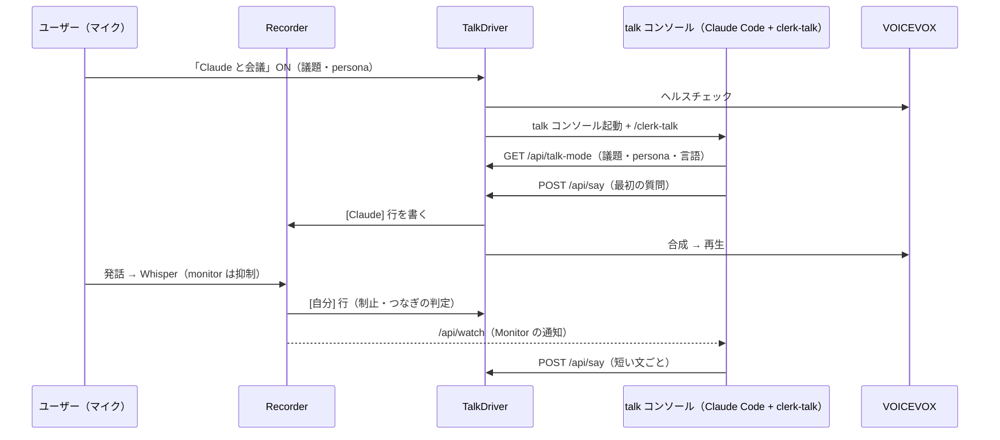

# Claude Talk Mode on an AI Console skill

`improvement/claude-talk-mode.md` の会話役（daemon が常駐させる `claude -p`）に加えて、AI Console 上で動く
Claude Code の skill を会話役に選べるようにし、既定をそちらにする。TTS・monitor の抑制・制止・つなぎの一言は
daemon の共通部分に残す。

## Problem

`claude -p` は画面も確認ダイアログも持たない。書き込みやコマンドを許可すると確認なしに実行させるしかなく、
既定では読み取り系のツールだけにしていたため、会話の中で「このファイルを書いて」と頼んでも書けなかった。
ユーザー設定の skill・MCP・hooks も切っていたので、普段の Claude Code と同じ道具が使えない。

## Goal

- 会話役は通常の Claude Code セッション（AI Console の PTY）で動き、ファイル編集などは通常の許可確認つきで行う
- 会議アシスタント（`clerk-meeting-helper`）と同時に使える
- 逐次読み上げ・制止・つなぎの一言・persona・声の設定といった現行の体験を保つ
- 速さ優先で話すだけの議論には、従来の `claude -p` 方式も選べる（`talk_engine`）

Non-goals: 任意個のコンソール、2つのコンソールの同時表示、Phase 2（第三者の参加）。

## Architecture

## 1. コンソールを役割ごとに2つ持つ

| 役割 | 用途 | 起動のきっかけ |
|---|---|---|
| `assistant` | 会議アシスタント（従来のコンソール） | 起動ボタン、`auto_analyze`、議事録の依頼 |
| `talk` | Claude と会議の会話役 | 「Claude と会議」の開始 |

- `_daemon_console.py`
  - `get_console(role: ConsoleRole = ConsoleRole.ASSISTANT) -> ConsoleSession`。役割ごとに1インスタンス。
    `ConsoleRole` は `domain/` の Enum（`assistant` / `talk`）
  - `ConsoleSession(role)`。列数の保存ファイルは役割ごと（`assistant` は従来の `console.cols`、`talk` は `console-talk.cols`）
  - SSE の `console` イベントの payload に `role` を足す（diff / full / status のすべて）
  - `start_console_for()`・`request_summary_from_console()`・`auto_analyze` は `assistant` 固定（挙動は変えない）
  - 終了処理（`_daemon_main.py`）は両方を止める
- API: `/api/console`（GET）、`/api/console/start`・`stop`・`input`・`resize`（POST）に `role` を足す。
  省略時は `assistant`。未知の値はエラー
- `/api/status` に `talk_console_running` を足す（`console_running` は従来どおり assistant）

### Dashboard

- コンソール欄のタブを「AI Console」「Claude と会議」「Logs」にする
- 表示中の役割を `_consoleRole` に持つ。SSE の `console` イベントは `role` が一致するものだけ描き、
  タブを切り替えたら grid の状態を捨てて `GET /api/console?role=...` で取り直す
- 起動・停止・入力・リサイズは表示中の役割に送る
- 表示していない役割が動いていれば、そのタブに ● を付ける
- `_daemon_dashboard_js_console.py` は 700 行を超えているので、役割の切り替えは新しいファイル
  （`_daemon_dashboard_js_console_role.py`）に置き、既存ファイルからは呼ぶだけにする

## 2. talk mode の流れ

### 会話の担い手（`talk_engine`）

TalkDriver を「共通の部分」と「会話の担い手（engine）」に分ける。

| | `console`（既定） | `headless` |
|---|---|---|
| 会話役 | talk コンソールの Claude Code + `clerk-talk` skill | `claude -p` の常駐プロセス（従来の実装） |
| 発言の受け取り | skill が Monitor で `/api/watch` を読む | engine が stdin に送る（生成中はためてまとめる） |
| 話す | skill が `/api/say` を呼ぶ | engine が text ブロックを受けて `say` する |
| 制止 | 次の `/api/say` に `interrupted` を返す | そのターンの残りを捨て、注記を付けて送る |
| 向いている使い方 | ファイル編集など作業を伴う議論 | 速さ優先の、話すだけの議論 |

engine のインターフェース（`_daemon_talk_engine.py` の Protocol）:

- `start(ctx: TalkContext) -> None` — 起動できなければ `TalkStartError`
- `stop() -> None` — 冪等
- `on_self_line(text: str) -> None` — `[自分]` 行（制止の注記が付くことがある）
- `on_interrupt() -> None` — 制止された。headless はこのターンの残りを捨てる。console は何もしない
- `consume_interrupt() -> str | None` — `/api/say` が制止の直後なら止めた文を返して制止の状態を解く（console のみ。headless は常に None）

`TalkContext` は `topic`・`persona`・`language`・`workdir`・`config` と、engine から driver を呼ぶための
`say(text)`・`ended(error)` を持つ。

### 共通の部分（TalkDriver）

- 開始（`POST /api/talk-mode {on: true, topic, persona}`）: VOICEVOX のヘルスチェック → 会話言語と persona を決める →
  TTS の再生器を作り monitor を抑制する → `talk_engine` の engine を `start()` する。失敗したら抑制と再生器を戻す
- 終了（トグル OFF、engine の終了、daemon の停止）: engine を `stop()` し、再生を止め、抑制を解く
- `[自分]` 行: 制止の言葉を含めば読み上げを止め（`TtsPlayer.interrupt()`）、`cut` を覚えて `engine.on_interrupt()` を呼ぶ。
  そのうえで `engine.on_self_line()` に渡す（headless では注記を付ける）
- つなぎの一言: 開始時と `[自分]` 行（制止を除く）から `talk_filler_sec` 秒、`say` が1回も無ければ読み上げる
- `say(text)`（`/api/say` と headless engine の両方から）: 制止の直後の最初の1回（console のみ）は話さずに
  `interrupted` を返して制止の状態を解く。それ以外は `[Claude]` 行を書いて読み上げる
- 残す: persona と言語の解決、声の設定と試聴、snapshot、`is_suppressed()`

### 作業ディレクトリ

- 開始時の指定（開始モーダルの欄、`POST /api/talk-mode` の `workdir`）→ `talk_workdir` → `ai_assistant_workdir` → ホームの順
- 開始時に明示した場所が無ければ開始しない（黙ってホームで始めると、違うリポジトリで作業してしまう）
- console engine は、talk コンソールが別の作業ディレクトリで動いていれば止めてから起動し直す。headless は `claude -p` をその場所で起動する

### console engine

- 開始: talk コンソールを `TalkContext.workdir` で起動し、準備ができたら `/clerk-talk` を送る（`send_after_ready`）。`clerk-talk` skill が入っていなければ開始しない
- talk コンソールが自分で終了したとき（`/exit` など）は `ended()` で talk mode を終える

### headless engine

- 従来の `_daemon_talk_claude.py`（`ClaudeTalkProcess`, `build_claude_argv`）と、TalkDriver にあったターン管理
  （busy・pending・まとめ送り・制止後に捨てる・注記・口火）をここへ移す
- system prompt は同梱 `talk_prompts/<lang>.md` から組み立てる（従来どおり）。設定 `talk_model`・`talk_allowed_tools` も headless 用に残す

### skill が使う API

| Method | Path | 内容 |
|---|---|---|
| `GET` | `/api/talk-mode` | `{active, engine, topic, persona, persona_instructions, language, credit, error}` |
| `POST` | `/api/say` | `{text}` → 読み上げる。制止の直後の1回（console engine）は話さずに `{status: "interrupted", cut}` を返す |
| `GET` | `/api/watch?interval=1` | 既存。`WATCH_INTERVAL_RANGE` の下限を 5 から 1 に下げる |

### 新しい skill `clerk-talk`（`src/shadow_clerk/skills/clerk-talk/SKILL.md`）

- `SHADOW_CLERK_URL` を使い、`GET /api/talk-mode` で議題・persona・会話言語を取る
- 最初の質問を `/api/say` で話す
- Monitor で `curl -sN "$SHADOW_CLERK_URL/api/watch?interval=1"` を張り、`[自分]` の行を待つ。
  `[Claude]` 行は自分の発言なので無視する
- 応答は短い文ごとに `/api/say` を呼ぶ。1文は短く、Markdown・記号・URL を使わない
- 時間がかかりそうなら、先に「ちょっと考えます」と `/api/say` してから取りかかる
- `/api/say` が `interrupted` を返したら、そのターンの発話をやめてユーザーの次の発言を待つ。
  `cut` の文より後は相手に届いていない
- 入力は音声認識の結果なので、誤認識を含む前提で解釈する
- ファイル編集などの依頼は通常どおり行う（許可確認は Claude Code の設定に従う）
- 会話言語は `/api/talk-mode` の `language` に従う
- `clerk-util install-skill` の配布対象に含める
- 話し方の指示は `talk_prompts/ja.md` と重なる。skill には同じ要点を書き、headless 用の同梱プロンプトは残す

## Error Handling

| 事象 | 挙動 |
|---|---|
| VOICEVOX に届かない | talk mode を開始しない（従来どおり） |
| engine を起動できない（talk コンソール / claude） | talk mode を開始せず、抑制と再生器を戻してエラーを返す |
| engine が終了した（talk コンソールの `/exit`、claude の終了） | talk mode を終える |
| skill が入っていない | 起動後に Claude Code が「unknown command」を出す。開始時に `/api/skill-status` 相当の確認をして、未導入なら開始しない |

## Testing

| ファイル | 対象 |
|---|---|
| `tests/test_console_pty.py` | 役割ごとに別インスタンス、列数ファイルが役割ごと、SSE payload に `role` |
| `tests/test_console_ops.py` | `role` の受け付け・既定値・不正値 |
| `tests/test_talk_driver.py` | 共通部分: engine の選択と開始・終了、制止で `on_interrupt`、console の制止後の最初の `say` が `interrupted`、つなぎの一言（`filler_wanted`） |
| `tests/test_talk_engine_console.py` | talk コンソールを起動して `/clerk-talk` を送る、skill 未導入なら開始しない、コンソール終了で `ended` |
| `tests/test_talk_engine_headless.py` | 従来の driver テストのターン管理部分（まとめ送り、制止後に捨てる、注記、口火） |
| `tests/test_talk_api.py` | `/api/say` の `interrupted` 応答、`/api/talk-mode` の `persona_instructions` |
| `tests/test_console_trim.py` | 既存の JS 関数名が保たれていること（変更しない） |

- `tests/test_talk_claude.py`・`tests/test_talk_prompt.py` は残す（headless engine が使う）
- 手動: assistant で meeting-helper を動かしたまま talk mode を開始し、タブを切り替えて両方が動いていること、
  会話の中でファイルを書かせると許可確認が出ること
